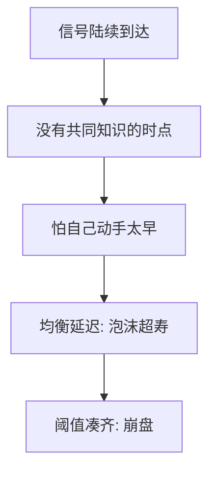

# Abreu–Brunnermeier 同步失败

套利者陆续知道泡沫存在，但不知道别人是不是已经知道；先动手的人独自承担价格还在涨的风险，于是都等，泡沫比消息更长寿。

<footer>—— Abreu and Brunnermeier, Bubbles and Crashes, Econometrica 2003</footer>

[上一课](/econ/rational-bubbles)留下「人人知道仍可能持有」。本课缺口是时机：专业套利者**陆续**意识到错定价，攻击需要同步。没有共同知识的那一天，各自动手都太早。不重写 $B=E[mB']$。

## 问题

Abreu 与 Brunnermeier（2003）：泡沫在某个未观测时点开始，套利者按随机顺序得到信号，知道「已经开始」但不知道自己在序列中的位置。卖空有资本约束（每人只能抛有限量），必须凑够数量才能刺破。每个人都想骑泡沫到接近破裂再动手（preemption 与 waiting 的权衡）。均衡是延迟：从第一个信号到崩盘有一段内生时间。缺口是给 [SV 套利限制](/econ/limits-to-arbitrage)加上**信息同步**，而不是再写委托赎回。

共同知识比「人人知道」更强：人人知道人人知道……。泡沫可以在高阶信念缺口上存活。这是协调博弈，不是噪声交易者的随机需求。

## 方法

连续时间，信号到达的泊松或均匀顺序，资本加总阈值。策略：收到信号后等待 $\tau$ 再攻击。对称均衡 $\tau\gt 0$。比较静态：资本越分散、信号越不同步，延迟越长，泡沫越大。崩盘可以比基本面消息猛——因为同步一旦达成，资本同时到位。

不把「攻击」写成限价簿上的大单扫货。阈值是资本加总，协议仍属量化栏。

## 机制

机制是协调失败。骑泡沫的收益是继续上涨；过早攻击的成本是被轧空或错过上涨。SV 的赎回在此换成「别人还没动手时价格继续涨」。DSSW 的噪声仍可以提供上涨；AB 即使在泡沫终将破裂的共同信念下，也能因不同步而延迟。与理性泡沫的差别：AB 的价格路径由行为或外生泡沫过程驱动，理论核心是刺破的博弈，不是齐次欧拉。

「人人知道价格太高」还不是共同知识：我不知道你是不是已经收到信号。先动手且别人未动，价格继续涨，自己被轧。对称均衡是等待一段内生时间。资本分散、信号不同步，则延迟拉长。不把攻击写成簿上的扫货；阈值是资本加总。主干在交接处停，本课仍是均衡时机，不是协议。

## 边界

若信号是公共公告（人人同时知道），同步问题消失，模型退回谁先抢的简单抢先。完全无卖空约束则一人即可刺破。本课不估计延迟长度。金融危机叙事可以当动机，不是识别。

后课默认：羊群与信息级联是另一条「看见别人的行动当信号」的协调；AB 是已经知情的人等别人一起动手。

陆续知情加资本阈值，均衡是等待：泡沫比第一条消息更长寿，崩盘是同步成功。

人人知道还不是共同知识。SV 是资本逃走；AB 是资本到了仍不下手。

公共同时公告则同步问题消失；一人可刺破则延迟消失。

## 小结

- 陆续知情 + 资本阈值 ⇒ 均衡等待，泡沫超寿。
- 崩盘是同步成功，不是基本面突然跳。
- 在 SV 的融资限制之上加上高阶信念缺口。
- 公共同时公告则同步问题消失。
- 一人即可刺破则延迟消失。
- 出处：Abreu and Brunnermeier, *Econometrica* 2003。
