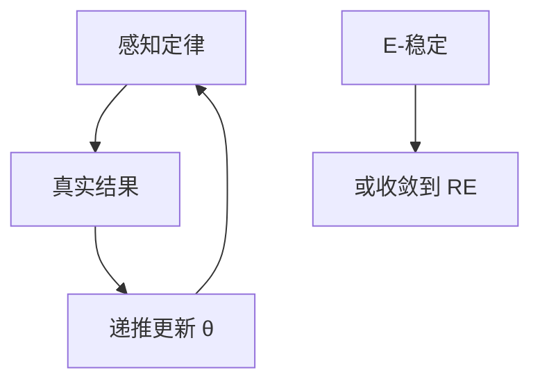

# 适应性预期与学习

理性预期把信念钉在真实定律上；学习把信念钉在递推估计上，定律与估计互相追，暂时可以偏离 RE 路径。

<footer>—— Evans and Honkapohja, Learning and Expectations in Macroeconomics, 2001；Marcet and Sargent, Convergence of Least Squares Learning, 1989</footer>

[上一课](/econ/firm-heterogeneity-investment)仍在理性预期下加总分布。本单元换问题：预期算子本身。本课缺口是**适应性学习**：最小二乘或随机梯度把系数当状态。不重写企业 $(S,s)$，不把粘性信息提前当主模型。

## 问题

RE：$\mathbb{E}_t$ 是模型真实条件期望。估计与 BK 都靠它。现实：系数未知，人用过去数据更新。Marcet–Sargent：若学习增益下降，信念可收敛到 RE。Evans–Honkapohja：E-稳定性——若人们相信的定律在学习动态下是吸引子，RE 才「可学习」。常增益学习永远不完全收敛，持续误设可放大冲击。缺口是给「预期」一条可替代 RE 的递推，而不是从零讲最小二乘。

Evans and Honkapohja, Princeton, 2001。Marcet and Sargent, *JEDC* 1989。Bullard and Mitra 对泰勒规则可学习性。Sargent 的 *The Conquest of American Inflation*。

## 方法

感知定律（PLM）：例如 $\pi_t=\alpha+\beta\pi_{t-1}$。真实定律（ALM）由 PLM 代入模型得出。学习：$\theta_t=\theta_{t-1}+\gamma_t x_t(\pi_t-\theta_{t-1}'x_t)$。E-稳定：在 RE 处 ALM 对 PLM 的映射导数稳定。政策：满足 BK 决定性的规则不一定 E-稳定，反之亦然。与校准：学习参数 $\gamma$ 几乎没有微观钉死，常被用来拟合持续性。

太阳黑子均衡的可学习性往往更差，学习有时充当选择装置。

## 机制

机制是信念成为额外状态。同一基本面冲击，经错误的 $\beta$ 预报会自我放大（通胀螺旋、资产价格外推）。常增益把结构变化当可能，适合政策体制转换，也适合制造超额波动。HANK 加上学习：高 MPC 家庭若外推收入，间接效应更猛——可叠加，本课先在代表或简单 NK 里钉装置。

与卢卡斯批判：学习模型里「参数」会随政策变，因为样本变。这是批判的一种实现，不是回到适应性预期的老 IS–LM。

早期 Cagan、Friedman 的适应性预期是固定滞后权重；现代学习让权重由估计得出。本课用后者。

## 边界

本课不把粘性信息（Mankiw–Reis）与疏忽（Sims）算作学习——后两课。诊断性预期是认知偏差，也不是最小二乘。调查数据后课才当靶。不估计股市量价。

后课默认：RE 可被学习动态替换；E-稳定性是额外许可证。下一课：即使知道结构，信息也不是每期都更新。

## 小结

- 学习：PLM 的递推估计；E-稳定性选择可达到的 RE。
- 信念是状态，可放大持续性与波动。
- BK 决定性 ≠ 可学习。
- 出处：Marcet and Sargent 1989；Evans and Honkapohja 2001。
