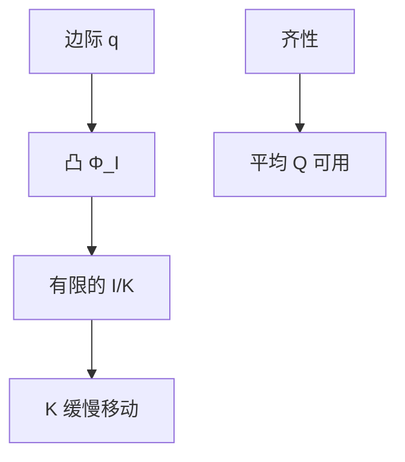

# 投资调整成本

资本不能免费瞬时改装；凸的安装成本让投资率有限，并使可观测的 $q$ 可以离开一。

<footer>—— Lucas 供给调整成本传统；Hayashi 把凸成本接到平均 q 与边际 q</footer>

[上一课](/econ/tobin-q)定义了边际 $q=\lambda/P_K$，并指出无摩擦时 $q$ 被钉在 1、投资跳到合意 $K$。本课的缺口是给出一种标准摩擦：对投资率的**凸**调整成本，使 $I$ 成为 $q$ 的光滑递增函数。Lucas 把调整成本写进供给反应；Hayashi 证明在齐性下平均 $Q$ 仍等于边际 $q$，于是股市代理继续可用。货币层次从下一课开始；投资摩擦在增长与周期里先收口。

## 问题

$q$ 理论没有成本时，任何 $q\neq 1$ 都会被无限投资或负投资抹平。观测上 $I/K$ 缓慢，$Q$ 可以长期不等于 1。缺口不是再定义 $q$，而是：把安装、学习、停工写成 $K$ 的凸成本 $\Phi(I,K)$，使最优

$$
q=1+\Phi_I(I,K),
$$

从而 $I=I(q)$，$q>1$ 对应正投资但有限。固定成本与不可逆（Dixit–Pindyck 一类）是另一条，给出 $(S,s)$ 与期权价值；本课保持凸成本，作为宏观可微的默认。

凸成本惩罚**快**装，不惩罚资本水平本身。折旧 $\delta K$ 仍在运动方程里。二者不要焊成「资本贵」。

## 方法

厂商最大化利润现值，受 $\dot{K}=I-\delta K$ 与调整成本约束。一阶条件把 $q$ 接到 $\Phi_I$；资本欧拉仍给 $\lambda$ 的运动。Hayashi：$\Phi$ 与 $F$ 对 $(I,K)$ 线性齐次时，平均 $Q$ 等于边际 $q$，投资率只是 $Q$ 的函数。Lucas（1967）一类调整成本解释供给为何不随价格瞬时跳满——同一数学，对象可以是产出也可以是资本。

没有凸成本，$q$ 理论在数据上无处安放：要么 $Q=1$ 永远，要么 $I$ 无穷。有了它，$Q$ 的波动可以预测 $I/K$，弹性由 $\Phi$ 的曲率定。本课不估计曲率。

### 凸不是唯一摩擦

不可逆使负投资更贵，产生等待期权，平均 $Q$ 与边际 $q$ 更容易分叉。信贷约束把内部资金当状态变量——金融加速器后课再加。本课只关闭「为何 $q$ 可以不等于 1 而 $I$ 仍有限」。

## 机制

正的需求或技术冲击抬 $\lambda$， $q$ 升，厂商愿意付更高的边际安装成本， $I/K$ 上升，但不是一步到位。过渡期 $q$ 高于 1，直到 $K$ 升到使边际产出回落。反向亦然。这使投资成为周期里持久的流量，而不是跳跃。索洛的 $sY$ 可以被读成某种经验规则；优化版本是 $I(q)$ 加上资源约束里的储蓄。

曲率越大，$I$ 对 $q$ 越不敏感，资本越像缓慢状态，周期越靠劳动与产能利用率。曲率趋于零，回到上一课的跳跃。宏观校准常把这条曲率设到能匹配 $I$ 的平滑，而不是从工程安装成本加总——与 Calvo 的 $\theta$ 同一类方便参数。声明它是行为曲率，才能避免把「投资惯性」写成技术定律。

效率工资与匹配影响未来利润，从而进入 $\lambda$，再进入 $I$——劳动摩擦传到投资，不必把工资写进 $\Phi$。开放经济的资本成本同样进折扣率；CIP 实证仍见 `/quant/irp`。

二次调整成本给出线性的 $I(q)$，便于宏观线性化。大冲击下二次型不诚实，与 Calvo 固定概率是同一类方便。

## 边界

本课不把调整成本写成工程工期表，不估计 $Q$ 回归。公司金融的融资优序是另一摩擦。量化栏没有宏观 $I(q)$。增长核算里的 $K$ 运动仍可用永续盘存；本课只改 $I$ 的行为，不改账户定义。

不可逆与固定成本给出投资的期权价值：等待本身有价格，$q$ 必须超过 1 一截才触发。凸成本没有这道门槛，便于线性宏观。周期课若看到投资对 $Q$ 不对称（降比升更钝），应想到不可逆，而不是先否定 $q$。本课默认凸，是为了让后课能写可微的 $I(q)$。

后课默认：需要缓慢投资时，用凸调整成本让 $q$ 离开 1；平均 $Q$ 在 Hayashi 条件下仍是代理。下一课换域：支付手段如何进入一般均衡——从 CIA/MIU 的装置，到配对交易里的货币。

## 小结

- $q$ 课给出影子价格；无成本时投资跳、 $q$ 钉在 1。
- 凸 $\Phi(I,K)$ 使 $q=1+\Phi_I$，投资率有限。
- Hayashi 齐性下平均 $Q$ 仍等于边际 $q$。
- 固定成本与信贷约束是并列摩擦，本课不展开。
- 出处：Lucas 调整成本传统；Hayashi, *Econometrica* 1982。
