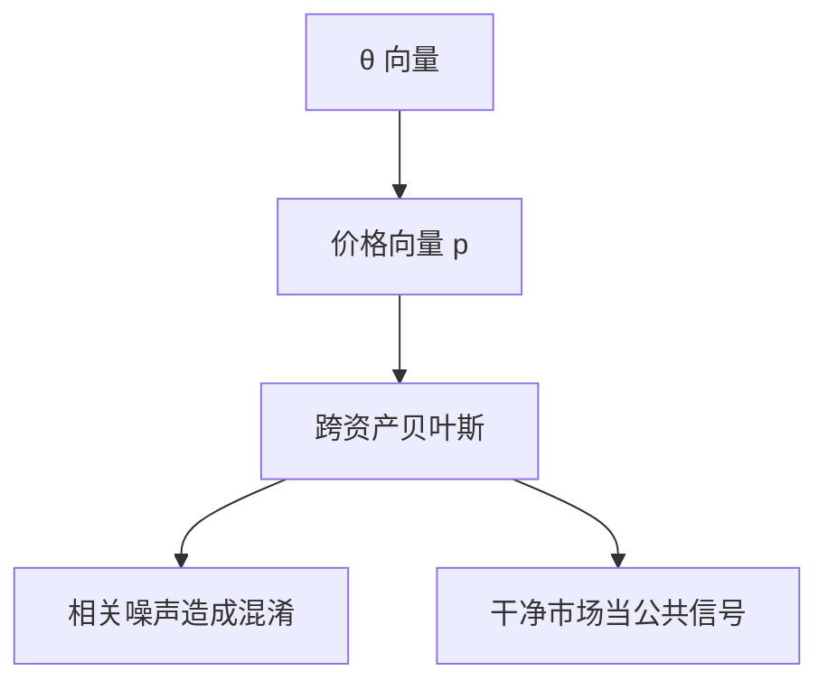

# Admati 多资产 REE

多资产时，一张价格不仅泄漏自己的信号，也泄漏相关资产的信号；学习与混淆同时沿截面展开。

<footer>—— Admati, A Noisy Rational Expectations Equilibrium for Multi-Asset Securities Markets, Econometrica, 1985</footer>

[上一课](/econ/hellwig-ree)在单一风险资产上把竞争性部分揭示写清。本课缺口是向量：若干种资产、若干个 $\theta$、价格向量 $p$。不重推连续统与线性猜测，只补**跨市场**学习。不把截面 beta 估计请进来——那是 [CAPM 作为均衡](/econ/capm-theory) 的实证换栏，不是 REE。

## 问题

单资产里，$p$ 高不是好 $\theta$ 就是少供给。多资产里，资产 $j$ 的价格还被与 $j$ 相关的信号和与 $j$ 相关的供给挪动。投资者用整个 $p$ 更新每一个 $\theta_k$。Admati（1985）给出 CARA–正态下的线性 REE：需求是价格与私有信号的线性函数，系数矩阵由条件协方差一次定住。

缺口不是「分散投资」，均值方差加总早已会。缺口是信息：相关资产使价格成为彼此的信号，也使噪声成为彼此的伪装。一种资产的「信息含量」不能只看自己的 $R^2$。

Admati, *Econometrica* 53(3), 1985。多资产 REE 的闭式依赖矩阵求逆：条件方差、信号精度、供给噪声的协方差一起进入系数。

## 方法

设 $\theta$ 为向量，私有信号 $s_i=\theta+\varepsilon_i$，供给 $z$ 为向量，均可联合正态。猜测 $p=A\theta+B z+const$。贝叶斯更新给出 $\mathrm{E}[\theta\mid s_i,p]$ 与条件方差；CARA 需求与条件均值成正比、与条件方差成反比。出清核对 $A,B$。对角世界（资产彼此独立）退回一排 Hellwig；非对角时，$A$ 的非对角元刻画「从 $k$ 的价格读 $j$ 的基本面」。

揭示可以不对称：精度高、供给稳的市场，价格更干净，并作为其他市场的公共信号。精度低的市场可能主要是在进口别人的信息，而不是出口自己的。这与后文信息披露、信息中介会再碰到：公共信号的来源不必是「该资产自己的公告」。

不要把跨资产学习写成因子模型估计。因子是 $m$ 在收益空间上的投影，见 [随机折现因子](/econ/stochastic-discount-factor)；这里的 $A,B$ 是信息加总的系数，不是风险价格。把 Admati 的 $A$ 叫成 beta，会把 REE 吞进 CAPM 实证。

## 机制

机制是联合正态的条件期望。相关一旦存在，最优是看全部价格；忽略其他市场等于扔掉公共信息。代价是混淆：共同噪声（例如共同流动性冲击）会让人以为看见了共同基本面。均衡里，投资者部分「看穿」这种结构——系数已经把噪声协方差编进去——但看不穿当期实现，因为当期 $z$ 仍未观测。

GS 的采集激励在多资产下会变成「买哪一组信号」。那是后课信息获取；本课信号外生，只钉加总几何。

资产数目多于独立噪声来源时，价格向量可能对 $\theta$ 几乎充分统计。反过来，噪声维度高，揭示永远残缺。维度比较是后课存在与揭示的入口。

## 边界

非正态、卖空限制、离散交易，线性闭式消失，精神可以保留：价格是公共信号，相关造成溢出。本课不写行业动量或铅滞后的回归——那是可预测性的测量，对象在量化栏。也不要把多资产 REE 写成限价簿上多标的同时排队。

下一课离开线性猜测，问一般 REE：何时存在、何时（几乎）完全揭示、何时只有部分揭示。Admati 的矩阵是特例，不是定义。

后课默认：竞争性多资产 REE 里，价格向量是联合信号；跨资产学习与共同噪声混淆是同一枚硬币的两面。

## 小结

- 多资产线性 REE 用整向量 $p$ 更新每个 $\theta$。
- 相关带来信息溢出，也带来共同噪声的伪装。
- 系数矩阵不是 CAPM 的 beta，实证换栏。
- 出处：Admati, *Econometrica* 1985。
