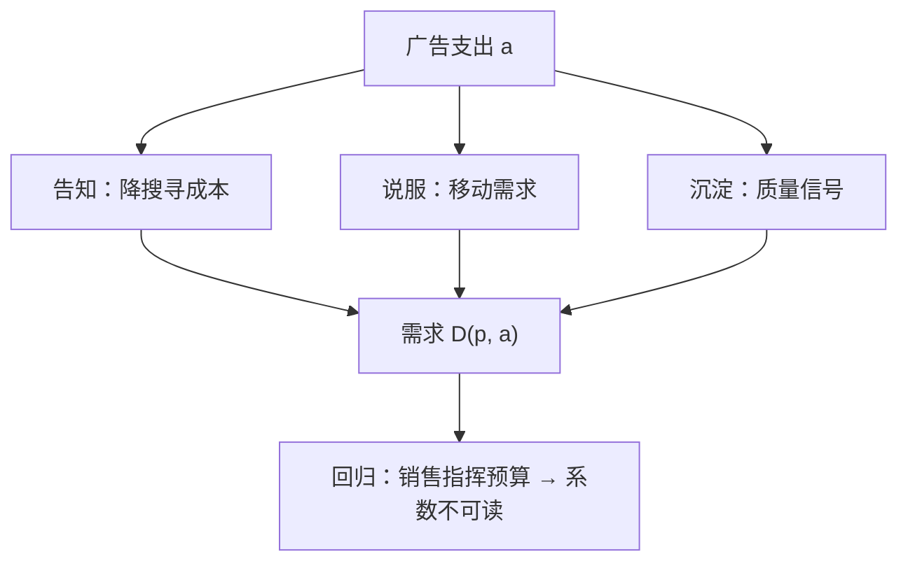
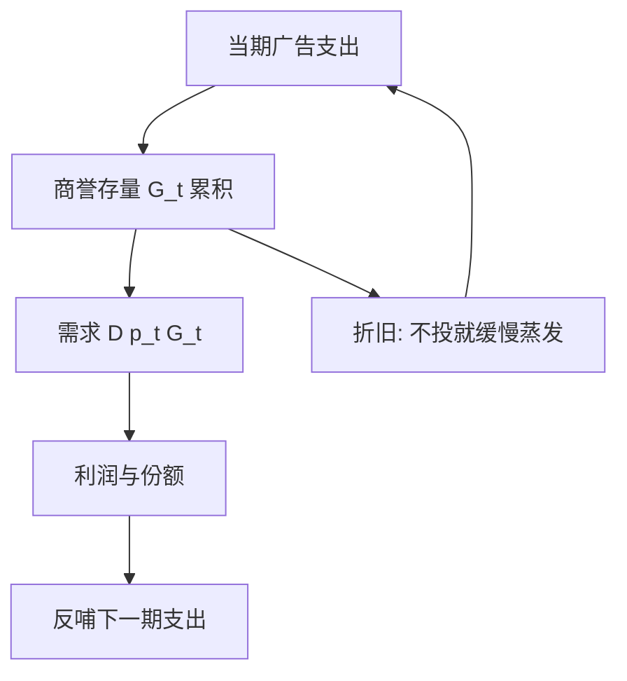

# 广告：信息与说服

同一支广告，信息观里是免费的地图，说服观里是给偏好压模的手；回归分不清二者，是因为销量本身就在指挥广告预算。

<footer>—— 据 Telser, Supply and Demand for Advertising Messages, AER 1966；Nelson, Advertising as Information, JPE 1974 整理</footer>

[上一课](/econ/rnd-patent-races)把产品的时间维打开：技术换代以竞赛的方式进行，奖品由专利局定价。本课转向需求侧：即使技术不变，需求矩阵也不是天生给定的——广告是厂商花钱改写需求的最直接工具。微观主干的[柠檬市场](/econ/akerlof-lemons)与[信息中介](/econ/information-intermediaries)都假设消费者知道市场上有什么；广告正往这个假设上开口。本课把「广告是什么」压成三种可检验的读法，再回答一个测量问题：广告—销售回归为什么几乎读不出因果。

## 问题

广告开支巨大且高度集中，经济学要问的却窄：它改变需求的哪一层。三种读法给出了三套含义。其一，**告知**：Stigler 1961 的搜寻框架里广告降低找货成本，Telser 1966 的面板研究即循此路——广告是消费者对信息的需求与厂商对信息供给的均衡价格。其二，**说服**：广告改变口味；Stigler–Becker 1977 反对这个说法，把广告写成消费生产函数里的互补品——口味不变，「欣赏能力」在积累。其三，**信号沉淀**（Nelson 1974）：对经验品，广告本身不携带信息，但**花钱**携带——只有高质量、回头客多的厂商付得起这支广告，广告强度是质量的信号。第三读法直接接到下一课的声誉抵押。

术语翻译：搜寻品是货架上看一眼就能验货的东西（西红柿、衬衫）；经验品是买回用了才知道好坏的东西（牙膏、餐馆）。Nelson 的「花钱即信号」逻辑只对经验品要紧——搜寻品不需要回头客背书，广告直接报事实就够了。

内生出在制度里：预算按销售额的百分比走，广告又反过来推销售——联立性把 OLS 系数拧成混合体，同时含「广告推销售」与「销售指挥预算」两个方向。

Dorfman–Steiner 1954 的最优广告强度：广告支出占销售额之比 $=\varepsilon_a/|\varepsilon_p|$。数字例：需求的广告弹性 $0.1$、价格弹性 $2$，则最优广告/销售比为 $5\%$。这是均衡关系，不是弹性的定义，拿它反推弹性要小心。

## 方法

识别的出路是找**不由销售决定**的广告变动：广告禁令（烟草、处方药的跨州差异）、媒体侧的外生变动（频道落地、报刊罢工）、平台侧的随机分流实验。设计上还要借品类结构：Ackerberg 2001 对新上市食品的追踪发现，信息型广告只对**无消费经验**的人群起作用，老顾客毫不动摇——这恰好把「告知」与「说服/沉淀」在同一数据里分开，是三读法的实证分水岭。另一条路是动态化：Roberts–Samuelson 1988 用香烟行业数据把广告写成商誉存量——支出积累一个缓慢折旧的 $G_t$，当期需求 $D(p_t, G_t)$；广告竞争于是是存量的军备，不是当期流量的比拼，与[合谋](/econ/collusion-cartel)的耐心逻辑接得上。

错在哪：把广告支出当需求弹性用——Dorfman–Steiner 比式是厂商已经优化后的均衡关系，截面上「广告多的行业弹性大」读不出任何因果；把禁令效应直接当说服证据——禁令同时改了信息的可得性，告知读法也预言销量下降。

## 机制

三读法对福利的判断不同。告知读法下广告近于公共品的信息生产，可与社会最优对齐；说服读法下均衡广告超过最优——Dixit–Norman 1978 论证广告的自我实现：各家都做，需求被互相拉扯，社会付出真金白银却只换来份额重分；沉淀读法下广告是抵押的另一种资产形态（下一课的会计）。经验品配情感型内容、搜寻品配硬信息是稳定的经验规律；成熟市场的份额争夺比开发新客更贵，集中行业常常广告过密。

数字实例：商誉存量的月折旧率若为 10%，停投广告后 $G_t$ 每月只剩九成，一年后存量只剩 $0.9^{12}\approx 28\%$。这解释了为什么广告一停销量是缓慢滑落而非立刻归零——需求里沉淀的商誉在折旧。

再补一条供给侧：广告密度高还可以是进入壁垒的形态——在位者用过量广告抬高新对手的获客成本，与[限制进入定价](/econ/limit-pricing)同一时序。错在哪：把「广告是壁垒」或「广告是纯信息」说死。同一支广告可以同时降搜寻成本、移动偏好、沉淀抵押——三读法不是三选一，是三种可分别检验的边界条件。

直觉类比：Dixit–Norman 的自我实现像剧场里所有人起立看戏——站起来的人没有一个看得更清楚，但谁也不敢先坐下。各家广告互相抵消、只重分份额，可单家停投就会丢地盘，于是全体停在过量广告的均衡上。

## 边界

本课不做广告创意与媒介策略，不评广告的社会文化外部性（儿童、成瘾品），那超出价格理论。平台广告的拍卖机制（关键词竞价）是双边市场课的邻居，这里只把广告当需求侧的变量。商誉存量的估计依赖折旧率假设；实验里平台分流的边际效应普遍小于回归文献的声称值——这本身就是内生性最好的注脚。后课默认：厂商可以花钱造需求，而造出来的需求自带可检验的形态约束。

## 小结

- 三读法：告知（降搜寻成本）、说服（移动需求）、沉淀（质量信号），可分别检验。
- 广告—销售回归内生：销售指挥预算，系数不可读作因果。
- Dorfman–Steiner：广告/销售比 $=\varepsilon_a/|\varepsilon_p|$，是均衡关系不是定义。
- 商誉存量把广告竞争写成军备（Roberts–Samuelson）；均衡广告可超过最优（Dixit–Norman）。
- 出处：Telser 1966；Nelson 1974；Stigler–Becker 1977；Dixit–Norman 1978；Ackerberg 2001。
