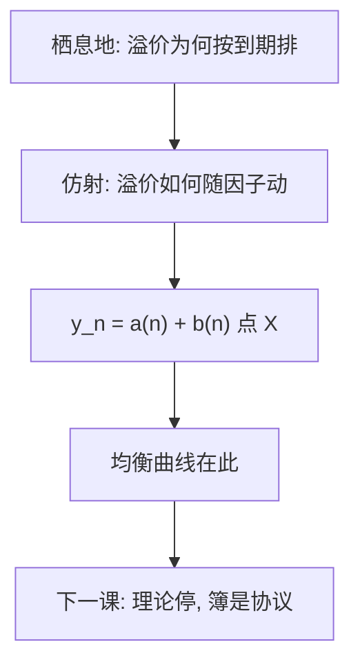

# 仿射期限结构

若短期利率与风险价格对状态仿射，债券价格就是指数仿射，收益率对因子线性；曲线是状态变量的函数，不是某一档国债的挂单价。

<footer>—— Duffie and Kan, A Yield-Factor Model of Interest Rates, Mathematical Finance, 1996；对照 Piazzesi 对仿射期限结构模型的综述</footer>

[上一课](/econ/liquidity-habitat-term)给 EH 补上期限溢价的均衡语言：价格风险、分割、栖息地。$\ell^{(n)}$ 仍是与 $m$ 的协方差，尚未给出一条可处理的动态曲线。本课缺口是仿射期限结构（DTSM 的理论核）：用低维因子生成整条 $y^{(n)}$。不是国债微观结构，不重写限价簿。主干下一课在等式处停，协议从队列处起。

## 问题

栖息地说明 $\ell^{(n)}$ 可以随相对供给与客户群动，但没有给出 $y_n$ 如何随几个状态一起走。Vasicek、CIR 已经是单因子特例：短期利率均值回复，债券价格有闭式。Duffie 与 Kan（1996）把家族收成仿射：状态 $X$ 的漂移与扩散协方差对 $X$ 仿射，短期利率 $r=\delta_0+\delta_1\cdot X$，风险中性下仍仿射，则零息价格 $P(n,X)=\exp(A(n)+B(n)\cdot X)$，到期收益率对 $X$ 线性。这就是因子收益率模型。

缺口是把 EH 加溢价写成一个状态空间，而不是把 on-the-run、特殊券、可交割最便宜提前写进本栏。那些是量化栏的券与协议；本课的对象是 $P_n=\mathrm{E}[m^{(n)}]$ 的仿射特化。

仿射：收益率 $y_n$ 对因子线性。高斯仿射里因子正态；CIR 式平方根保证利率为正但破坏高斯。DTSM 是这类动态期限结构模型的统称，不是某一家央行的拟合软件名。

## 方法

在风险中性测度下设定 $X$ 的仿射扩散，选 $r$ 仿射，解 ODE 得 $A(n),B(n)$。物理测度上的风险价格若也对 $X$ 仿射，则两测度的漂移差可识别为期限溢价的来源——正是上一课 $\ell^{(n)}$ 的动态版。因子可以叫「水平、斜率、曲率」，那是载荷 $B(n)$ 的形状，不必先有主成分故事。

Piazzesi 的综述把识别、测量误差、宏观因子（货币政策规则进 $X$）写成同一家族的扩展。本课只取 Duffie–Kan 的核：闭式来自仿射，不是来自「国债流动性分层」。相对供给若被写进 $X$ 的一个分量，栖息地与仿射可以接；盘口厚度仍不是 $X$。

### 不要把 $y_n$ 当成某一档报价

模型产出的是贴现函数。哪一张券、哪一个到期惯例、是否 cheapest-to-deliver，是把贴现函数映射到发票价格的约定。本栏不进入这些约定，以免把 DTSM 吞进微观结构。下一课 [到限价簿](/econ/to-limit-order-book)会把这句话执行到底：理论停；簿是协议。

## 机制

机制是指数仿射把条件期望变成 ODE。无套利要求同一 $X$ 给所有到期定价；载荷 $B(n)$ 描述久期对因子的敏感，期限溢价是风险价格乘这些敏感。EH 是风险价格为零（或与债券回报不相关）的特例；Hicks 式流动性偏好对应风险价格使长端 $B(n)$ 贡献正的 $\ell^{(n)}$。供给冲击若移动栖息地，在仿射里表现为 $X$ 或风险价格的跳，仍是均衡状态，不是某一档时间优先。

货币政策可以把短端钉在规则上，长端由 $B(n)$ 把预期与溢价推出去——非常规政策扭的是 $X$ 里的期限供给或风险价格，上一课已经留过通道。本课不估计 QE 基点。

Duffie and Kan, *Mathematical Finance* 1996。Piazzesi 的 Handbook 章节是对照综述。不要发明 arXiv。不要把仿射写成「三因子股票模型」的债券版；截面股票因子在量化栏。

## 边界

不要在本栏做 Fama–Bliss 回归，不要拟合 Nelson–Siegel 再宣布栖息地被证实。也不要把国债 ETF、期货基差、回购特殊券写进来。因子实证与交易协议一律换栏。本课之后不是再写一个均衡模型，而是承认曲线上的数字还没有交易程序。

后课默认：仿射 DTSM 用低维状态生成整条收益率曲线，期限溢价是仿射风险价格；这不是微观结构。下一课把本栏主干停在限价簿之前。打开 [/quant/lob-structure](/quant/lob-structure) 时，只携带「应当有一个均衡价格」，不携带队列几何，也不携带哪一档国债的挂单。

高斯仿射可以让利率为负；那是模型代价，不是对 ZLB 的描述。平方根与影子利率是后补，本课不展开。

宏观因子（通胀、产出缺口）可以放进 $X$，使短端规则与长端溢价在同一个仿射里。那仍是均衡 DTSM，不是把 Phillips 曲线画到国债盘口上。测量误差、调查利率、或用掉期代替国债，属于把 $y_n$ 接到哪一套报价，后课交接时一并放下。

本栏读者打开 [到限价簿](/econ/to-limit-order-book) 时，只携带仿射曲线与栖息地溢价，不携带 tick、队列与特殊券。

## 小结

- Duffie–Kan：仿射状态 ⇒ 债券价格指数仿射 ⇒ 收益率对因子线性。
- 这是 EH 与栖息地溢价的动态特化，不是国债盘口理论。
- 主干下一课交接：理论停，簿是协议；不重写限价簿。
- $y_n$ 不是某一档挂单价；特殊券与 CTD 是映射约定，换栏再谈。
- 打开 [/quant/lob-structure](/quant/lob-structure) 时不携带队列几何。
- 高斯仿射可让利率为负，那是模型代价，不是对下限的描述。
- 出处：Duffie and Kan, *Mathematical Finance* 1996；对照 Piazzesi 对仿射 DTSM 的综述。
