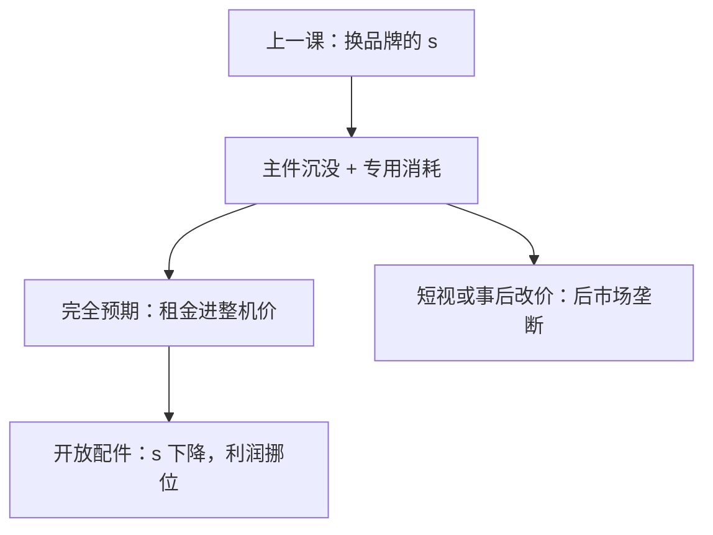

# 后市场锁定

整机可以卖得很便宜，消耗品再收租——若买者买整机时已经算清墨盒，租金会在整机上被打掉；若看不清或事后被锁死，后市场就变成单独的垄断。

<footer>—— 据 Shapiro and Varian, Information Rules, 1999 整理</footer>

[上一课](/econ/switching-costs)（转换成本）。两期价格把 $s$ 写成换品牌的沉淀。本课不重写新老客折扣，也不把 Klemperer 的份额竞争再推一遍。缺口是互补的耐用加消耗：打印机与墨盒、游戏机与卡带、整机与零件。锁定发生在**已经买了主件**之后，后市场的 $s$ 接近「再买一台主件」或「失去兼容」。Shapiro–Varian 把这种锁当信息产业的标准策略。

## 问题

主市场（打印机）与后市场（墨盒）。墨盒与特定主件互补，竞争受专利、芯片、合同限制。若消费者买主件时对生命周期成本 $p_{\mathrm{机}}+\mathbb{E}[\sum p_{\mathrm{墨}}]$ 完全知情，且主市场竞争，则后市场租金会资本化进更便宜的整机——芝加哥「单一垄断租金」：不能在墨盒上再剥一层。缺口是这笔资本化何时失败：短视、信息浑、主市场也被锁、或买后再改墨盒价（敲竹杠）。

与纯转换成本的差别：Klemperer 的 $s$ 是换**同一层**产品的品牌；后市场是互补品，主件已沉没，消耗品的需求短期几乎无弹性。政策争论（配件强制开放、反垄断的 Kodak 式后市场）问的是：整机竞争是否已经保护了买者。

### 生命周期知情则租金前移

完全预期下，加价墨盒等价于整机贵一点；主市场伯川德会把这笔现值打掉，利润仍可接近零。失败条件是买者算不清、或厂商在售后再提墨盒价（承诺问题）。合同、预告价、自有品牌墨盒，是承诺装置；芯片认证是反装置。

Shapiro–Varian 强调锁定的度量：迁移成本、数据、培训、互补品。打印机墨盒是消耗品教具；软件许可证、专用零件是同一逻辑。不要把后市场自动写成「剥削」，先问主市场是否把租金前移。

## 方法

两部：主件价 $F$，单位消耗 $p$。使用强度异质时，这是[两部收费](/econ/two-part-bundling)在互补品上的实现：$F$ 收参与，$p$ 收用量。完全知情、主市场可竞争，$(F,p)$ 的现值被主市场竞争掉。短视买者只看 $F$，厂商压 $F$、抬 $p$，用量扭曲，无谓损失出现在墨盒上。

开放后市场（兼容墨盒）降低有效 $s$，整机加价空间变小，厂商会把利润挪回 $F$ 或减少主件促销。福利取决于原来的扭曲是承诺失败还是价格歧视（高强度用户多付）。主件差异化越强，芝加哥前移越不完全，后市场加价越能留下利润。

本课对象是产品系统：主件加专用消耗。

## 机制

锁定的机制是互补加专用：墨盒对已买机的交叉弹性低，勒纳可以很高。租金前移的机制是主市场的竞争：买者比较生命周期成本，整机需求弹性吸收后市场加价。失败的机制是信息不对称与承诺：售后再优化 $p$，等于对沉淀用户征税，一期整机竞争无法为尚未宣布的加价做补偿。

与网络、双边的叠合：游戏机一边补贴主机、一边从软件抽成，是双边结构加后市场。逻辑上先拆：交叉网络解释为什么要补贴一边；锁定解释为什么软件必须专用。不要用一个「生态」把三课焊死。

承诺装置：公布墨盒价路径、预装耗材包、以旧换新回购，把生命周期写进主件合同，买者才能把租金前移。芯片认证、墨水监控则是反承诺：售后再收紧兼容，等于对沉淀用户加税。政策若只开放后市场而不管主件承诺，厂商会改 $F$，不一定降总价。

芝加哥命题要主市场可竞争且买者理性。主件也差异化、或买者流动性约束只付得起低 $F$ 时，后市场加价不会被完全打掉。Shapiro–Varian 把策略写给厂商：提高 $s$ 的同时，用承诺管理买者预期。

## 边界

主件越差异化，芝加哥前移越不完全。

专利耗尽、平行进口、第三方维修，改的是 $s$ 的法律高度。Kodak 式反垄断争议的核心正是：整机是否已经竞争到把后市场租金打掉。规制强制开放后市场，可能降扭曲，也可能毁两部收费的计量。平台课的独家应用商店是后市场的当代形态，机制仍是专用互补，不必另起一套垄断定义。

平台与锁定课序在此收束。后课默认：后市场势力存在，当且仅当生命周期租金没有在主市场上被打掉；打印机墨盒是教具，不是唯一产业。

本课不把墨盒加价自动写成第二层垄断租金。

## 小结

- 专用消耗品把转换成本写进互补，而不是换同一层品牌。
- 买者算清生命周期且主件可竞争时，后市场租金前移到整机。
- 短视或事后改价，后市场成为单独加价。
- 开放配件降低 $s$，利润会挪回主件，不一定消灭。
- 出处：Shapiro and Varian, *Information Rules*, 1999。
