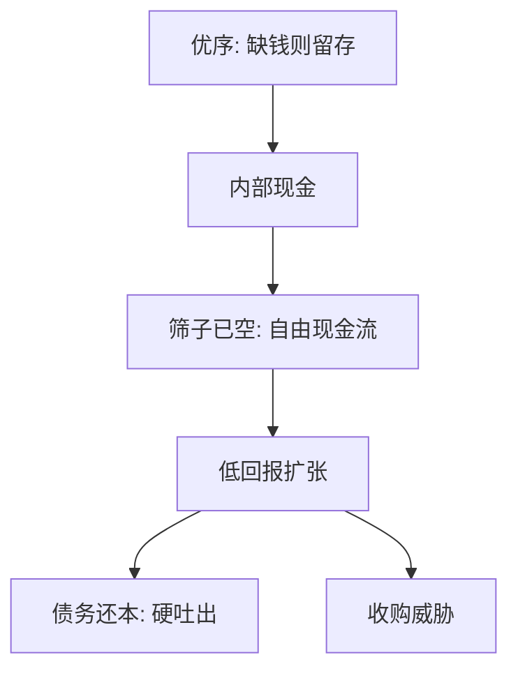

# 自由现金流代理成本

超过正 NPV 项目所需的现金，留在经理手里会变成低回报扩张；债务还本是比许诺更硬的吐出。

<footer>—— Jensen, Agency Costs of Free Cash Flow, Corporate Finance, and Takeovers, American Economic Review 1986</footer>

定位：[上一课](/econ/pecking-order)。Myers–Majluf 已经把内部资金排在发行之前：缺钱时留存最便宜。本课缺口是对称的过量：钱已经多于可置信的好项目时，再按优序囤现金，会把代理成本做大。不重做发股的柠檬折价，不把股利平滑提前写成主线。

## 问题

优序解释「朝 $D^\ast$ 发股很贵」，也解释盈利企业债少、现金多——内部资金先用、少发。若投资机会仍然正 NPV，囤现金是缓冲。若投资机会已经耗尽，同一缓冲变成经理的无监督基金：规模、在职消费、低回报多元化。Jensen（1986）把超过为所有正 NPV 项目筹资之后的可分配现金定义为自由现金流（FCF），并把浪费 FCF 写成股权分散企业的中心代理成本。

缺口不是再找一个融资顺序，而是：在经理追求规模而股东追求价值时，哪一种合同能把 FCF 逼出企业。债务还本付息、收购威胁，是他的两件工具。派息的细节留给[股利](/econ/dividend-fcf)。

FCF 不是会计净利润，也不是经营活动现金流的某一行。它是反事实：正 NPV 筛子用完之后还剩的现金。对象是成熟、高现金流、低成长的企业（Jensen 举石油、烟草），不是正在烧钱的成长企业。

## 方法

把优序与 FCF 放在同一张现金表上，符号相反。优序：内部资金减少柠檬，应保留。FCF：内部资金超过筛子，应吐出。成长约束、信息不对称重的企业靠近前一句；成熟、筛子已空的企业靠近后一句。不要用同一条「现金为王」概括两类。

Jensen 的债务控制假说：承诺未来支付利息与本金，把 FCF 预先抵押给债权人；违约可触发控制权转移，比「我们会派息」更硬。杠杆在这里的好处不是税盾——税盾已在[1963](/econ/mm-corporate-tax)——而是减少经理可处置现金。收购（尤其是杠杆收购）是外部版本：把未来 FCF 写进债务，逼出现金，替换经理。

这与权衡的困境成本方向相反：那边杠杆提高间接破产成本，这边杠杆降低 FCF 浪费。成熟企业的私人最优可以把两边际再权衡一次；本课只钉代理这一边，以免把权衡重写。石油企业在油价高、储量已探明时最接近 Jensen 的样本：FCF 大，再打一口低回报井的私人收益仍可为正。

## 机制

机制是控制权与现金流权分离。现金留在企业，决策权在经理；剩余索取在股东。正 NPV 筛子在经理私人收益随规模上升时不再自动执行——项目的财务 NPV 为负，私人 NPV 仍可为正。债务把未来现金流的决策权按合同转给债权人：不付就转移控制。收购市场把同一转移做成可交易的控制权争夺。

优序没有被逻辑取消。信息不对称下发股仍贵；FCF 说的是**已经在内部的现金**不该为了「以后可能缺钱」而无限期堆积。动态上企业可以在被高估时发股囤现金（优序的预防），也可以在筛子变空时加杠杆吐出现金（Jensen）。两种政策对应生命周期的两端。

### 过度投资不是优序的失败

优序预测被低估时放弃正 NPV（投资不足）。FCF 预测筛子空时接受负 NPV（过度投资）。符号相反，摩擦不同：一个是发行市场的柠檬，一个是已有现金的控制权。用盈利企业的低杠杆去「否证优序」或用石油公司的多元化去「否证权衡」，都是拿错了样本。Jensen 要的检验对象是高 FCF 加低成长。

债务纪律要求有可抵押的、相对稳定的 FCF。成长企业把债务当纪律，会先触发投资不足。工具与样本必须匹配，不能写成「杠杆总是治理。」

## 边界

不要把 Jensen 1986 写成股利政策全文：派息与回购如何平滑、如何被读成信号，是下一课。本课只保留：吐出现金的理由是代理，不是投资者「喜欢支票」。也不要把收购溢价表、LBO 的年代统计写进主干——那是事件，不是合同逻辑。债务纪律在 FCF 不稳定时会先触发[投资不足](/econ/bankruptcy-direct-indirect)，工具选错样本，代理假说看起来像被否证。

后课默认：优序管缺钱时的发行排序；FCF 管多钱时的过度投资。债务可以是纪律，与税盾、与柠檬并列，必须点名是哪一句。下一课用 MM 1961 的股利无关性接住「如何吐出」。

成长企业的现金是优序缓冲。成熟企业的现金是代理弹药。同一科目，两种理论。

不要用「内部融资最好」覆盖筛子已空的情形。那一句是 Myers–Majluf，不是 Jensen。

筛子是否已空，看投资机会而不是看利润表上的现金科目。科目同一，理论不同。

## 小结

- 优序在缺钱时排内部资金；FCF 在筛子空时把内部资金写成代理成本。
- Jensen：债务还本与收购把现金逼出企业，降低过度投资。
- 对象是成熟高现金流企业，不是成长约束企业。
- 出处：Jensen, *AER* 1986。
