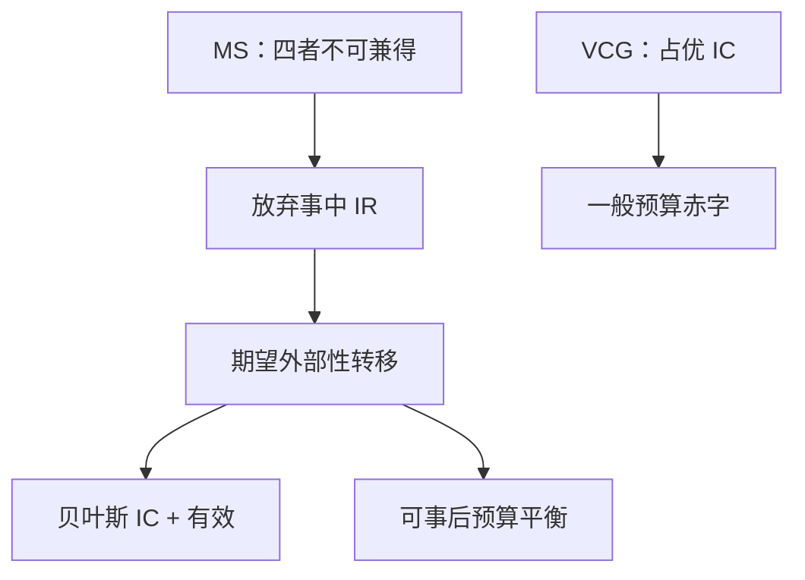

# AGV 期望外部性

每人支付自己对他人期望福利造成的外部性，则有效配置在贝叶斯激励相容下可实施，且转移可以事后预算平衡。

<footer>—— d'Aspremont and Gérard-Varet, Incentives and Incomplete Information, Journal of Public Economics, 1979；Arrow, The Property Rights Doctrine and Demand Revelation under Incomplete Information, 1979</footer>

[上一课](/econ/myerson-satterthwaite)证明：事后有效、事中 IR、IC 与预算平衡不能一起要。缺口是：若放弃事中自愿参与，能否保住有效与平衡？AGV（期望外部性）给出肯定：转移不按枢轴的事后实现来收，而按「对他人类型取期望」的外部性来收。本课钉这条机制，不把无转移的匹配写成拍卖，也不重推 MS 的包络亏空。

## 问题

公共品或双边交易，有效规则 $x^*(\theta)=\arg\max_x\sum_i v_i(x,\theta_i)$。VCG / 克拉克枢轴：每人付自己给别人造成的**事后**福利差，占优策略 IC，但转移一般不平衡（设计者赤字）。AGV：给 $i$ 的转移是

$$
t_i(\hat\theta_i)= \mathbb{E}_{\theta_{-i}}\Bigl[\sum_{j\neq i} v_j\bigl(x^*(\hat\theta_i,\theta_{-i}),\theta_j\bigr)\Bigr] + h_i(\hat\theta_{-i}),
$$

即 $i$ 的报告通过 $x^*$ 加在别人身上的**期望**外部性（外加只依赖别人报告的 $h_i$）。选 $h$ 可使 $\sum t_i=0$ 对每一报告向量成立（事后预算平衡）。

贝叶斯 IC：在共同先验下，报真值最大化期望支付。不是占优策略——先验错了，IC 会坏。

### 不与 MS 矛盾

MS 要事中 IR。AGV 的期望支付对某些类型可以为负：高成本卖家、低估值买家可能「被有效规则强迫参加」，事中宁愿退出。事前 IR（对类型取期望后再比不参与）有时能满足，事中不能——这正是上一课缺口里被放松的那一条。

Arrow 与 d'Aspremont–Gérard-Varet 独立给出期望外部性。课堂上 AGV 常对照 Groves：一个对每个 $v_{-i}$ 都内部化（占优），一个只对分布内部化（贝叶斯）。平衡性来自「期望」把交叉项收成可抵消的 $h_i$。

## 方法

对象：准线性、共同先验、有限或紧类型空间。先取有效 $x^*$，再写期望 Groves 项，最后解 $h_i$ 使预算恒等为零（若期望外部性之和已能写成可分离形式）。检验：偏离报告等于在错误的边际上最大化「自己的价值 + 别人的期望价值」，而真值才对齐社会目标的期望。

公共品、双边交易、团队生产，只要有效规则明确、先验共同，同一套转移。匹配下一课开始没有货币，$t$ 写不出，AGV 用不上。双边交易教具：有效规则是 $v\ge c$ 则成交，期望外部性让买家承担「自己的报告如何改变卖方的期望剩余」，预算用 $h$ 对冲；低 $v$、高 $c$ 的类型事中可能为负，正是 MS 卡住的那些端点。

## 机制

占优策略要求对每一对手报告都内部化，转移被钉得太死，加总留赤字。贝叶斯只要求对先验平均内部化，设计者多出一组 $h_i(\theta_{-i})$ 的自由度，正好用来平衡预算。代价是执行依赖「大家都按这个先验算期望」；先验不是共同知识时，AGV 的 IC 比 VCG 脆。

事中 IR 失败的几何：有效规则会让「不该交易」的报告组合仍按期望外部性付钱——极端类型承担了为别人的效率付账。MS 把这些人的事中支付托在保留效用之上，于是预算裂开。AGV 不托，预算能合上。

### 团队与公共品是同一会计

团队里每人报边际产出，AGV 让每人承担对其余产出期望的影响，平衡时总奖金不靠老板贴钱。公共品里每人报 MRS，期望林达尔式转移可平衡，但低需求类型可能事中亏损——与「自愿贡献不足」不同：这里是强制规则加转移，不是纳什自愿供给。

若坚持占优策略 IC 又要平衡，一般只剩下无弹性的机制（Green–Laffont）。贝叶斯是换来平衡与有效的那一层。后课 Gale–Shapley 连转移都没有，解概念改成稳定，不再用 $t_i$。

## 边界

相关类型、没有共同先验、风险厌恶，期望外部性不必 IC。动态、重新谈判会把 $h_i$ 的承诺掀掉。也不要把 AGV 写成宏观转移支付或限价簿手续费。

后课默认：放松事中 IR 之后，有效 + 贝叶斯 IC + 预算平衡可用 AGV 实施。下一课进入无货币的双边匹配：稳定配对，不再靠转移内部化外部性。

## 小结

- MS 卡住是因为事中 IR；AGV 放弃它，保住有效与平衡。
- 转移按对他人的期望外部性来收，IC 是贝叶斯的，不是占优。
- VCG 更强的 IC，一般不平衡；AGV 相反。
- 没有共同先验或没有货币时，这套转移写不出。
- 出处：d'Aspremont and Gérard-Varet, *JPubE*, 1979；Arrow, 1979。
