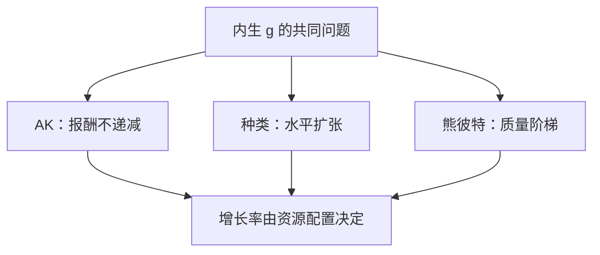

# AK、种类与熊彼特

内生增长可以是资本报酬不递减、可以是品种扩张，也可以是旧产品被新产品摧毁；三句话不要写成同一个研发部门。

<footer>—— Rebelo, JPE 1991 的 AK；Romer, JPE 1990 的种类；Aghion and Howitt, Econometrica 1992 的创造性破坏</footer>

[上一课](/econ/endogenous-growth)已经用 Lucas 的人力资本与 Romer 的溢出/研发，把 $g$ 从索洛参数里解放出来，并声明创新被写成平滑的 $\dot{A}$、没有熊彼特式企业微观。本课的缺口是把三条**不同的技术故事**分分工：AK 刀刃、种类扩张、质量阶梯上的创造性破坏。错配下一课会说明加总 $A$ 还可以来自配置；本课先把「技术如何内生」分成三套机制，不把人力资本积累再推一遍。

## 问题

内生增长课给出「知识非竞争 $\Rightarrow$ $g$ 可被资源移动」。经验讨论却把 AK、品种数目与「创新摧毁旧租」混成一句「研发」。缺口是：报酬为何不递减到零，在三套模型里不是同一个答案。Rebelo 的 AK 让可积累要素的报酬恒定；Romer 1990 让中间品种类 $N$ 扩张，最终产品看起来递增；Aghion–Howitt 让质量阶梯上的研发同时消灭在位者的垄断租。本课钉分工，不估计跨国回归。

AK 的 $Y=AK$ 要求广义资本（含人力资本、知识）报酬恰好为 1。它是教学极限，不是观测到的资本份额等于 1。规模效应与刀刃仍在。

## 方法

AK：$\dot{K}=sAK-\delta K$，人均增长 $sA-\delta-n$ 一类，政策改 $s$ 即改稳态增长率。没有过渡到外生 $g$ 的回归。种类：研发生产新蓝图，中间品种类增加提高最终产出；增长靠研发劳动力份额，在位品种继续存在——水平创新。熊彼特：研发瞄准更高质量，成功则取代旧品种，租从旧垄断转到新垄断——垂直创新，均衡里含有意的破坏。

社会最优：AK 往往没有研发外部性（若 $A$ 是私人资本）；种类模型有知识溢出与垄断扭曲；熊彼特还有商业窃取——私人研发可能过多或过少，符号不定。上一课「分散研发通常不足」主要对应溢出；本课不允许把那句话抄到创造性破坏上当定理。

### 三种故事不要共用同一政策按钮

专利长度在种类模型里权衡静态扭曲与发明激励；在质量阶梯上还改变取代速度。教育补贴更贴近 Lucas，不是 Aghion–Howitt 的工业组织。把「提高 $s$」当 AK 政策，在种类/熊彼特里只改水平或改研发的机会成本，不保证同一 $g$ 公式。

## 机制

报酬不递减：要么把知识写进广义 $K$ 且弹性刚好为 1，要么用种类使加总像递增，要么用质量使「有效 $A$」沿阶梯跳。熊彼特的微观是：在位者知道自己会被取代，研发既创造又毁灭现值；均衡增长率依赖研发生产力与市场结构，不是外生 $g$。创造性破坏使企业微观出现又消失——上一课故意平滑掉的那一块。

半内生修正（$\phi\lt 1$）对三种故事都可能需要，否则规模效应过强。本课保留分工，不选「唯一正确」的内生增长。

Lucas 人力资本仍是第四条常见主干：积累对象是 $h$ 而不是中间品种类或质量阶梯。上一课已经写过，本课不重推 $\dot{h}$。经验讨论里「东亚靠教育」更贴近 Lucas，「新产业替代旧产业」更贴近熊彼特，「品种变多」更贴近 Romer 1990。把三者都叫「内生增长政策」会把教育补贴、专利与反垄断焊成同一个按钮。

AK 对索洛的翻转最干净：$s$ 改增长率。种类与熊彼特里，$s$ 改的是资本密度或研发的机会成本，稳态 $g$ 由研发部门参数决定。不要用 AK 的比较静态去读另外两套模型的税率实验。

Romer 1990 的品种仍在市场上并存；Aghion–Howitt 的旧品种被踢出。经验上两者都有：新产品线与替代性创新。加总 TFP 看不出你用的是哪一套。

## 边界

本课不把熊彼特写成股市上的创造性破坏指数，也不把 AK 当发展中国家的储蓄政策。短期失业、货币仍不在增长主干。错配可以使加总 $A$ 在技术不变时变动——下一课；本课的 $A$ 仍是「生产函数里的技术故事」，不是残差的全部。CIP 与资产定价不在此检验这三种模型。

索洛残差看不出你用的是哪一套故事：品种增加、质量跳升与广义资本积累都可以表现为 $\Delta\ln A$。政策实验必须先声明机制。黄金律在三种模型里都要重写计划者问题，本课不把修正黄金律抄过来当 AK 的 $s$。

规模效应：种类与熊彼特的早期版本里人口越大 $g$ 越高；经验上跨国 $g$ 并不随人口线性上升，半内生把知识弹性降到 1 以下。AK 没有这条人口通道，刀刃改在资本报酬。三种故事的「政策改 $g$」含义因此不同，不能共用同一张政策表。

后课默认：谈到内生技术，能区分 AK、种类与质量阶梯，不把三者写成同一个 $\dot{A}=\eta L_A A$。下一课问：资源错配如何表现为同一个残差。

## 小结

- 内生增长课给出 $g$ 可被动；本课把机制分成 AK、种类、熊彼特。
- AK 是报酬恒定的刀刃；种类是水平扩张；熊彼特是取代式垂直创新。
- 研发不足不是定理：创造性破坏下私人激励可过高。
- 加总 $A$ 看不出故事；错配是残差的另一来源。
- Lucas 人力资本仍是上一课的主干，本课不重推。
- 出处：Rebelo, JPE 1991；Romer, JPE 1990；Aghion and Howitt, Econometrica 1992。
