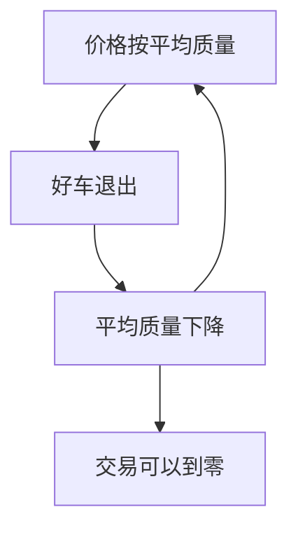

# Akerlof 柠檬市场原文

质量不确定时，买方按平均质量出价，卖方只把次品投入市场，市场可以萎缩到零。

<footer>—— Akerlof, The Market for "Lemons": Quality Uncertainty and the Market Mechanism, Quarterly Journal of Economics 1970</footer>

附录对照。主干[逆向选择与柠檬市场](/econ/akerlof-lemons)已用这篇当机制默认。本篇对照 **1970 原文的问题设定**：不是贝叶斯博弈的精炼，而是「信息不对称如何让瓦尔拉斯市场失灵」。上一篇附录停在 Debreu 的完全信息竞争；这里从同一竞争语言里把质量改成私有信息。

## 问题

原文从二手车起笔。卖者知道车是好车还是柠檬，买者只知道市场上的平均质量。若价格按平均质量定，好车的保留价值高于该价格，好车退出，平均质量再下降——逆向选择的螺旋。Akerlof 要说明的缺口是：这不是交易成本的小扰动，而是市场可以完全消失。Gresham 法则被拿来当类比：坏的驱逐好的，但这里驱逐发生在质量不可验证、而非法定劣币。

文章后半把同一结构搬到保险、少数族裔就业、信贷与发展中的资本市场——论证这是一种普遍的市场失灵，不是汽车业轶事。担保、品牌、执照被写成对抗逆向选择的制度，而不是道德说教。

题名中的 lemons 是美式口语的次品车。模型用连续质量与线性效用的简单供需，没有信号、没有筛选合同。那些是后两篇附录。

## 方法

设质量 $q$ 均匀分布，卖者保留效用为 $q$，买者对同一 $q$ 的评价更高（例如 $\frac{3}{2}q$）。买者按市场平均质量出价。均衡要满足：愿意出售的集合与买者信念一致。原文展示可以没有交易，或只留下最差的一层。关键假设是价格不能按个体质量条件化——因为买者看不见 $q$。

没有博弈论术语。没有「类型、策略、完美贝叶斯」。主干课用后起的博弈语言重写了同一螺旋；附录对照的是原文用供需语言就写完了失灵。

## 机制

机制是信念与供给集合的联立。价格既是支付，也是对留下的质量的推断；推断反过来决定谁留下。Debreu 的价格只传递稀缺，不传递对方私有信息，所以第一福利定理在这里不适用——不是因为外部性，是因为商品的真实属性未进入买者的消费集描述。担保与品牌把部分质量变成可合同的，等于把商品空间重新变回 Debreu 可写的那种。

### 对照主干柠檬课，不插入均衡课中间

主干[逆向选择](/econ/akerlof-lemons)已用螺旋当机制。本附录对照原文的问题设定：市场为何可以不存在，以及保险、信贷、少数群体就业被写成同一结构。没有信号、没有筛选菜单、没有精炼贝叶斯。那些是后两篇附录与主干后课。把 1970 插进[核等价](/econ/core-equivalence)之后当作「第 5.5 课」，会打断一般均衡的福利链。

*QJE* 84(3), 1970, 488–500。题名里的 lemons 是次品车的口语。不要发明 arXiv。

## 边界

原文没有解决「为什么还会有新车市场、为什么有检测」。它点到制度，不建模信号成本——下一篇 [Spence 1973](/econ/spence-1973) 才把可观察行动写成分离工具。也不要把 1970 的信贷例子读成已经包含 Stiglitz–Weiss 配给：那是另一篇。引用时用 *QJE* 1970，不要把后来教科书的均匀分布数字当成原文独有的定理编号。

这与 Diamond–Dybvig 挤兑不同：那里质量可以公开，坏均衡来自序贯服务。柠檬是质量随参与集内生恶化。

也不要与道德风险混淆：签约前的隐藏类型，不是签约后的隐藏行动。

原文没有计量表。二手车数据检验是后来文献。担保与品牌在原文是点到的制度，不是已经写成的信号博弈。

把 1970 插进一般均衡课序中间，会打断福利定理链。对照链接指向主干柠檬课即可。

## 小结

- 附录对照 Akerlof 1970：不可观察质量使平均定价驱逐好车，市场可关闭。
- 方法是供需加一致信念，不是信号博弈。
- 制度（担保、品牌）被写成对抗逆向选择，而不是附录外的伦理。
- 出处：Akerlof, *QJE* 1970。
