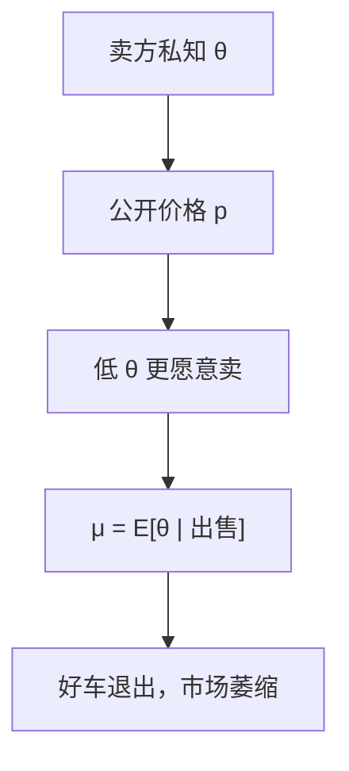

# 逆向选择与柠檬市场

卖方知道车的质量，买方只看见市场上的平均质量；价格下降驱逐好车，市场可以收缩到柠檬。

<footer>—— Akerlof, The Market for “Lemons”: Quality Uncertainty and the Market Mechanism, QJE, 1970</footer>

[上一课](/econ/school-choice)（学校选择）。给了隐藏类型下的信念与序贯理性。缺口是把类型读成商品质量，把「信号」先取最瘦的一种：价格本身。卖方知情、买方不知情，又没有教育、担保、菜单去分离，只剩一个公开市价。Akerlof 证明：这个市价会通过逆向选择把好车逐出，第一定理的商品空间再次列不全——列不全的是质量。本课钉柠檬，不写发送者先动的信号。

## 问题

质量 $\theta$ 是卖方类型，分布 $F$ 为共同先验。卖方保留效用随 $\theta$ 升，买方对 $\theta$ 的评价也升，且买方评价高于卖方（否则无贸易增益）。买方只看见是否成交与价格，看不见 $\theta$。给定价格 $p$，愿意出售的是 $\theta\le\hat\theta(p)$ 的车，市场上的条件期望质量 $\mu(p)=\mathbb{E}[\theta\mid\theta\le\hat\theta(p)]$ 随 $p$ 下降而变差。

买方最多愿付 $\mu(p)$ 对应的评价。若该评价低于 $p$，这个价格出不清。可能没有任何 $p$ 使「愿意买平均质量」与「该价格下愿意卖的集合」一致，互利交易全部消失。即使有均衡价格，好车仍可能卖不掉。这是逆向选择：参与决策本身携带类型信息，把条件分布朝坏的方向推。

### 逆向选择不是道德风险

这里行动（卖或不卖）在质量已实现之后，质量是隐藏类型，不是隐藏努力。隐藏行动是后课。柠檬里即使人人诚实报质量，只要质量不可验证、不可写入合同，问题仍在——缺的是可签约的商品维。

Akerlof 的数字教具：质量均匀分布，卖方评价等于质量，买方评价是质量的倍数。需求取决于平均质量，供给取决于价格切断点，两者可以不相交。附录课读 1970 原文；本课只把机制接入 PBE：卖方策略是类型依存的出售阈值。

好车的卖方保留效用高，给定 $p$ 更不卖。
切断从下往上吃供给，条件期望质量被拉低，这是逆向选择的会计，不是偏好变坏。
互利交易可以全部消失，即使买方对每辆车的评价都高于卖方。

## 方法

把市场写成买方竞争（或一个代表性买方）加卖方类型连续统。均衡价格使需求等于该价格下的供给，且买方信念等于该供给集上的条件期望——路径上的贝叶斯。若只有一个价格、没有其他信号，分离做不到：不同 $\theta$ 要么都卖、要么按阈值切断，是混同或半混同。

担保、品牌、强制检验是把质量重新变成可签约商品，或变成下一课的昂贵信号。本课先让市场只靠价格，才能看见失灵有多干净。

## 机制

价格有两个角色：支付手段，以及切断供给集合。第二角色制造逆向选择：提高 $p$ 能拉进更好的车，也必须付更多；降低 $p$ 更便宜，但平均质量更差。买方的支付意愿绑在 $\mu(p)$ 上，可以没有不动点，或不动点丢掉大量增益。这是 PBE 的混同（或半混同）在商品市场上的实现：单一公开价格无法让高 $\theta$ 付一份只对自己便宜的鉴定，切断点把好车留在场外。

这与[核](/econ/core-equivalence)的对照：质量不可验证时，联盟无法用「带着好车走开」来阻塞，因为走开后买方仍看不见。核与竞争均衡一起建立在可描述商品上；柠檬是描述失败。第一定理并没有算错，是商品空间少了一维「可验证质量」。

## 边界

若买方也有私型，双边逆向选择更狠。若有廉价交谈，不可验证时仍无用。竞争保险里的逆向选择是同一逻辑，Rothschild–Stiglitz 还加了菜单，那是筛选课。Akerlof 原文的「平均质量随价格」是局部市场故事，不是一般均衡存在性反例的全部；但足以推翻「有增益必有交易」。

强制公开、最低质量标准是另一条路：把 $\theta$ 的一部分变成可验证商品，切断集合被法规改写，不是被价格切断。本课不把标准写成最优机制。

后课默认：隐藏类型且不知情方只能看见价格时，逆向选择可以摧毁市场；要分离，需知情者先动（信号）或不知情者先出菜单（筛选）。

### 保险是同一切断，担保是改树

保险里高风险更愿意在给定保费下投保，条件风险变差，保费再赶走低风险。这是柠檬的保单版；菜单与分离留给筛选课。线性教具：$\theta\sim U[0,1]$，卖方保留 $\theta$，买方评价 $(3/2)\theta$。对称信息应全部成交。不对称且供给是「$\theta\le p$」时，$\mathbb{E}[\theta\mid\theta\le p]=p/2$，买方最多出 $3p/4<p$，唯一一致可以是 $p=0$。评价倍数够大时存在部分成交；要点是制度可以摧毁交易。

担保若可验证，等于把质量维补回商品空间，切断不再只靠价格。强制公开、最低质量标准同样改树，不是在原树上找另一个 $p$。买者的折价也不是限价簿价差：没有做市存货，只有平均质量定价。

Akerlof 原文是局部市场故事，不是一般均衡存在性的全部反例；但足以推翻「有增益必有交易」。

## 小结

- 质量是隐藏类型；出售决策使市场上的条件质量变差。
- 价格同时做支付与切断，均衡可以空或不有效。
- 这是逆向选择，不是隐藏行动。
- 担保与信号是后课补上的商品或行动维。
- 出处：Akerlof, *QJE* 1970。
