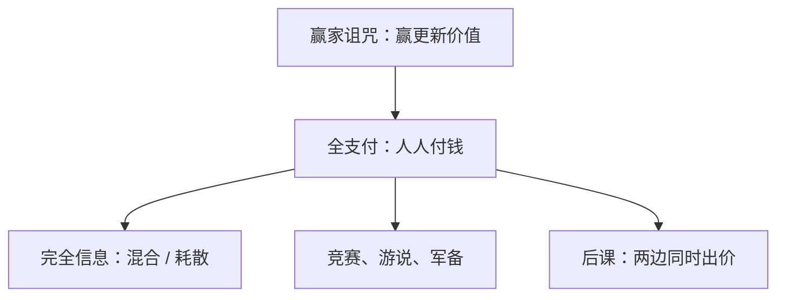

# 全支付拍卖

每人按自己的报价付钱，只有最高者得到奖赏；游说、竞赛与军备是同一场拍卖，输家的支出并不退回。

<footer>—— Baye, Kovenock and de Vries, The All-Pay Auction with Complete Information, Economic Theory, 1996；Rigging the Lobbying Process, American Economic Review, 1993</footer>

[上一课](/econ/winner-curse)把「赢」写成关于共同价值的坏消息，叫价要预先扣减。缺口换成支付规则：不必有共同价值，也可以把钱烧光——游说献金、专利竞赛、晋级考试，所有人支付自己的投入，只有一名赢家。本课钉全支付拍卖，不重写关联与联动，也不把价格发现写成连续簿。

## 问题

完全信息、$n$ 人，奖赏 $v$（可非对称 $v_i$）。每人同时选支出 $x_i\ge 0$，最高者得奖，**所有人支付各自的** $x_i$。两人对称时，纯策略纳什空：若对方出 $x$，自己或略高、或出 $0$；双方都「略高」不可能。混合均衡：支出在 $[0,v]$ 上有连续分布，使对手无差异。

期望总支出可以等于 $v$（完全耗散），也可以在非对称时小于 $v$（弱者很少跟，强者省钱）。Baye–Kovenock–de Vries 给出完全信息下均衡集与耗散公式：弱者的参与把强者的租金压住，但强者仍保有正期望支付。

### 不是一价，也不是消耗战的时钟

一价只赢家付钱；全支付人人付钱。消耗战把支出写成等待时间，结构同构（连续时间两人消耗战 $\simeq$ 全支付），但本课用一次同时叫价，便于接到竞赛。赢家诅咒是信息；全支付是会计——即使 IPV 或完全信息，输家也不退款。

Hillman–Riley 把政治竞赛写成全支付；Tullock 的比率竞赛（赢率 $\propto x_i^R$）是平滑版，纯策略常存在。全支付是 $R\to\infty$ 的极限：最大支出者以概率一获胜。

## 方法

对象：完全信息、不可分奖赏、线性成本。两人对称：混合 cdf $F(x)=x/v$ 于 $[0,v]$，期望支付为零。非对称 $v_1\gt v_2$：弱者在 $[0,v_2]$ 上混合，强者在同一区间混合但在 $0$ 处有原子（正概率出 $0$）。不完全信息 IPV 全支付：对称递增 $b(v)$，遮挡比一价更狠，因为付款不再以赢为条件。

主办方若关心耗散而非配置，可以把奖赏故意给弱者、或公开 handicap，利用非对称压低总支出。这与「提高竞争强度」的直觉相反，但是全支付会计。

收入（主办方收到的总支出）在完全信息对称时等于奖赏；设计竞赛的人关心耗散，不关心「有效配置」——奖赏往往不可分，配置规则就是最高努力者得。IPV 对称时，全支付的递增均衡把几乎整段估值都变成支出：低类型出接近 $0$，高类型仍远低于 $v$，因为付款无条件。主办方收到的期望仍可由后课包络对齐，但选手体验是「输了钱也没回来」。

## 机制

无差异再次出现：多花 $dx$ 提高赢率，但 $dx$ 一定付出，无论输赢。一价里 $dx$ 只在赢的时候付，所以遮挡较薄。全支付把成本做成沉没，均衡要么混合（完全信息），要么把叫价压到远低于估值（IPV）。耗散是租金的去向：社会剩余变成支出，若支出本身无社会价值（纯游说），福利低于把奖赏直接交给指定者。

非对称是设计工具。Baye 等「操纵游说」：故意让强者更强，可以降低总耗散——弱者不跟，强者不必烧那么多。这与「公平竞争提高努力」的直觉相反，却是全支付会计的直接结果。

### IPV 全支付与收入等价

对称 IPV、风险中性、最高估值者赢、最低类型支付为零时，全支付的期望收入仍可以对齐一价 / 二价——后课收入等价已经把支付钉在 $Q$ 上。本课完全信息分支不走那条包络：类型公开，混合把租金耗在支出里，不是信息租金。

预算约束、头奖与参与奖、多人取前 $k$，会改变耗散。实验里全支付常过度支出，与混合无差异难实施有关，不是定义要求「必须亏钱」。

## 边界

努力有外部社会价值（研发）时，耗散不全是浪费。动态、多阶段竞赛、全支付加共同价值，诅咒与沉没支出叠在一起，本课不混写。也不要把全支付写成限价簿的吃单——这里没有对手方队列。

完全信息混合在实验里难实施：无差异对任意密度成立，受试者往往过度支出。设计含义仍成立——奖赏越大、越对称，耗散越狠。要把努力当社会产出，需改支付（部分报销、参与奖），不是改成「鼓励公平竞争」一句话。

后课默认：全支付是人人付款的竞赛；完全信息靠混合，IPV 靠更狠的遮挡。下一课把单边拍卖换成买卖双方同时叫价。

## 小结

- 赢家诅咒改信念；全支付改的是「输家也付钱」。
- 完全信息对称：混合，$[0,v]$ 上均匀，租金耗尽。
- 非对称可降低总耗散；公平不一定提高努力。
- 与消耗战同构，与一价只赢家付款不同。
- 出处：Baye, Kovenock and de Vries, *AER* 1993；*Economic Theory* 1996。
