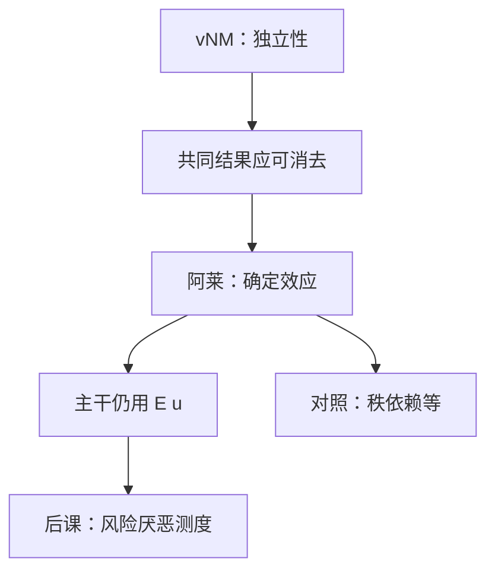

# 阿莱悖论与独立性

共同结果从两张彩票里同时删去之后，排序仍应保持——可实验里同一批人会把这道算术做错。

<footer>—— 据 Allais, Le comportement de l'homme rationnel devant le risque, Econometrica, 1953 整理</footer>

上一课[冯·诺依曼–Morgenstern 期望效用](/econ/expected-utility)用独立性推出 $U(F)=\mathbb{E}_F u$。本课不重讲表示定理，也不另起一套彩票符号。缺口是：独立性在复合彩票上意味着共同混合项可以消掉，但 Allais 的问卷让相当一部分人留下共同项、改变排序。主干仍用期望效用，必须先标明这条公理哪里脆，后课 Arrow–Pratt 才知道自己站在哪一块石头上。

## 问题

取 Allais 的经典四张彩票。$A$ 确定得到一笔中奖；$B$ 以高概率得到更多、以小概率得到零。另一对 $A'$、$B'$ 是把前一对与「大概率得到零」做同样的混合。独立性要求 $A\succsim B$ 当且仅当 $A'\succsim B'$，因为两对之差只是同一个共同结果被加进或拿掉。许多人选 $A$ 而选 $B'$：确定效应让人在第一对里躲开零的可能，第二对里零已经是常态，又去追高期望。

缺口因此不是「人不会算期望」，而是：**共同结果独立性在描述上失败**。若把失败写成新理论，后课的凹伯努利函数、随机占优都要改写。本栏选择：把阿莱当边界对照，主干继续用 $\mathbb{E}u$，但禁止后课假装独立性从未被质疑。

### 共同结果与共同比率是同一公理的两面

共同比率效应把概率按同一因子缩小，独立性同样要求排序不变。经验上它与共同结果一起出现。Machina 的局部期望效用、Chew 的加权效用、Quiggin 的秩依赖，都是放松独立性而保留一阶随机占优之类的弱性质。本课不展开这些表示，只指出：放松点是独立性，不是完备传递。

确定性的 $1$ 与概率 $0.99$ 在 vNM 里只差一个仿射刻度上的小权重。阿莱显示人把「确定」当成质变。这是对线性概率权重的打击。

## 方法

把独立性写成：比较 $F$ 与 $G$ 时，把二者同时与 $H$ 混合，排序不变。阿莱构造的是特别的 $H$——一大块共同的零，或一大块共同的确定中奖。检验只需两对选择，不必估计 $u$。这与显示偏好课的 WARP 同类：成对观测直接打公理，不经过参数。

若坚持 vNM，只能说受试者「算错」或问卷框架不稳定。若放弃 vNM，下一条仍常用的弱化是：一阶随机占优保留、介于独立与完全非线性之间。后课随机占优会在期望效用内部叙述；它也可以在更弱的单调性下叙述，那是边界。

本课不把前景理论写成新主干。概率扭曲、损失参照是另一条文献；货币理论与资产定价课默认仍是 $\mathbb{E}u$。

## 机制

独立性失败的机制是「确定」与「几乎确定」不对齐线性权重，以及共同尾事件并未被决策者心理消掉。vNM 的证明把无差异概率当效用，正是假定这些权重可加减。阿莱等于说：无差异概率在不同共同项背景下不一致，伯努利函数随问卷变，表示崩溃。

对后课的含义是双层的。规范层：若接受独立性作为理性要求，阿莱是偏差，保险与最优风险分担公式仍按 $\mathbb{E}u$ 写。描述层：若要拟合问卷，不要用同一 $u$ 去硬套四张彩票。本栏宏观与公司金融走规范层；问卷本身不当成拒绝保险理论的充分统计。

Allais 原文针对的是 Savage 与 vNM 当时的确定性等价讨论，不是后来的前景理论。引用时不要把 1953 年的悖论写成 Kahneman–Tversky 的附录。

## 边界

实验室彩票的钱小、概率刻度被画在纸上，与市场里的保险、组合选择不是同一菜单。市场数据较少直接复制阿莱四张表。因此主干保留期望效用，不是无视实验，而是对象不同：后课 Arrow–Pratt、随机占优、或有要求权都在市场与理论内部使用 $\mathbb{E}u$。

也不要把阿莱读成「人喜欢风险」。同一批人在第一对里表现得极度厌恶零结果，在第二对里又去追尾。这是独立性失败，不是凹性失败。凹性是下一课在 vNM 内部的缺口。

Ellsberg 打的是未知概率，不是已知概率上的线性。本课序不把模糊引进主干。保险与资产定价后课若改用秩依赖，必须显式声明；默认仍是期望。

后课默认：工作表示仍是 $\mathbb{E}u$；写风险厌恶时不再回头论证独立性。

## 小结

- 独立性要求共同混合项不改变排序；阿莱问卷系统违背这一点。
- 失败打在线性概率权重上，不是打在完备传递上。
- 本栏主干仍用期望效用，把阿莱当描述对照。
- 下一课在 vNM 内部测度凹性，不把悖论改写成「喜欢风险」。
- 出处：Allais, *Econometrica*, 1953；von Neumann and Morgenstern, 1944；Mas-Colell, Whinston and Green 第 6 章。
