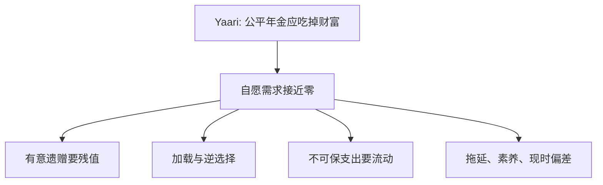

# 年金之谜

公平年金把长寿风险从个人挪到池里；理论说退休者应把大部分财富年金化，市场里他们几乎不买。

<footer>—— Yaari, Uncertain Lifetime, Life Insurance, and the Theory of the Consumer, RES 1965；Davidoff, Brown and Diamond, AER 2005</footer>

[上一课](/econ/bequest-motive)留下终点财富的两种读法。本课缺口是保险市场：Yaari（1965）证明，无遗赠动机且年金精算公平时，最优是把财富全部年金化——活着就有支付，死后无残值，正好对冲寿命。自愿年金需求远低于这一基准，是谜。不重写 $v(b)$。

## 问题

确定寿命下 LCH 不需要年金。寿命随机时，自保要求多留缓冲，死后留下意外遗产。精算公平的终身年金按存活概率支付，欧拉里出现「活着才有下一期」的项，最优持有把非年金财富压到零（Yaari）。Mitchell、Poterba、Warshawsky 与 Brown 以及后续文献记录：私人年金市场规模小，加载（费用、逆选择）高，但即使用加载校正，需求仍低。Davidoff、Brown 与 Diamond（2005）在更一般的偏好与不完全年金菜单下仍得到：应年金化的份额远高于观测。

缺口是在遗赠与市场摩擦之间定位谜，而不是重讲预防性储蓄。

逆选择：长寿者更买年金，推高价格，短寿者退出。这能解释加载，难以单独解释接近零的自愿需求。

## 方法

在 Yaari 基准上逐项放松：有意遗赠给出残值需求；年金相对债券的加载；医疗与长期护理的不可保支出（年金支付在生病时不够灵活）；家族内部风险分担；现时偏差与金融素养使人低估长寿或拖延购买。本课把菜单列清，不把住房与组合之谜提前写完——住房常常充当劣质年金（住着就消费、卖掉才有残值）。

## 机制

年金的机制是条件支付：只有存活状态才给钱，等价于按存活概率提高有效回报。这正是长寿保险。谜是为何家庭拒绝这个更高的条件回报。若 $v(b)>0$，拒绝可以是理性的。若 $v\approx 0$ 仍拒绝，则要么加载过大，要么偏好或信念偏离 Yaari：例如对长寿概率加权不足，或把年金看成「赌自己死得早」。后一类已经踩进前景理论的损失框架，本单元先记账，行为单元再展开。

不把年金报价写成限价簿。精算价格是合同，不是盘口。量化栏若遇到年金二级市场，那是产品微观结构，本课只问家庭为什么不买一级合同。

Yaari 的欧拉多了一项存活概率：活着才需要下一期消费，年金把「死了就停付」写进回报，有效 $r$ 高于债券。拒绝年金等于拒绝这笔条件超额。加载可以把超额吃掉；Davidoff–Brown–Diamond 的要点是：合理加载仍留下应买而未买的份额。行为解释（把年金当赌命）先记账，前景理论课再给 $v$。

## 边界

公共养老金与职业年金已经强制年金化了一块财富，自愿市场小可能是替代而不是谜。本课承认替代，仍留下私人财富中可年金化而未年金化的部分。也不估计最优份额。

后课默认：住房同时提供消费服务与部分长寿对冲，会进一步挤出金融年金——下一课写这个资产。

Yaari 的条件回报来自「死了就停付」；拒绝年金等于拒绝这笔存活溢价。

公共养老金已强制年金化一块，谜留下的是私人财富中可买而未买的份额。

## 小结

- Yaari：无遗赠、公平年金时，财富应全部年金化。
- 观测需求远低：遗赠、加载、不可保支出与行为都能贡献。
- 与意外遗赠同一枚硬币：不买年金，死后才有残值。
- 有意遗赠要残值，与纯意外遗赠的符号相反。
- 把年金当赌命是后课前景理论的记账。
- 出处：Yaari, *RES* 1965；Davidoff, Brown and Diamond, *AER* 2005。
