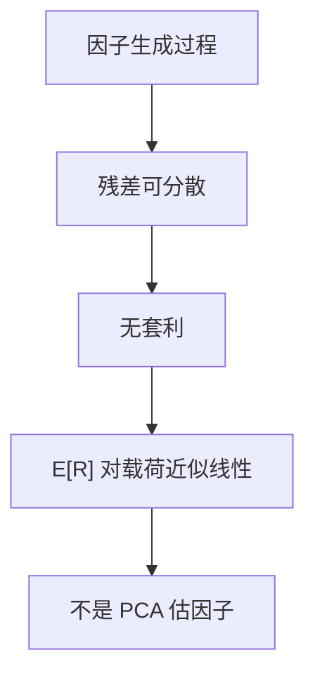

# APT 作为均衡

    
若收益由少数共同因子加上可分散残差生成，无套利要求期望收益近似落在因子载荷的线性定价平面上。

    <footer>—— Ross, The Arbitrage Theory of Capital Asset Pricing, Journal of Economic Theory 1976</footer>

[上一课](/econ/capm-theory)在均值–方差与同质预期下把定价核收成与市场回报线性。本课缺口不是再估一条市场回归，而是：**去掉均值–方差偏好**之后，无套利本身能否给出截面上的线性定价。Ross（1976）的回答是均衡陈述：因子结构加可分散残差 ⇒ 期望收益对载荷近似线性。主成分、风格因子、横截面 $t$ 统计不在本栏，见量化栏 [统计风险模型 PCA](/quant/stat-risk-pca)。

## 问题

CAPM 把「被定价的风险」钉成对市场组合的协方差，因为切点出清成了市场。若投资者并不只关心均值与方差，市场组合不必有效，$m$ 也不必与 $R_m$ 线性。还剩下什么？Ross 假定收益有因子生成过程

$$
R_i=\mathrm{E}[R_i]+\beta_i^\top f+\varepsilon_i,
$$

其中 $f$ 是均值为零的共同冲击，$\varepsilon_i$ 在充分分散的组合里可以忽略。缺口是：在这种结构下，若 $\mathrm{E}[R_i]$ 不是载荷的线性函数，能否构造出风险任意小、超额任意大的套利。能，则均衡（无套利）要求线性定价。这不是「对收益矩阵做 PCA 得到因子」。

近似 APT：残差不必严格正交，只要特异风险可分散，定价误差在大经济里一致地变小。Chamberlain–Rothschild（1983）把近似因子结构写成特征值条件，仍是理论，不是估 $K$。

## 方法

无套利在这里是组合层面的：存在充分分散的零净投资组合，使因子暴露为零、残差风险趋于零，则其期望超额必须趋于零，否则可无限放大。于是存在因子价格 $\lambda$（及零 beta 回报 $\lambda_0$）使得

$$
\mathrm{E}[R_i]\approx\lambda_0+\beta_i^\top\lambda.
$$

这与 SDF 语言一致：若 $m$ 落在因子张成的空间里（或对其投影足够），则只有因子协方差被定价。市场组合可以是因子之一，但不必是唯一因子——APT 不把切点定理再证一遍。

Connor 一类竞争均衡版本把「无套利」换成大经济里的价格接受者；线性关系变成精确的一阶条件。本课采用 Ross 最瘦的无套利陈述，不把存在性再做成角谷习题。

## 机制

机制是分散化切断特异风险与期望收益的联系。一个人可以做多被低估、做空被高估、对冲掉 $f$，剩下的 $\varepsilon$ 在 $N\to\infty$ 时进组合方差的速度不够快——若定价误差不消失，就有免费午餐。因此被定价的是**对共同因子的暴露**，不是名字叫「市场」的某一个指数。因子在理论里是收益生成过程的原语；它们是什么宏观变量、要不要可交易，是后话，不是 1976 年的定理。

### 本栏停在无套利平面，实证换栏

把 $f$ 换成样本主成分、行业收益或 Fama–French 风格，再做时间序列 $\alpha$，对象已经变成可交易（或统计）因子模型。那是量化栏的风险模型，不是把 Ross 改写成估特征值。链接足够：[统计风险模型 PCA](/quant/stat-risk-pca)；市场因子检验仍见 [CAPM 与市场因子](/quant/capm)。本课不排序组合、不写 GRS、不选 $K$。

Chen–Roll–Ross 的宏观因子、Connor–Korajczyk 的渐近主成分，都是对这条线性关系的实施与估计。失败方式（载荷不稳、因子旋转、残差仍有定价）属于估计对象，不是 APT 作为均衡被终审。

## 边界

不要在本栏宣布「APT 比 CAPM 更真，因为因子更多」。多因子是更富的 $m$ 投影，仍需要无套利加可分散残差；没有因子结构，无套利只回到一般的 $0=\mathrm{E}[m R^e]$。也不要把 APT 写成 EMH：线性定价是对期望的形状限制，信息公开速度是另一句话。

下一课离开截面因子，把同一套折现用到不同到期的无违约债券：[期限结构预期假说](/econ/eh-term-structure)。

不要把限价簿上的共同冲击（拥挤、流动性枯竭）写进本课当「APT 因子」。簿是协议，见量化栏；本栏的 $f$ 没有队列。

精确 APT 需要残差在分散后消失。有界非对角的特异协方差只给近似。有套利限制（卖空、资金）时，定价误差可以不消失——那是摩擦，不是把 1976 从主干删掉。

因子必须是共同冲击。把每个行业虚拟变量都叫因子，而不问残差能否分散，线性关系可以是会计恒等而不是无套利。Ross 的锋芒在可分散 $\varepsilon$，不在给 $f$ 起宏观名字。

## 小结

- 因子结构 + 可分散残差 + 无套利 ⇒ 期望收益对载荷近似线性。
- 这是均衡陈述，不依赖均值–方差切点，也不把市场规定为唯一因子。
- 本栏不估主成分、不跑风格横截面；实证见量化栏 PCA。
- 出处：Ross, *Journal of Economic Theory* 1976。
