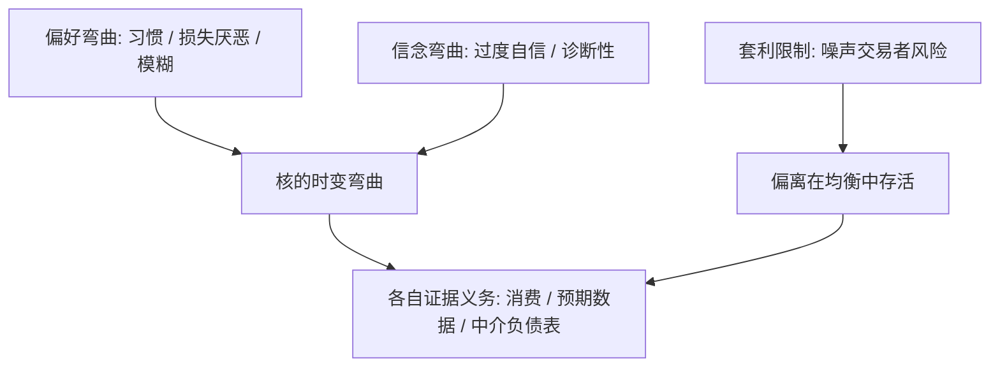
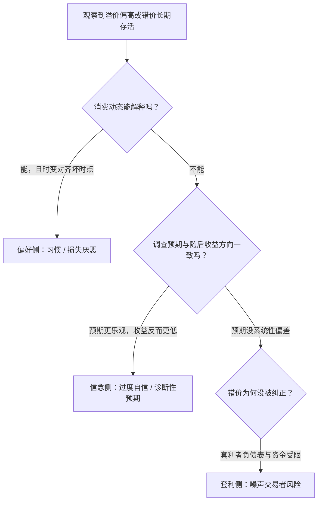

# 行为资产定价的深化

当弯曲不能全推给外生状态，就把弯曲者从状态搬进主体：偏好、信念、套利者的资产负债表，三处都能动手术——但每一处都欠一笔证据。

<footer>—— 据 Campbell and Cochrane, *JPE* 1999；Barberis, Huang and Santos, *Econometrica* 2001；De Long et al., *JPE* 1990 整理</footer>

[上一课](/econ/apt-tail-risk-premia)在保持理性与期望效用的前提下，把左尾装进核的弯曲。缺口是：如果弯曲的根源不在状态而在主体——偏好违反期望效用公理、信念系统性偏离贝叶斯、纠正错价本身有风险——定价的语法要怎么改？本课把三个手术台摆在一起，讲各自怎么改、改出什么可检验含义、各欠哪笔证据。

## 问题

理性框架留下三个残余反常。溢价对风险厌恶的要求仍然偏高，即便装了灾难；预期数据与实现收益方向相反——投资者在市场涨后更乐观，随后收益却更低（Greenwood–Shleifer 2014 的证据，见[调查预期](/econ/survey-expectations)）；价格对红利的反应超过现值模型允许的幅度（[Shiller 过度波动](/econ/shiller-excess-volatility)）。三个反常共享一问：核的时变弯曲从哪里来。把它继续归给外生状态，候选状态越列越多，越像补丁。

Barberis–Huang–Santos 2001 把 Kahneman–Tversky 的损失厌恶系数 λ≈2.25 引入消费资产定价，并让参照点随上一期盈亏移动：账面亏损后投资者更怕再亏，风险厌恶升高——弯曲不再需要灾难状态，账面盈亏本身就是状态变量。

「核的弯曲」翻译成白话：把未来的钱折算到今天的「汇率」不是常数——坏时候一元更值钱，好时候一元更不值钱。理性模型让这个汇率只随外生状态（衰退、灾难）弯；行为模型说，它还会随人的心情（参照点）、想法（信念偏差）、钱包（套利者资金）而弯。

## 方法

三个手术台，各动一处。偏好侧：习惯形成让风险厌恶随剩余消费比率时变（Campbell–Cochrane 1999，见[习惯形成](/econ/habit-formation)）；损失厌恶把价值函数钉在参照点上并随前次盈亏移动（[前景理论资产定价](/econ/prospect-theory-asset-pricing)）；模糊厌恶连概率测度一起换（[Ellsberg 模糊](/econ/ellsberg-ambiguity)、[maxmin 期望效用](/econ/maxmin-eu)）。信念侧：对信号精度的过度自信（[DHS 过度自信](/econ/dhs-overconfidence)）、保守性与代表性（[BSV 情绪模型](/econ/bsv-sentiment-model)）、诊断性预期（[诊断性预期](/econ/diagnostic-expectations)）分别改写贝叶斯更新的不同环节。套利侧：即便价格错了，纠正它要先承担让它更错的风险——[噪声交易者风险](/econ/noise-trader-risk)（De Long–Shleifer–Summers–Waldmann 1990）与[套利限制](/econ/limits-to-arbitrage)（Shleifer–Vishny 1997）给出偏离在均衡里存活的资金条件。第三课的异质信念是信念侧不需要偏差的特例：那里只需分散，这里连贝叶斯也可以不要。

## 机制

三条路在核的语法里同构：都是让弯曲时变化、并对齐到坏时点——习惯在衰退时弯曲，损失厌恶在亏损后弯曲，噪声交易者风险在套利者被挤出时弯曲。区别在证据义务：偏好模型要过第二课的界并核对消费动态；信念模型要过预期数据——调查测得的预期与随后收益的对照；套利模型要报套利者的资产负债表与资金成本。处置效应（[处置效应](/econ/disposition-effect)）是损失厌恶留在交易记录里的指纹，把实验参数与市场行为接起来。机制上最要紧的一点：套利限制不是理论豁免，而是均衡条件——偏离能存活，是因为消除它的交易有风险有成本，这句话本身必须被数据支持。

上一张图并列了三个手术台；这一张回答另一个问题：拿到一份市场数据，怎么按证据义务把三条路逐一排查——这正是「判别要靠第三类证据」的操作化。

数字实例：λ≈2.25 意味着亏 1 万元带来的痛苦约等于赚 2.25 万元带来的快乐。于是账户浮亏后，同样波动的股票在心里显得「更危险」，必须给出更高的期望补偿投资者才肯继续持有——这是「账面亏损后溢价升高」最直接的微观来源。

## 边界

行为建模的代价是可证伪性弱：偏差清单开放，「一个偏差救一个异常」的补丁式结构难以整体否证。实验校准的参数（λ≈2.25）搬进市场要跨场景保持，这一步常常没有检验。与理性模型的区分在数据上困难：习惯与长期风险、灾难与诊断性预期，可预测性预言常常相似，判别要靠第三类证据（预期数据、微观账户、中介头寸），而这正是下一课的流水线要处理的事。不要把行为当成免检标签：改了偏好或信念，第二课的界一寸不让。

常见误区：初学者容易以为「行为金融 = 推翻理性定价」。实际上本课的纪律恰好相反——无论怎么改偏好或信念，无套利与欧拉方程的约束一寸不让；行为只是给「弯曲从哪里来」换了一批候选来源，可证伪的要求反而更严。

## 小结

- 三个手术台：偏好弯曲、信念弯曲、套利限制；前两者改核，第三个解释偏离为何存活。
- 三条路同构——让弯曲时变并对齐坏时点；区别在各自欠的证据义务。
- 损失厌恶的 λ≈2.25 加参照点移动，让账面盈亏成为状态变量，是行为侧最紧凑的定价机制。
- 行为不是免检标签：界照常适用，判别要靠第三类证据而非拟合优度。
- 出处：Campbell and Cochrane, *JPE* 1999；Barberis, Huang and Santos, *Econometrica* 2001；De Long, Shleifer, Summers and Waldmann, *JPE* 1990；Shleifer and Vishny, *JF* 1997。
