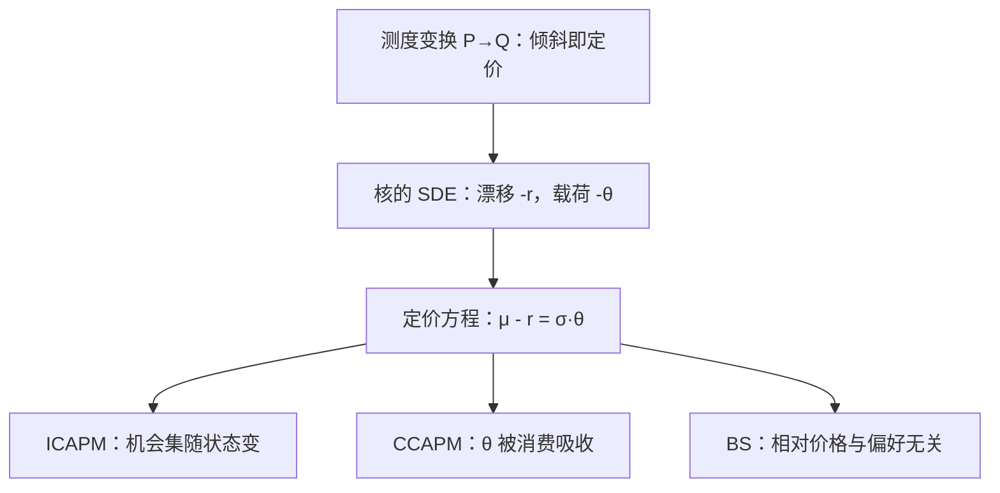
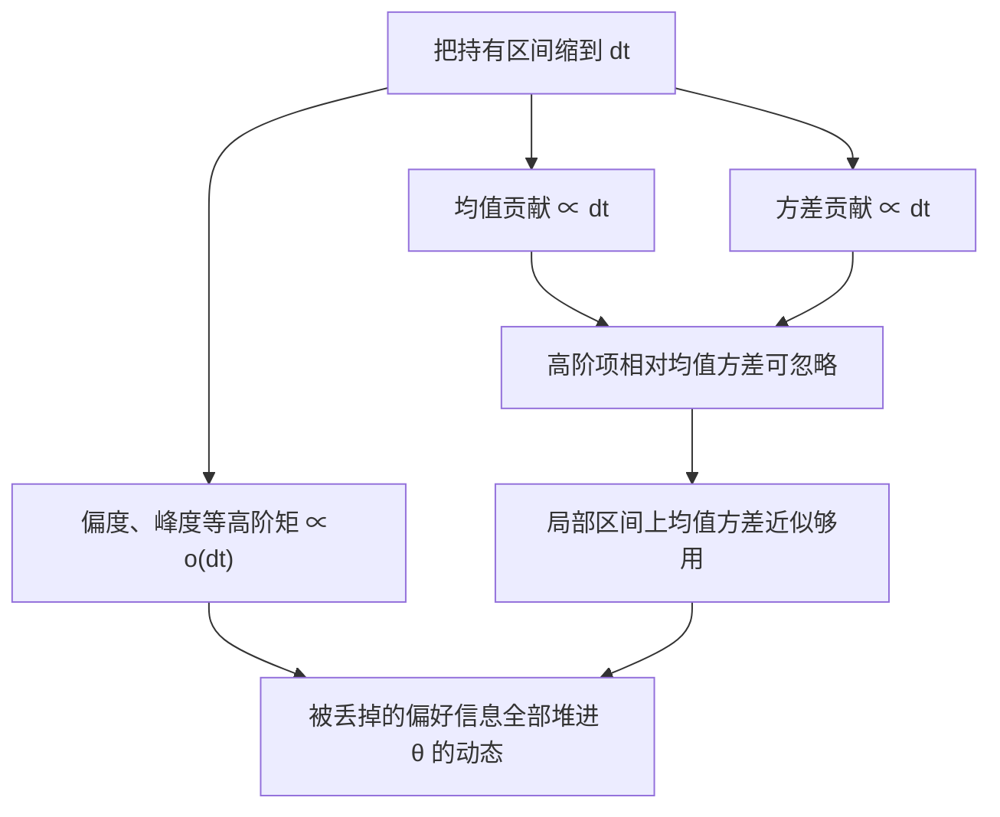

# 连续时间资产定价

连续时间把定价收成一条微分方程：漂移之差与载荷成正比，比例向量就是市场愿意为每一单位风险付的价格。

<footer>—— 据 Merton, Econometrica 1973；Cochrane, Asset Pricing, 2005 年修订版 整理</footer>

[上一课](/econ/pm-specification-map)把预测与机器学习计量收在目标声明、主结果保护与可复现三件套上，那门课程到此收束。本课是「资产定价理论深化」的第一课，从一条旧账说起：定价的需求一侧，[布朗运动与伊藤引理](/econ/brownian-ito)给了微积分的 license，[连续时间预算约束](/econ/continuous-time-budget)与[Merton 组合问题](/econ/merton-portfolio-theory)写了需求方程，主干课末的[多期消费组合](/econ/multi-period-consumption-portfolio)把多期版本收拢；但定价方程一侧还只在特例里出现过（[Black–Scholes 作为均衡结果](/econ/bs-as-equilibrium)、[连续时间 CAPM](/econ/continuous-time-capm)）。本课把两侧合成一个对象：核的随机微分方程，让 ICAPM、CCAPM、期权定价都成为它的特例。后课默认已经读完本课。

## 问题

离散时间的核 $m_{t+1}=\beta u'(c_{t+1})/u'(c_t)$ 回答「下一期一元值多少」，回答不了「此刻价格如何随状态微分」。机会集连续变化时，欧拉方程要写在每个无穷小区间上：溢价、无风险利率、对冲需求不再分期出现，而是同时挤进一条漂移方程。缺口是：[随机折现因子](/econ/stochastic-discount-factor)在连续时间里的动力学长什么样，它对每只资产的开价如何读出。

### 核的 SDE 与定价方程

设核服从

$$
\frac{dm_t}{m_t}=-r_t\,dt-\theta_t^{\top}\,\mathrm{d}W_t ,
$$

漂移取 $-r_t$ 不是假设，是定义：核自身对应的「资产」必须给无风险利率，否则一元下期与一元本期之间没有账可平。任意资产若

$$
\frac{dp_t^i}{p_t^i}=\mu_t^i\,dt+\sigma_t^{i\top}\,\mathrm{d}W_t ,
$$

则[连续时间预算约束](/econ/continuous-time-budget)下的欧拉条件立刻给出定价方程

$$
\mu_t^i-r_t=\sigma_t^{i\top}\theta_t .
$$

$\theta_t$ 是风险的市场价格向量：资产要求的风险补偿，等于它对 $\mathrm{d}W$ 的载荷点乘核的载荷。这与[等价鞅测度](/econ/equivalent-martingale-measure)说的是一件事——$\mathbb{P}\to\mathbb{Q}$ 的测度变换密度正是 $m_t$ 乘货币账户，倾斜的强度就是 $\theta_t$（[状态价格到 SDF](/econ/state-price-sdf-bridge) 的连续版）。

夏普按 $\sqrt{dt}$ 缩放：年化 0.5 的夏普比率，月度只有 $0.5/\sqrt{12}\approx 0.14$。所以「瞬时定价方程」不能拿月度收益直接去套——先把频率换算做对，是这条路线最常翻车的簿记。

$\theta_t$ 叫「风险的市场价格」，可以读成市场给每单位不可分散波动开出的补偿费率。数字实例：若 $r=2\%$、某资产波动 $\sigma=20\%$、$\theta=0.3$，则定价方程给出期望收益 $\mu\approx 2\%+20\%\times 0.3=8\%$——补偿只看波动的大小和费率，不看资产的名字。

## 方法

三条特化各取一个方向。[ICAPM](/econ/icapm-merton)：当 $r_t$ 与 $\theta_t$ 随状态 $z_t$ 变动，期望收益成为状态的函数，组合一侧的[对冲需求](/econ/hedging-demand-origin)与定价一侧的时变 $\theta_t$ 是同一枚硬币——Merton 1973 把它们写成同一个均衡。CCAPM：取 $m_t=\beta e^{-\delta t}u'(c_t)$，$\theta_t$ 被 $c_t$ 的载荷吸收，溢价与消费 beta 成正比（[消费 CAPM](/econ/ccapm)）。BS：相对价格（期权对标的）的定价方程里 $u$ 被复制消掉，剩下的只是让该 $\mathbb{Q}$ 出现的核（[Black–Scholes 作为均衡结果](/econ/bs-as-equilibrium)）。

跳跃要单独记账。若 $dp^i/p^i$ 还含一项跳跃 $\int z^i\,\tilde\nu(\mathrm{d}t,\mathrm{d}z)$，定价方程变成 $\mu_t^i-r_t=\sigma_t^{i\top}\theta_t+\phi_t^i$：跳跃有其自己的风险价格 $\phi_t^i$，纯扩散的 $\theta_t$ 不给它开价。这一项正是后面尾部风险一课的入口，本课只立账。

直觉类比：$\sigma^\top\theta$ 是为「连续颠簸」付的保费，$\phi$ 是为「突发坑洞」另买的一份保单。只持有前一份保单（纯扩散定价方程）的组合，遇到 2008 式的跳空行情就拿不到赔偿——这正是尾部风险要单独立账、单独定价的原因。

## 机制

定价方程为什么这么便宜：在 $dt$ 上，收益分布的高阶矩都是 $o(\mathrm{d}t)$，均值与方差吞噬一切——所以连续时间天然把「均值方差即期望效用」的许可证（对照[均值方差与期望效用](/econ/mean-variance-eu)）发给了局部区间，二阶以上的偏好信息全部堆进 $\theta_t$ 的动态。这既是威力也是代价：方程对「此刻」极有效率，对「核从哪里来」保持沉默，$r_t$ 与 $\theta_t$ 的动态必须由均衡另给——[CIR 一般均衡利率](/econ/cir-general-equilibrium)就是给 $r_t$ 找均衡来源的一次尝试。

第一张图画的是定价方程的家族树；这一张拆的是「为什么方程这么便宜」——区间缩到无穷小时，各阶矩的量级赛跑如何让均值方差独占定价权。

常见误区：以为连续时间模型是在假设「价格真的每一瞬间都在连续交易」。它其实是一套极限装置——把区间切到无穷小，数学最干净、方程最简洁；真实数据仍是离散采样，落地时必须做频率换算，别把装置当成对报价机的描述。

## 边界

瞬时方程不是实证区间：可观测的只有离散采样，$\theta_t$ 的点识别要靠本课程第二课的投影逻辑。跳跃与随机波动破坏精确复制，[资产定价基本定理](/econ/ftap)在连续时间把无套利升级为 NFLVR，对偶精神仍在，但「一个 $\mathbb{Q}$ 定一切」的便利不再免费。也别把扩散当数据频率：[布朗运动与伊藤引理](/econ/brownian-ito)的提醒在定价侧同样成立——连续时间是装置，不是对报价机的描述。

## 小结

- 连续时间定价 = 核的 SDE 加定价方程 $\mu-r=\sigma^\top\theta$；漂移差对载荷线性，$\theta$ 是风险的市场价格。
- ICAPM、CCAPM、BS 都是同一方程的特化：一个把机会集状态化，一个把核钉在消费上，一个让相对价格与偏好无关。
- 跳跃有自己的风险价格，纯扩散方程定价不了尾部。
- 瞬时方程效率极高但来源沉默；$r_t$ 与 $\theta_t$ 的动态由均衡另给。
- 出处：Merton, *Econometrica* 1973；Lucas, *Econometrica* 1978；Breeden, *JFE* 1979；Cochrane, *Asset Pricing*, 2005 年修订版。
