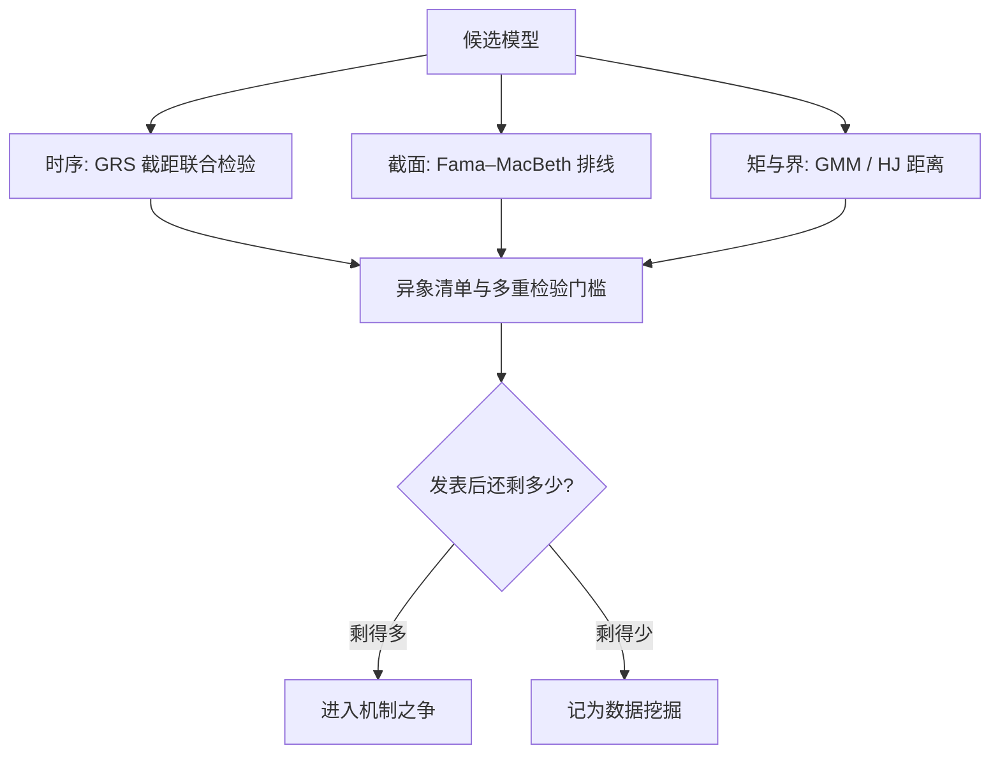
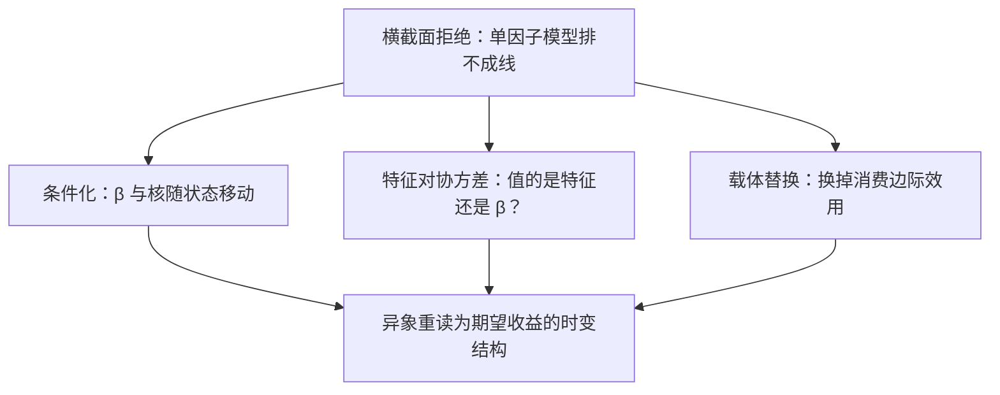

# 实证挑战与理论的回应

理论在黑板上从不输，输在资产定价的检验协议里：一桩联合假设、一串多重比较、一次发表之后的衰减。

<footer>—— 据 Fama, *Journal of Finance* 1970；Harvey, Liu and Zhu, *RFS* 2016；McLean and Pontiff, *JF* 2016 整理</footer>

[上一课](/econ/apt-behavioral-deep)摆出三个弯曲核的手术台，并写明各自欠的证据。本课收账：候选模型在数据前怎么判。工具链的一半已经存在——[Fama–MacBeth 截面回归](/quant/fama-macbeth)、[GMM 矩检验](/econ/gmm-econ)、[Hansen–Jagannathan 界](/econ/hansen-jagannathan)、[过度波动](/econ/shiller-excess-volatility)与[股利-价格比预测](/econ/dp-ratio-predictability)。缺口是把它们串成流水线，再看几十年的异象清单如何反过来重塑理论。

## 问题

资产定价的检验生来是联合假设：定价模型与市场有效性捆在一起（Fama 1970，见[市场有效性](/econ/emh)），拒绝时分不清账该记在哪边。第二重困难是多重性：几十年间发表的因子数以百计，按 5% 名义水平筛，必然捞出真伪混合的一批。第三重是适应性：因子一旦发表就被人交易，溢价本身会衰减。三重困难叠加的后果是：不设协议，「发现」的存量不可信；设了协议，理论必须换一种方式回应数据。

Harvey–Liu–Zhu 2016 清点了 316 个已发表因子：在多重检验之下，新因子的 t 统计量门槛应从习惯的 1.96 抬到 3.0 以上；McLean–Pontiff 2016 给出市场侧的对应证据——因子收益在发表后平均衰减约 58%。「门槛抬高」与「发现即衰减」是同一枚硬币的两面。

「联合假设」翻译成白话：你一次检验的其实是「定价模型正确」加「市场有效」两个捆在一起的命题。统计上拒绝时只能说「至少有一个错了」，却分不清该记在哪一边——这一刀切不开，是资产定价检验的先天限制，不是做得不够仔细。

## 方法

四道工序。第一，时序与截面分工：GRS 检验（Gibbons–Ross–Shanken 1989）在时序上问「截距是否共同为零」，[Fama–MacBeth](/quant/fama-macbeth) 在截面上问「定价误差是否与贝塔排成一条线」——两条腿缺一条，横截面拟合就能靠因子之间的相关性蒙混。第二，矩与界：GMM 直接检验 $1=E[mR]$，Hansen–Jagannathan 距离报「离可行集多远」，与参数化无关。第三，异象清单：规模与账面市值比（Fama–French 1992、1993）、动量及其后数百个因子；多重比较按[多重检验](/econ/multiple-testing-econ)的纪律校正，规格自由度按[实证设计规范与收束](/econ/pm-specification-map)登记。第四，衰减诊断：McLean–Pontiff 2016 报样本外衰减约四分之一、发表后约 58%；Hou–Xue–Zhang 2020 在计入微观结构成本后，多数异象不再显著。

## 机制

协议如何反过来重塑理论。条件化：让贝塔与核随状态移动（Lettau–Ludvigson 2001 的 cay）确实能救一些模型，但 Lewellen–Nagel 2006 显示条件 CAPM 的时变不足以解释动量与横截面——救不到头。特征对协方差：Daniel–Titman 1997 问「值的是特征还是贝塔」，把解释义务从协方差压到公司层变量上。载体替换：[中介资产定价](/econ/intermediary-asset-pricing)、[需求系统资产定价](/econ/demand-system-asset-pricing)与[生产基础的资产定价](/econ/production-based-asset-pricing)各自换掉「消费边际效用」这个默认载体。Cochrane 2011 用 [Campbell–Shiller 分解](/econ/campbell-shiller-decomposition)把横截面按现金流消息与折现率消息重新记账：异象不再是待消灭的「谜」，而是期望收益时变结构的清单——本课程前六课正是给这份清单配机制。

第一张图画的是检验流水线：数据怎么审模型。这一张画反方向：被数据拒绝之后，理论有哪些退路、三条路又如何汇入对异象的同一份重读。

数字实例：假设 100 个候选因子彼此独立、全都毫无真溢价，按 5% 的名义门槛筛选，平均也会「发现」约 5 个假因子。t 门槛从 1.96 抬到 3.0 不是苛刻，是给这种「翻车率」上保险——翻车的候选越多，单次检验的名义水平就得越紧。

## 边界

协议只保证拒绝的语义，不生产理论；候选名单仍由想象力供给。发表偏置与数据挖掘无法被完全校正，复制对数据商与处理细节敏感——Hou–Xue–Zhang 的复现争议说明连「异象是否存在」都依赖处理口径。衰减诊断有自己的样本期问题：近年登记的因子还没走完发表后窗口，现在断言「都衰减了」为时过早。判别设计的选择本身是自由度，登记在案才不沦为又一次规格搜索。

为什么重要：假如你按一篇论文的回测把真金白银押上去，而溢价在发表后平均衰减约 58%，策略上线后的表现会远低于回测。发表滞后不是技术细节，而是回测可信度的「折旧率」——读任何异象论文都要先问：这是税前还是税后、是发表前还是发表后。

## 小结

- 检验生来是联合假设；时序（GRS）与截面（Fama–MacBeth）两条腿必须同时走。
- HJ 距离与 GMM 提供与参数化无关的拒绝口径；多重检验把 t 门槛抬到 3.0 以上。
- 发表后衰减约 58% 是市场学习的证据；「门槛抬高」与「发现即衰减」互为印证。
- 理论的回应是条件化、特征化与载体替换；异象清单被重读为期望收益的时变结构。
- 出处：Fama and MacBeth, *JPE* 1973；Gibbons, Ross and Shanken, *Econometrica* 1989；Harvey, Liu and Zhu, *RFS* 2016；McLean and Pontiff, *JF* 2016；Cochrane, *JF* 2011。
