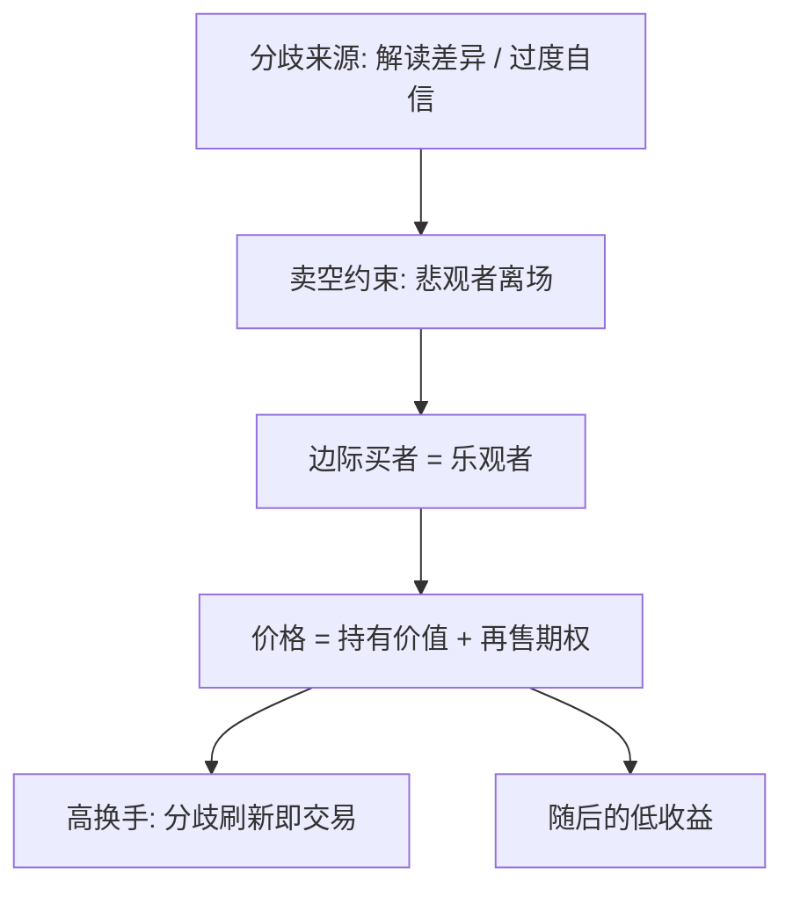
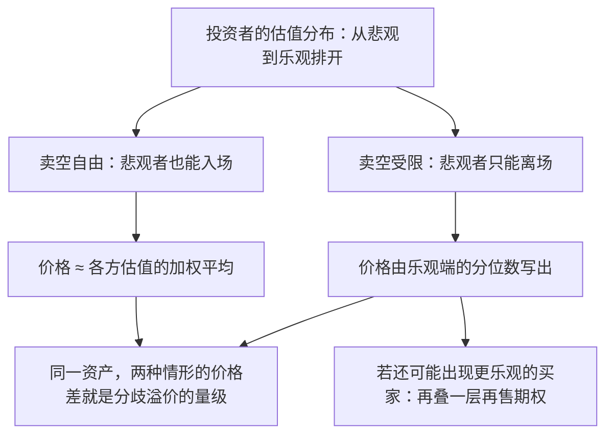

# 异质信念与交易

当卖空比买入贵，价格就不再征询平均意见，只听最乐观的那一个；分歧本身不是噪声，它是一项被交易的资产。

<footer>—— 据 Miller, *Journal of Finance* 1977；Harrison and Kreps 1978；Scheinkman and Xiong, *JPE* 2003 整理</footer>

[上一课](/econ/apt-sdf-deep)把全部定价压进一个核 $m$，但那个核默认市场上所有投资者读同一份信号、得出同一份后验。缺口从这份默认的裂缝开始：信念一旦分散，谁的价格算数？换手从哪里来？价格与基本面还差多少？本课程第二课说过，完备市场加共同先验时交易根本无从发生（Milgrom–Stokey 1982 的无交易定理）；实际市场庞大的换手率说明必有东西被打破——先验不同、信号解读不同，或对信号精度过度自信。本课写这三条裂缝如何各自变成风险溢价。

## 问题

同质信念的代表性主体把「定价者是谁」藏起来了。信念分散后问题显形：悲观者若能卖空，价格落在双方估值的加权上；卖空受限时，悲观者只能离场，价格由乐观者独写——[Miller 1977 的命题](/econ/emh)从这里起步。更深一层：若持有者随时可能遇到更乐观的新买家，资产今天的价格就含一项「把它再卖出去」的期权价值，可以高于在场每一个人的持有价值。缺口是把三件事连起来：分歧的来源、约束的方向、由此生成的溢价与换手。

Harrison–Kreps 1978 的要点一句话可记：连续变化的信念加卖空约束下，价格严格高于所有投资者的最高持有价值——溢价全部来自再售期权；Scheinkman–Xiong 2003 把同一条机制推到换手上，模型同时给出泡沫与高换手这对孪生预言。

「卖空」是先借入股票卖出、日后再买回来归还的交易方式，让看跌的人也能把钱押上自己的判断；「卖空约束」指借券太贵或干脆被禁止。一旦看跌者无法出场，市场里就只剩看涨者的报价——价格征询的不再是全体意见，而是被约束筛过的乐观意见。

## 方法

三步。第一，分歧进入价格的水平：卖空约束下边际买者是乐观者，意见分歧越大、卖空越贵，价格越高，随后的收益越低——这是横截面可检验的「分歧溢价」。第二，再售期权：Harrison–Kreps 1978 把它算成显式项，价格等于持有价值加再售期权；[Harrison–Kreps 异质信念](/econ/harrison-kreps-speculation)那课已经立过此账，本课强调它对「泡沫不需要傻瓜」的含义：每个人都理性地付溢价，因为期权在别人手里。第三，分歧的内生来源：对信号精度的过度自信（[DHS 的机制](/econ/dhs-overconfidence)）使分歧随新信息不断刷新，[Scheinkman–Xiong 换手与泡沫](/econ/scheinkman-xiong)由此同时定价换手与价格；信息缓慢扩散时分歧先放大后收敛，给出动量转崩盘的形状（[Hong–Stein 信息扩散](/econ/hong-stein-diffusion)）。

## 机制

全部机制系于边际定价者的更换：价格不再是均值，而是信念分布的乐观分位数。于是交易量不需要新信息——解读分歧的刷新本身就是交易的理由，这解释了换手率与随后收益负相关的实证组合。再看它对核语法的意义：上一课的 $m$ 由「边际效用」构造，本课的 $m$ 由「边际买者」构造，两者在卖空不受限时重合，受限时分道。为什么不套利掉这部分溢价？借券贵、期限错，且偏离可以先更深——[套利限制](/econ/limits-to-arbitrage)与[噪声交易者风险](/econ/noise-trader-risk)给出均衡里的存活条件。调查测得的分歧度与换手正相关、与随后收益负相关（[调查预期](/econ/survey-expectations)），是这条链最直接的证据。

上一张图画因果链；这一张只换一个变量——卖空是否自由——看同一份信念分布下价格落在哪里，对比出「边际买者更换」的全部含义。

数字实例：十位投资者对一只股票的估值从 50 元到 90 元排开，均值约 70 元。卖空自由时价格接近 70 元；卖空受限后，价格由最乐观的几位写，比如 85 元。日后分歧一旦收敛，价格向 70 元回落，高位接手者吃到的负收益就是「分歧溢价」的兑现。

## 边界

分歧不必然高估：约束若对买卖双向都贵——借券贵、加杠杆同样贵——低估也会出现，方向由哪一侧受限更紧决定。共同先验加完备市场下投机溢价严格为零（Varian 1985；Milgrom–Stokey 1982），所以「异质信念定价」必须与市场不完备或非共同先验配套读，单独引用是把前提丢了一半。度量侧：卖空成本、换手、调查宽度各有噪声，横截面证据集中在小市值与高约束子集，外推到大盘蓝筹要克制。

常见误区：以为「异质信念必然推高价格」。方向其实取决于哪一侧被约束卡得更紧——借券贵时偏乐观高估，加杠杆贵时同样可以出现低估；而在完备市场加共同先验的基准下，投机溢价干脆严格为零。「分歧看涨」是有前提的结论，不是定理。

## 小结

- 卖空约束把边际定价者换成乐观者；分歧越大，价格偏离越高，随后收益越低。
- 再售期权让价格可高于所有人的持有价值——泡沫不需要非理性者，只需要约束与分歧。
- 换手是分歧的观测器：交易量不需要新信息，只需要解读不同。
- 前提是市场不完备或非共同先验；完备加共同先验时本课的溢价为零。
- 出处：Miller, *Journal of Finance* 1977；Harrison and Kreps 1978；Scheinkman and Xiong, *JPE* 2003；Hong and Stein, *JEP* 2007。
