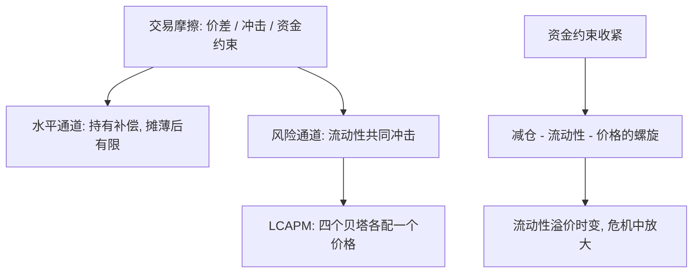
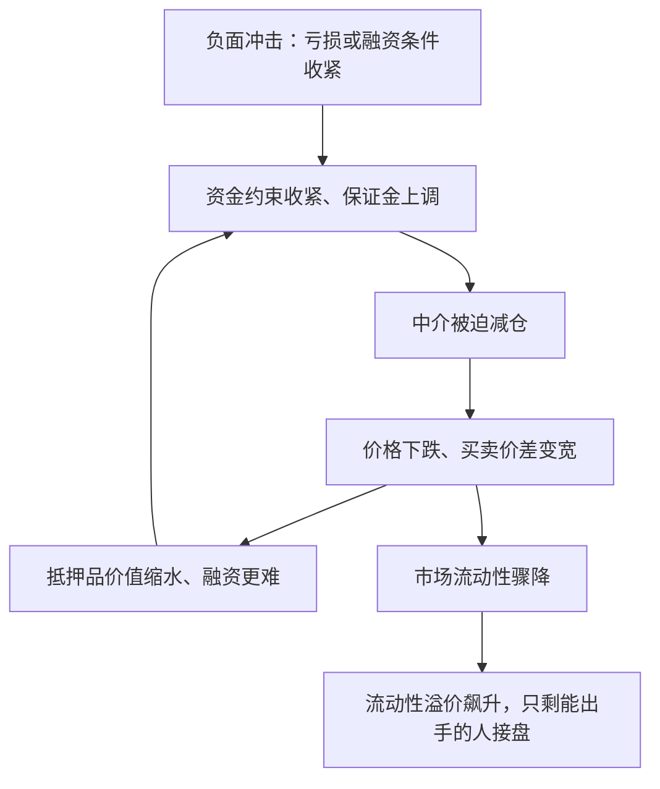

# 流动性的资产定价深化

资产不因难卖而不同，但买它的人会要求两笔补偿：为「这件资产难卖」付一次价，再为「大家一起难卖」付一次价。

<footer>—— 据 Amihud and Mendelson, *Journal of Financial Economics* 1986；Acharya and Pedersen, *JFE* 2005；Brunnermeier and Pedersen, *RFS* 2009 整理</footer>

[上一课](/econ/apt-heterogeneous-beliefs)说明价格由边际买者写；本课把「写价格的成本」记进收益。微观侧的地基已经打好：[不对称信息与流动性理论](/econ/asymmetric-info-liquidity)拆过价差的构成，[市场与融资流动性](/econ/market-funding-liquidity)拆过两种流动性的联动。缺口是定价含义：交易要过价差、冲击成本与资金约束，这些摩擦以什么形式、多大的量，进入预期收益。

## 问题

交易无成本时，横截面收益只该由协方差决定；现实里摩擦直接改写持有者的实现收益，缺口有两层。水平层：持有一只难卖的资产，实现收益被价差与冲击吃掉一块，要求收益必须抬高才打平——这是「为流动性付费」。风险层：流动性不是各资产独立的噪声，它有共同成分，且在危机中与收益同时恶化；持有「市场流动性变坏时收益也变坏」的资产，承担了一种新的状态暴露。只看水平不看风险，溢价会被记成常数；只看风险不看水平，会把价差补偿误认为超额收益。

易错点在水平效应的摊薄：Constantinides 1986 证明，比例交易成本即便不小，对要求收益的影响也远小于线性直觉——投资者会把调仓频率降下来摊薄成本；Longstaff 1995 算出的约三成折价是「完全不可交易」的上限，现实的可交易性折价远低于它。把上限当典型值，是流动性溢价文献最常见的夸大来源。

术语翻译：「买卖价差」是同一时刻买价与卖价之间的缺口，一买一卖立刻亏掉这一截；「冲击成本」是你的大单自己把价格推向不利方向的部分。两者都不是谁赚走的暴利，而是进出场必须付的「过路费」——所谓流动性好，就是过路费低。

## 方法

两条通道各有一套度量与一组价格。水平通道：Amihud–Mendelson 1986 在纽约证交所数据上发现价差与净收益正相关——买宽价差资产的人必须预期更高的毛收益，净收益才打平；持有期机制自动摊薄，见[交易成本下的组合](/econ/transaction-cost-portfolio-theory)。风险通道：Amihud 2002 的非流动性比把「单位成交额的价格移动」变成可算的时序（[Amihud 非流动性](/quant/amihud-illiquidity)），Pastor–Stambaugh 2003 发现流动性冲击的系统成分有价格；Acharya–Pedersen 2005 的 LCAPM 把两通道统一成四个贝塔：资产收益对市场的贝塔、资产收益对市场流动性的贝塔、资产流动性对市场收益的贝塔、资产流动性对市场流动性的贝塔，各配各的价格。结构性来源在[不对称信息与流动性理论](/econ/asymmetric-info-liquidity)：逆向选择成分由知情交易决定，本身随波动与信息环境移动。

## 机制

两条通道的枢纽都是边际持有者的资产负债表。常态下，边际者是低约束的长期投资者，水平溢价温和；危机里资金约束收紧（[资金约束与 CAPM 偏离](/econ/funding-constraints-capm)），中介被迫减仓，市场流动性骤降，价格向受约束的边际者坍缩——[中介资产定价](/econ/intermediary-asset-pricing)与[杠杆周期](/econ/leverage-cycle)把这写成螺旋。所以流动性溢价的时变性远大于其均值：静态的价差—收益回归在危机年份系统性失灵，漏掉的不是常数项而是状态项。这也接得上第一课的 HJB：流动性是状态变量，对冲需求与流动性溢价是同一枚硬币的两面。

第一张图把摩擦分成两通道；这一张把「螺旋」两个字拆开——危机中资金约束与市场流动性如何互相喂给、逐圈放大，这正是溢价时变性的来源。

LCAPM 的四个贝塔可以翻译成四份保单：大盘跌你也跌（市场贝塔）；市场流动性变坏你也变坏（流动性水平贝塔）；你自己变得更难卖恰逢大盘下跌（收益与流动性的交叉贝塔）；你变得更难卖恰逢市场普遍难卖（流动性对流动性的贝塔）。每份保单风险不同、保费各付各的。

## 边界

度量内生：价差与波动同涨同跌，「流动性溢价」里混着波动风险的份额，四个贝塔在线性近似里也拆不干净。螺旋是非线性的，线性贝塔是它的局部切片，样本又多来自平稳期，危机中的估值得靠极值样本、误差极大。水平与风险两层不要互相冒充：价差补偿不是超额收益，流动性贝塔也不是价差；清算折价的实证口径（禁售、锁仓、限售股）各自混着别的摩擦，引用时先看对照设计。

常见误区：把「流动性溢价」当成一个永远为正的常数补贴。常态下它温和、还能被低频调仓摊薄；只有危机中资金螺旋转起来它才飙升。用平稳年份估出的平均溢价去外推危机期，会同时看错水平和状态——静态回归漏掉的是状态项，不是噪声项。

## 小结

- 交易摩擦分两笔记账：持有补偿的水平效应，与流动性共同冲击的风险效应。
- LCAPM 把预期超额收益写成四个贝塔的加权和；流动性由此从「特征」升格为「状态变量」。
- 资金约束是时变性的来源：常态温和、危机放大，静态回归漏掉的是状态项。
- 水平效应受摊薄限制，三成是「完全不可交易」的上限而非典型值。
- 出处：Amihud and Mendelson 1986；Amihud, *JFE* 2002；Pastor and Stambaugh, *JPE* 2003；Acharya and Pedersen, *JFE* 2005；Brunnermeier and Pedersen, *RFS* 2009。
