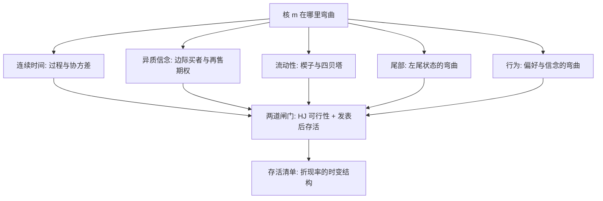
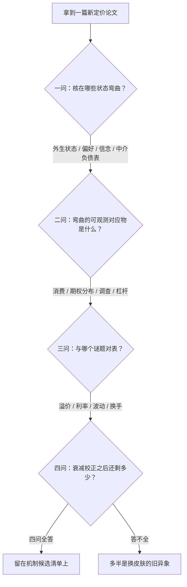

# 资产定价深化的收束

八课只有一个对象：核在哪里弯曲、弯多少、谁来检验——其余都是这句话的变奏。

<footer>—— 据 Cochrane, *Asset Pricing*, 2005；Campbell and Viceira, *Strategic Asset Allocation*, 2002 整理</footer>

[上一课](/econ/apt-empirical-challenges)把检验协议钉成流水线：GRS 与 Fama–MacBeth 排线、GMM 与 HJ 距离量距、t 门槛抬到 3.0、发表后看衰减。本课是「资产定价理论深化」的最后一课，本课程到此收束：把八课收成一张账——每课都是随机贴现因子的一处可观测缺陷与一种修复，以及修复后必须过的那道闸门。

## 问题

深化之后留下的不是八块知识，而是一个隐患：理论的花色太多，同一个异常能被尾部、行为、中介各自解释一遍。收束的缺口是纪律：给「读一篇新定价论文」一套可复用的检查单，让新模型落在哪一课的框架里、欠哪一课的证据，一望而知；做不到这一点的理论繁荣，只是把识别问题从黑板搬进了期刊。

第二课的 HJ 界与第七课的发表衰减是全课程的两道闸门：前者问「隐含的核可行吗」，后者问「溢价还能活多久」。任何新模型先报这两行，再谈机制——顺序颠倒过来，评审就成了投稿人的独白。

「随机贴现因子（SDF）」又叫「定价核」，可以翻译成一把随状态变动的折现尺：好年景，未来一元只按八折计；坏年景，未来一元反而比今天的一元更值钱。全课程说的「弯曲」，指的都是这把尺在哪些年份、被什么力量改变了刻度。

## 方法

一张账，按课记。第一课把核写成过程，定价一行协方差，机会集时变时多出对冲项。第二课立界：$\sigma(m)/E(m)$ 不得低于可实现的最大夏普，完备给唯一核、不完备只给区间。第三课换边际者：分歧加卖空约束下，价格由乐观尾部写，再售期权是溢价的另一个名字。第四课记楔子：交易摩擦分水平补偿与四贝塔的流动性风险两笔账，资金约束让它们时变。第五课弯在尾部：小概率大跌幅状态承担溢价，期权隐含分布是观测器。第六课把弯曲者搬进主体：习惯、损失厌恶、过度自信与套利边界，各欠各的证据。第七课设闸门：联合假设、多重检验、发表衰减。

## 机制

检查单四问，读完新模型依次问。一，核在哪些状态弯曲——外生状态、主体偏好、信念，还是中介的资产负债表；二，弯曲的可观测对应物是什么——消费、期权隐含分布、调查预期、中介杠杆，答不出对应物的弯曲无法检验；三，与哪个谜题对表——溢价、无风险利率、过度波动、换手，谜题清单即第二课的界加第七课的异象账；四，多重检验与发表衰减之后还剩多少。四问答不全的模型，多半只是给已知异象换了一层皮肤。机制层的统一判词是第七课的记账法：异象不是待消灭的谜，而是折现率时变结构的清单——本课程前六课是给这份清单配机制，机制候选越少越好，不是越多越好。

第一张图是全课程的地图；这一张把四问检查单画成流程——地图告诉你课与课的关系，流程告诉你拿到新模型时按什么顺序过筛。

为什么重要：没有检查单，每篇新论文都能自说自话地「解释」一个异象；有了四问，机制候选越少越好——识别出一个来源，比罗列五个平行故事更有信息量。理论繁荣若过不了这四问，只是把识别问题从黑板搬进了期刊。

## 边界

收束不是完成。识别问题未解：弯曲的来源常常不可分，灾难与诊断性预期、习惯与长期风险在可预测性上同预言。接口未合拢：与微观结构的接缝在[微观结构与资产定价的接口](/econ/microstructure-asset-pricing-interface)，生产侧与需求侧的载体替换在[生产基础的资产定价](/econ/production-based-asset-pricing)与[需求系统资产定价](/econ/demand-system-asset-pricing)，中介与资金约束的深化在[中介资产定价](/econ/intermediary-asset-pricing)。落地未展开：时变机会集下长期投资者的配置问题是 Campbell–Viceira 2002 的地界，本课程停在定价侧。预测与结构解释的分工，沿用上一课程立下的双轨规范：预测轨报样本外与经济价值，结构轨报识别假设与矩条件，两轨不得互借功劳。

直觉类比：这套收束像一份体检流程——八课是不同科室，两道闸门是两项硬指标（核可不可行、溢价活不活得久），四问是主诉问诊。读新模型先看化验单，再听医生讲机制故事；顺序反了，故事再动听也不该开药。

## 小结

- 八课一以贯之：核的弯曲位置、幅度、可观测对应物与检验闸门。
- 两道闸门收束全课程：Hansen–Jagannathan 可行性，发表后的溢价存活率。
- 读新模型四问：弯在哪、观测器是什么、对哪个谜题、衰减后剩多少。
- 未清账目在识别、接口与配置三处；本课程到此收束，清单留给下一门课接手。
- 出处：Cochrane, *Asset Pricing*, 2005；Campbell and Viceira, *Strategic Asset Allocation*, 2002；据本课程八课综合整理。
