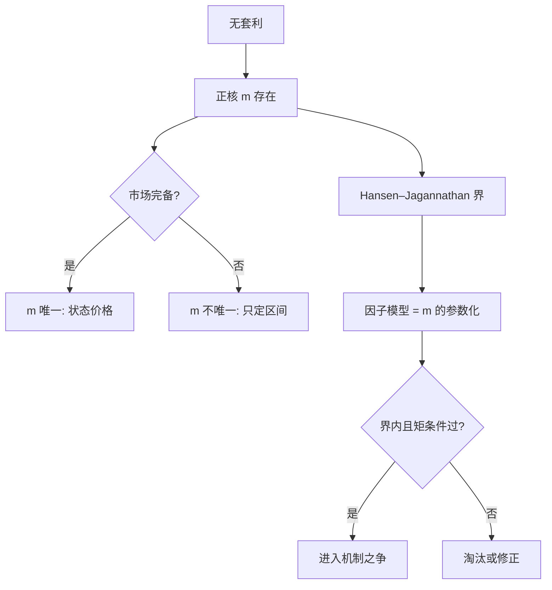
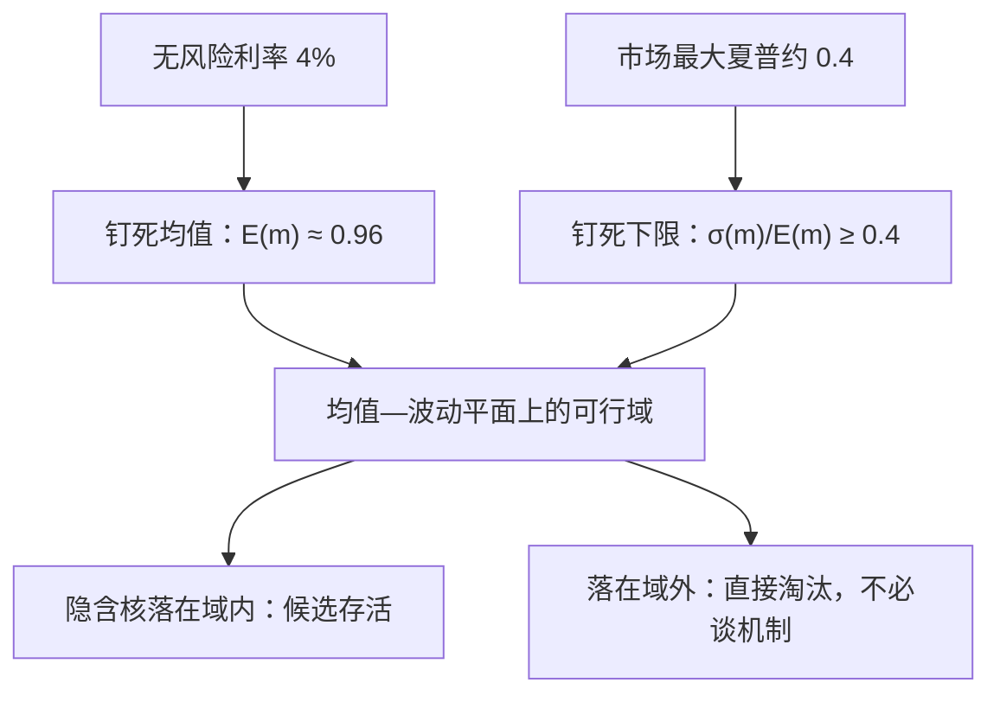

# 随机贴现因子的深化

所有定价模型共享同一句语法 $E[mR]=1$；模型之间的争论，从来不是要不要核，而是核在哪些状态弯曲、弯多少，以及这两问有没有独立证据。

<footer>—— 据 Cochrane, *Asset Pricing*, 2005；Hansen and Jagannathan, *JPE* 1991 整理</footer>

[上一课](/econ/apt-continuous-time)把定价收成核的随机微分方程与一行协方差开价，并给跳跃立了账。本课把这个对象推到整个课程的中枢：不进新市场，只问给定任意候选因子或模型——它作为核 $m$ 的一种参数化，必须过哪几道关。离散侧的地基是[随机贴现因子](/econ/stochastic-discount-factor)与[状态价格到 SDF](/econ/state-price-sdf-bridge)的恒等式 $1=E_t[m_{t+1}R_{t+1}]$；本课补的是存在性与唯一性之间、约束与识别之间那些没讲透的层次。

## 问题

一个恒等式不足以成为理论，缺口分三层。存在层：无套利保证存在正的 $m$（[资产定价基本定理](/econ/ftap)），但那是「存在」，不是「这一个」——市场不完备时 $m$ 不唯一（[不完全市场的定价界](/econ/incomplete-market-pricing-bounds)），许多候选同定价而含义不同，把「能定价」读成「解释了」就记错账。约束层：$m$ 的均值被无风险利率钉死，波动被可实现的最大夏普比率钉死，越界的模型不必讨论。识别层：$m$ 不可观测，「因子显著」究竟是核的性质还是投影的性质，需要一套与参数化无关的度量。

数字口径：年无风险利率 4% 意味着 $E(m)\approx 1/1.04\approx 0.96$；市场夏普比率 0.4 到 0.5 要求 $\sigma(m)\ge 0.38$。CRRA 下 $\sigma(m)/E(m)\approx\gamma\,\sigma(\Delta c)$，而消费年波动只有 1.5% 上下，$\gamma$ 就得推到 25 以上——股权溢价之谜的全部语法就这三行算术。

「$E[mR]=1$」翻译成白话：把未来各状态下的收益，各乘一个「该状态的折现权重」$m$ 再求平均，必须恰好等于今天的一元。$m$ 大的状态就是「钱最值钱」的坏年景——能在坏年景里依然兑现的收益，才配得上高价格；模型之争全在 $m$ 的形状。

## 方法

三步走。第一，矩条件：把 $1=E[mR]$ 沿时间向前展开，得到 $p_t=E_t\big[\sum_{s\ge 1}m_{t+1}\cdots m_{t+s}D_{t+s}\big]$，[现值恒等式](/econ/present-value-identity)与 [Campbell–Shiller 分解](/econ/campbell-shiller-decomposition)都是它的展开式；[Lucas 树](/econ/lucas-tree)与[消费 CAPM](/econ/ccapm) 则把 $m$ 钉在边际效用上。第二，界：$\sigma(m)/E(m)$ 不得小于任何可实现收益的夏普比率（Hansen–Jagannathan 1991），这是与参数化无关的[可行域](/econ/hansen-jagannathan)；条件信息会松动无条件界（Hansen–Richard 1987），报告时必须写清用的是哪种口径。第三，参数化：因子模型就是 $m=a-b'f$ 的具体选择，[CAPM 理论](/econ/capm-theory)取 $f$ 为市场收益，宏观模型取消费增长；估计用 [GMM](/econ/gmm-econ) 的矩条件，距离用核到可行集的 Hansen–Jagannathan 距离。

## 机制

界为什么能当普遍记分板：它把「模型好不好」翻译成「隐含核的均值—波动对落在可行域内还是外」，[股权溢价之谜](/econ/equity-premium-puzzle)与[无风险利率之谜](/econ/risk-free-rate-puzzle)由此变成边注里那三行算术，不再依赖具体效用函数。模仿组合机制让界可操作：任意 $m$ 投影到收益空间得到最小方差模仿组合，距离与资产集的选取共同决定结论。非唯一性则解释了本课程的推进方式：既然许多 $m$ 同样定价，理论竞争就不在「能不能定价」，而在「弯曲发生在哪些状态、要多少风险承担、有没有定价之外的证据」——后面三课（分歧、流动性、尾部）各自给出一种弯曲方式，再后一课把弯曲者搬进主体。

上一张图画候选核的审查流程；这一张拆记分板本身：两个可观测对象如何把均值—波动平面切成可行域，候选一落点便知生死。

直觉类比：HJ 距离像「落榜距离」——把候选核投影到真实收益空间里最好的模仿组合上，量一量它离可行集还差多远；距离越短，候选越像真的。因为它与具体效用函数无关，不同门派的模型才能放在同一张记分板上比。

## 边界

HJ 界是无条件的：条件口径的放松足以救活一些在无条件检验里出局的模型，也能冤枉合格的，两种口径混用是这条路线最常见的自欺。非唯一性意味着「通过检验」只是必要条件：与消费无关的 $m$ 也能定价，机制解释需要横截面之外的证据。GMM 的加权矩阵、模仿组合的资产集都会移动结论，这些自由度得登记在案——上一课程那套规范三件套在本课程照常生效。

常见误区：以为「通过 HJ 界」就等于模型被证实。界只是必要条件——与消费毫无关系的 $m$ 也可能落在可行域内；过了界，机制之争才刚开场，还需要定价之外的独立证据（预期数据、微观账户、期权分布）来分胜负。

## 小结

- 全部定价模型共享 $1=E[mR]$；分歧只在核的弯曲位置与幅度。
- 完备给出唯一核，不完备只给区间；把「能定价」当「解释了」是第一类错误。
- Hansen–Jagannathan 界把模型竞争翻译成均值—波动对的可行性；条件与无条件口径必须分开报。
- 因子模型是 $m$ 的参数化；通过检验是必要条件，机制之争从本课之后才开场。
- 出处：Hansen and Jagannathan, *JPE* 1991；Hansen and Richard, *Econometrica* 1987；Cochrane, *Asset Pricing*, 2005。
