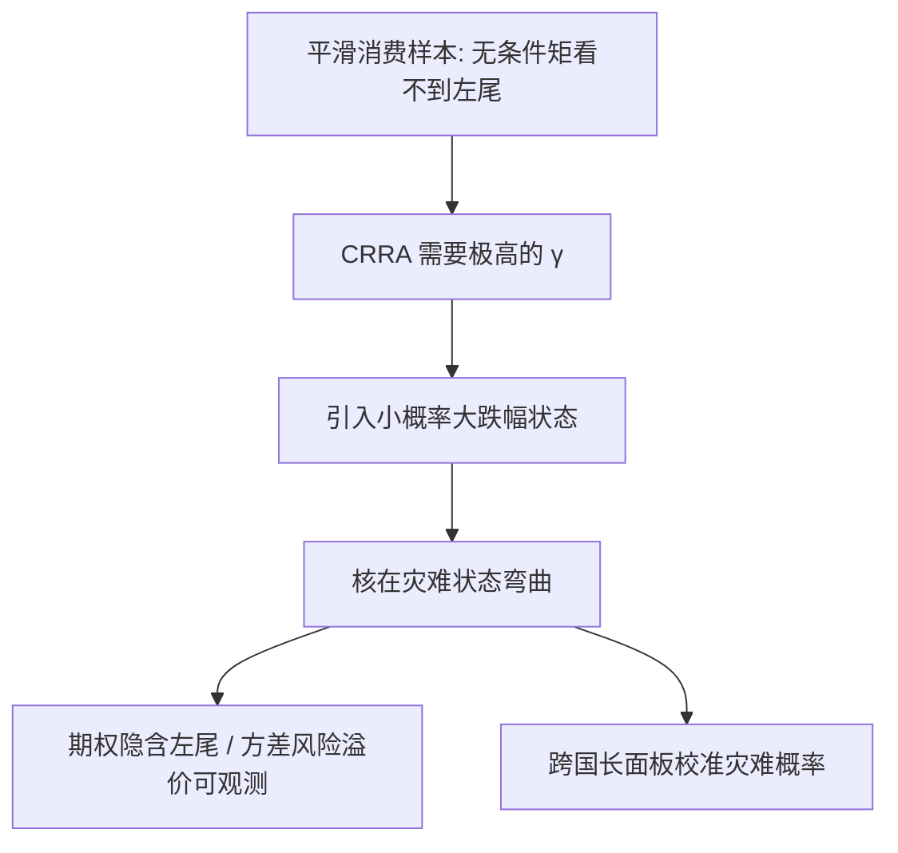
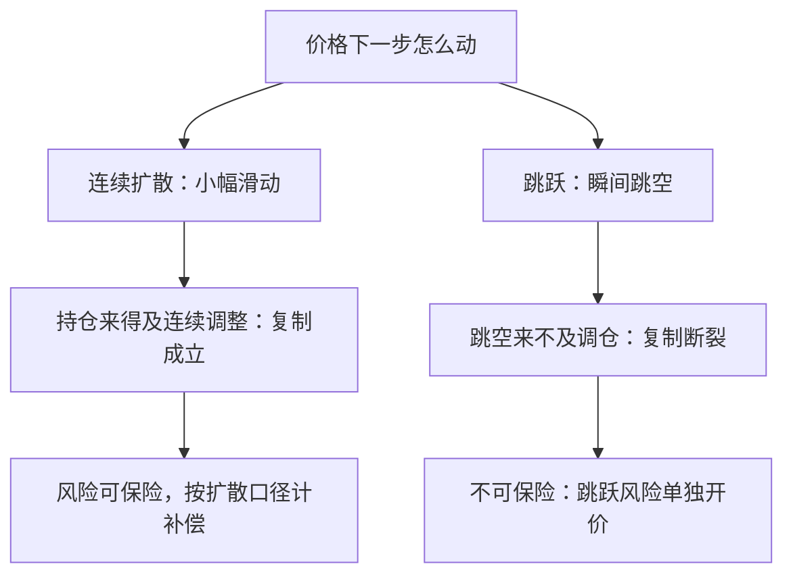

# 尾部风险溢价

平滑的样本均值看不见小概率的大跌幅，定价却看得见：核的弯曲恰恰发生在数据最稀的地方。

<footer>—— 据 Rietz, *Journal of Monetary Economics* 1988；Barro, *QJE* 2006；Weitzman, *AER* 2007 整理</footer>

[上一课](/econ/apt-liquidity-deep)把交易摩擦记进收益；本课转向分布本身。第二课的界要求 $\sigma(m)/E(m)$ 达到 0.4 上下，而第一课的扩散假设把路径剪得连续、把左尾剪平了——用平滑消费的 CRRA 去够这条界，风险厌恶就得推到不可信的高度。缺口是左尾：溢价可能不在平均日子里，而在样本里几乎没有的那些状态中。

## 问题

[股权溢价之谜](/econ/equity-premium-puzzle)的原始表述（Mehra–Prescott 1985）基于平滑的美国消费样本：样本里没有大灾难，CRRA 只能靠极高的 $\gamma$ 同时抬高溢价并压低无风险利率，而那样[无风险利率之谜](/econ/risk-free-rate-puzzle)又冒出来。困难是认识论的：左尾事件在样本内太稀，无条件矩几乎不携带它们的信息——历史均值方差算不出灾难溢价的份额，缺口只能靠模型外推与别的观测器（期权、跨国长面板）补。

Barro 2006 的校准口径：约四十国、上百年的面板里，人均 GDP 累计跌幅不低于 15% 的灾难，年概率约 1.7%，平均深度约 29%。把这两行装进 Lucas 树，模型第一次同时压住股权溢价与无风险利率——代价是「灾难里股票究竟跌多少」留作自由参数。

数字实例：年概率 1.7%、深度 29% 的灾难，对期望增长的拖累只有约 $0.017\times 29\%\approx 0.5\%$——在样本均值上几乎无痕；但灾难状态里一元消费的边际价值极高，折现权重一变，溢价就上来了。这就是「均值看不见、定价却看得见」的算术含义。

## 方法

三条路。其一，把灾难装进模型：Rietz 1988 提出小概率灾难假说，Barro 2006 用长面板校准它；[Lucas 树](/econ/lucas-tree)里加一条「红利累计跌近三成、年概率约 2%」的左尾，核在灾难状态乘上一个大数，溢价与利率同时回到合理区间（[罕见灾难](/econ/rare-disasters)）。其二，从期权读尾：隐含分布的左尾有价，方差风险溢价——已实现方差与隐含方差之差——为正且能预测收益（Carr–Wu 2009；Bollerslev, Tauchen and Zhou 2009）；下行贝塔把「坏年景里的贝塔」单独拿出来定价（Ang, Chen and Xing 2006）。其三，对分布本身的认知：Weitzman 2007 证明对分布参数的学习会把观测到的肥尾内生化——感知的尾部比真实尾部更肥，低利率与高溢价同时出现。

## 机制

尾部溢价为什么不是普通的波动溢价：扩散下连续对冲成立，跳跃不可对冲——第一课给跳跃立的那笔账在这里定价，跳跃风险的补偿是对「复制断裂」的保险。无条件夏普比率主要由少数状态贡献：普通日子里收益与核几乎无关，溢价集中在灾难日前后，这就是为什么高波动时期可以有平平的已实现溢价。时变性也由此而来：灾难概率随波动与宏观条件移动（Kelly–Jiang 2014），溢价的波动是状态、不是噪声。偏好侧的另一条路——让弯曲来自习惯或长期风险（[习惯形成](/econ/habit-formation)、[长期风险](/econ/long-run-risk)）——与本课共享「弯曲在坏状态」的结构，下一课把两条路的证据义务摆在一起。

上一张图画「为什么需要左尾」；这一张对比两种价格路径下对冲能否成立，说明跳跃风险的补偿为什么必须单独开价、不能混进普通波动溢价。

术语翻译：「方差风险溢价」是期权市场为「未来波动会有多大」开的价，与后来实际兑现的波动之差。它平均为正——投资者愿意为「怕大波动」付保费——所以被当作市场尾部担忧的温度计：读数升高，往往对应灾难概率被感知得更肥。

## 边界

灾难概率与灾难中的资产收益都是自由参数：Barro 度量的是 GDP 不是消费，灾难里股票的收益结构在数据上仍难钉，校准自由度大到「界内」不等于「对」。美国样本自证循环的风险真实存在——这正是上一课程[实证设计规范与收束](/econ/pm-specification-map)警告的那类自由度，跨国与期权数据是必须的独立观测器。还有识别的长期债务：尾部模型与行为模型（下一课）在可预测性上常常同预言，判别要靠第三类证据，不能靠拟合优度。

常见误区：把「尾部模型能拟合溢价」当成「灾难假说被证实」。灾难的概率、深度与灾难中股票的跌幅都是校准者自定的参数，美国样本还可能自证循环——拟合成功只是必要条件，跨国长面板与期权隐含分布才是独立的证据来源。

## 小结

- 平滑样本看不见左尾，但核的弯曲恰在小概率状态；溢价是灾难日的，不是平均日的。
- 灾难校准（年概率约 2%、深度近三成）能同时压住股权溢价与无风险利率，但留有自由参数。
- 跳跃不可对冲，尾部溢价是对复制断裂的保险；期权隐含分布与方差风险溢价是可观测对应物。
- 学习效应把感知尾部放大（Weitzman 2007），低利率与高溢价得以共存。
- 出处：Rietz 1988；Mehra and Prescott, *JME* 1985；Barro, *QJE* 2006；Weitzman, *AER* 2007；Carr and Wu, *RFS* 2009。
