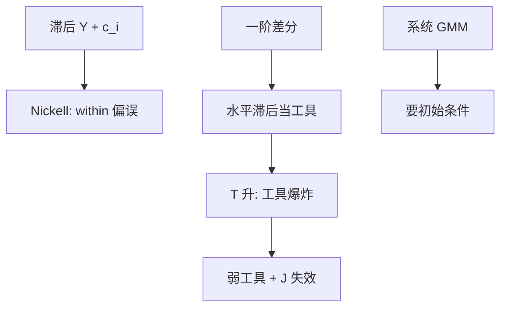

# 动态面板 Arellano–Bond

$T$ 短、$N$ 大、方程里有滞后 $Y$ 时，组内去均值让滞后项与误差相关；差分后用更早的水平当工具，是 Arellano–Bond 的处方，不是再加一年虚拟变量。

<footer>—— Nickell, Biases in Dynamic Models with Fixed Effects, Econometrica 1981；Arellano and Bond, Some Tests of Specification for Panel Data, RES 1991</footer>

[上一课](/econ/fe-re)在严格外生下用 FE 吸掉 $c_i$。本课缺口是动态：$Y_{it}=\rho Y_{i,t-1}+X_{it}\beta+c_i+u_{it}$。Nickell：within 之后 $\rho$ 的偏误阶为 $1/T$，短面板不可忽略。异质处理效应下一课回到因果参数本身；本课先把动态面板的工具装置钉死。

## 问题

滞后 $Y$ 含 $c_i$，FE 去均值让 $\tilde Y_{i,t-1}$ 与 $\tilde u_{it}$ 相关。$T\to\infty$ 偏误消失，公司金融与宏观国别面板往往 $T$ 二三十，$N$ 大，正是 Nickell 区域。一阶差分消去 $c_i$：

$$
\Delta Y_{it}=\rho\Delta Y_{i,t-1}+\Delta X_{it}\beta+\Delta u_{it}.
$$

$\Delta Y_{i,t-1}$ 仍与 $\Delta u_{it}$ 相关（因为 $Y_{i,t-1}$ 含 $u_{i,t-1}$）。若 $u$ 无序列相关，$Y_{i,t-2}$ 及更早水平与 $\Delta u_{it}$ 不相关、与 $\Delta Y_{i,t-1}$ 相关，于是可当工具。这是 Arellano–Bond（差分 GMM）。缺口是：工具个数随 $T$ 爆炸，弱工具与过度识别同时来——上一课序的警告在这里最狠。

Blundell–Bond 系统 GMM：再加水平方程，用差分当工具，改善 $\rho$ 接近 1 时差分工具弱。前提是平稳与均值平稳的初始条件，不是免费午餐。

## 方法

一步 / 两步 GMM，Windmeijer 有限样本校正两步标准误。Hansen $J$ 检验过度识别；AR(2) 检验差分残差的二阶相关（一阶相关是差分的代数，AR(1) 拒绝不说明失败）。工具崩溃：限制滞后深度、塌缩工具。Roodman 的「too many instruments」是操作红线。

$X$ 若前定或内生，工具滞后结构要跟着改，不能把所有 $X$ 当严格外生。

## 机制

机制仍是 IV：差分把 $c_i$ 去掉，时间上的前定把更早的 $Y$ 变成合法 $Z$。序列相关一出现，滞后就不再排除——投资、工资的持久冲击会让 AR(2) 拒绝。$\rho$ 近单位根时差分几乎不提供变异，第一阶段弱，估计坍向有偏。系统 GMM 用水平方程找回变异，把假设从「无相关」换成「对初始偏差的限制」。

与[卢卡斯批判](/econ/lucas-critique)：$\rho$ 是简化式持续，政策规则变了可以变。GMM 一致不等于结构消费欧拉。宏观估计消费习惯或调整成本，要另写欧拉，不能把 Arellano–Bond 的 $\rho$ 直接当深层参数。

公司金融的滞后杠杆回归是高频用户。工具是滞后资本结构，排除故事弱，弱工具常见。本课给装置，不重做那些表。

## 边界

本课不推荐「默认系统 GMM 加全部滞后」。不处理异质 $\rho_i$（Pesaran 一类平均组）。$T$ 大时偏误小，可以直接 FE 加稳健推断，不必 GMM。下一课把「$\beta$ 对谁」的异质从动态装置里抽出来单独讲。

后课默认：短面板动态先承认 Nickell；差分 GMM 要 AR(2)、工具计数与崩溃诊断。系统 GMM 必须写初始条件。不要用动态 GMM 替代[交错 DiD](/econ/staggered-did) 的干净对照。

## 小结

- Nickell：FE + 滞后 $Y$，短 $T$ 下 $\rho$ 有偏。
- Arellano–Bond：差分后用更早水平当工具。
- 工具随 $T$ 爆炸则弱、则 $J$ 不可信；要崩溃。
- 系统 GMM 改善弱差分，但吃初始条件。
- 出处：Nickell, *Econometrica* 1981；Arellano and Bond, *RES* 1991；Blundell and Bond；Roodman 工具过多。
