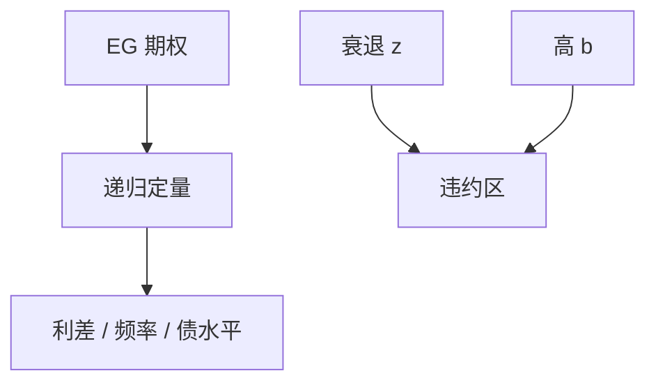

# Arellano 主权债务

把 Eaton–Gersovitz 放进随机递归定量模型，才能同时谈违约频率、利差水平与债务/GDP——定性期权不够校准。

<footer>—— Arellano, Default Risk and Income Fluctuations in Emerging Economies, AER 2008</footer>

[上一课](/econ/eaton-gersovitz)给出违约期权装置。本课缺口是 **Arellano 定量**：匹配新兴市场的利差与违约。不重写惩罚的哲学，不把 $r-g$ 会计提前当主课。

## 问题

EG 能解释利差随债与 $z$ 升，但能否同时匹配：平均债不高、利差高、违约稀少却痛苦？Arellano：非完全可分的禀赋、违约时产出损失加排除，短期债，校准到阿根廷一类事实。发现：违约发生在衰退，利差波动大，债务水平被利差压在并不极高的位置。缺口是给 EG 一条可对矩的递归，而不是再讲一次声誉。

Arellano, *AER* 98(3), 2008, 690–712。Aguiar and Gopinath 的趋势冲击。Chatterjee and Eyigungor 的长期债。Hatchondo and Martinez。

## 方法

状态 $(b,z)$，贝尔曼分履约值与违约值。债价由债权人零利润。算法：与 Aiyagari 同族——猜价格函数，解政府，更新价格。矩：违约频率、平均利差、债/GDP、贸易余额的周期。长期债：价格对未来违约更敏感，稀释激励（Borri、Hatchondo）。集体行动、谈判回收率改惩罚。

与全球周期：把债权人的随机贴现或 $\phi$ 写成全球因子，Arellano 的 $z$ 就不只是本国 TFP。与银行：国内银行持有主权债，违约打 GK 净值（双环）。

## 机制

机制仍是期权，定量上产出损失函数的凸性决定「坏年景才违约」。好年景借、坏年景紧——与数据中新兴市场的逆周期利差一致。趋势冲击（Aguiar–Gopinath）把「增长新闻」当成违约驱动，与新闻冲击课同构。短债滚动：像银行批发融资，对 $q$ 的敏感超过基本面 $z$ 的敏感。

不能匹配的矩推动模型扩充：长期债、风险厌恶债权人、政治。不要用一个 $z$ 过程假装解释全部拉美史。

本课不评价某一笔重组方案。CDS 定价是模型的市场价格，不是本栏的交易课。

## 边界

本课不写 IMF 规划的全部条件性。本币债与通胀违约（稀释）下一课之后的主导课。发达经济的 $r-g$ 可持续会计下一课：违约概率近零时 EG 的期权不是主约束。危机史模式再后。

后课默认：新兴市场利差可用 Arellano 类递归定量；矩驱动惩罚与债期限。下一课：当违约不是选项时，用 $r-g$ 谈滚动。

## 小结

- Arellano：EG 的定量递归，对利差、频率、债水平。
- 违约在衰退；利差压低稳态债务。
- 长期债、全球因子、银行持仓是标准扩充。
- 出处：Arellano, *AER* 2008。
