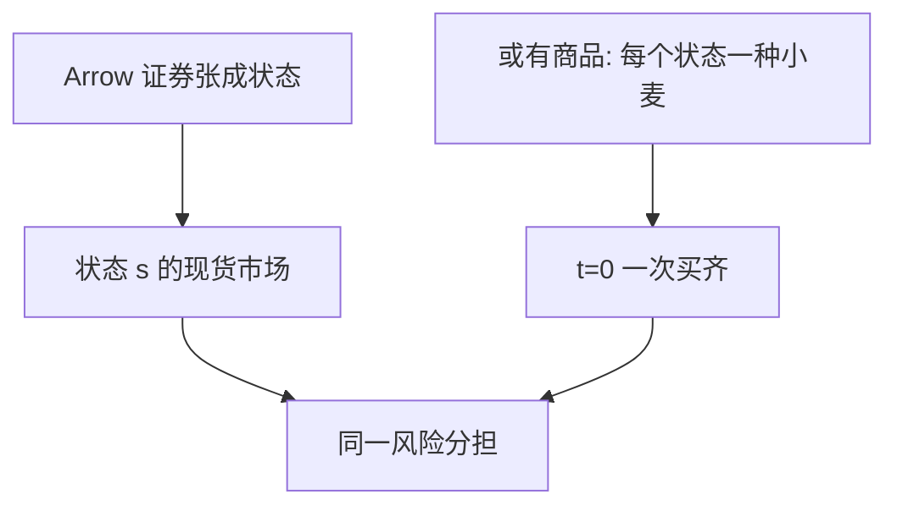

# Arrow–Debreu 或有商品

把商品按发生的状态来标记，不确定下的配置就回到确定环境里的竞争均衡。

<footer>—— Arrow, The Role of Securities in the Optimal Allocation of Risk-Bearing, Review of Economic Studies 1964（1953 年法语稿）</footer>

附录对照。本篇不插入主干课序。主干已在[状态依存](/econ/state-contingent)、[瓦尔拉斯均衡](/econ/walrasian-equilibrium)、[存在性](/econ/ge-existence)里用过或有商品与不动点；这里对照 **Arrow 1953/1964 原文的问题**：完整的或有商品市场太重，能否改成一套证券，仍实施最优风险分担。不重做角谷不动点。

## 问题

Debreu 式的商品可以带日期、地点与状态：一单位「下雨时的小麦」与「晴天的小麦」是不同商品。若每种状态–商品都有现货市场在 $t=0$ 开齐，不确定只是把商品空间加维，[第一福利定理](/econ/welfare-theorems)原样适用。Arrow 问的缺口是实施：真实经济没有为每个状态开一个小麦市场。有没有一种更瘦的证券结构，使人们先对状态下注，再在该状态的现货市场上买小麦？

1953 年法语文本针对的是风险分担，不是存在性。Arrow–Debreu（1954, *Econometrica*）那篇存在性论文是另一份对照，主干[存在性](/econ/ge-existence)已经取过不动点骨架。本附录只钉或有商品与证券的等价。

Arrow 证券：在指定状态支付一单位计价物、其余状态支付零。有限状态、每种状态一张，再加上各状态的现货市场，即可复制完整或有商品配置。

## 方法

两阶段。$t=0$ 只交易 Arrow 证券（或能张成同样支付的普通证券）。状态 $s$ 实现后，证券结算，代理人带着计价物进入 $s$ 的现货市场，按 $s$ 的现货价格购买商品。若证券张成所有状态，预算的状态依存与或有商品经济相同，均衡配置一致。证券不必以小麦计价；用计价物标记状态即可。

不完全市场是后话：证券张不成全部状态时，配置一般达不到或有商品帕累托集。原文的贡献是完全市场下的**降维**，不是证明现实市场完全。

## 机制

机制是把「哪一种小麦」拆成「哪一个状态的购买力」乘「该状态的现货」。状态价格（证券价格）承担风险分担；现货价格承担该状态下的相对稀缺。主干 SDF 课里的 $m(s)\propto$ 状态价格 / 概率，就是这套证券价格的随机折现写法。本附录不把 $m$ 再推一遍，只对照：Arrow 的证券是 $m$ 的可交易实现。

### 为何对照而不插入主干

主干[状态依存](/econ/state-contingent)已经用加标商品讲过风险分担；[存在性](/econ/ge-existence)已经用不动点。[中介](/econ/why-intermediaries)则从「市场不全」起笔，正因为这篇世界里银行没有位置。把 1954/1953 插进中介课之前，会让读者以为银行是一般均衡的一章。附录只对照原文如何把不确定性收成维数，以及证券如何实施或有商品。

Arrow and Debreu, *Econometrica* 22(3), 1954。Arrow 证券文常引 1964 年 *RES* 英译本（法文 1953）。不要给两篇发明 arXiv 号。

## 边界

不要把 1954 存在性论文与 1953/1964 证券论文读成同一篇。前者回答「竞争均衡有没有」，后者回答「不确定能否用证券实施」。也不要在附录里开不完全市场一般均衡（GEI）的存在性——那是 Magill–Quinzii 一线，主干未收。

下一篇附录对照 Debreu《价值理论》如何把商品、价格与存在性写成公理系统。

不完全市场、太阳黑子、无限维，都是后继，不是 1954 年未写完的章节。本附录也不重画埃奇沃思盒——那是主干配置课的教具。

1954 年短文的重点是存在性，或有商品是把不确定性塞进有限维的方法。Arrow 证券文（1953/1964）才把风险分担的实施单独写出。

完整市场使[中介](/econ/why-intermediaries)没有位置。读这篇是为了看银行课为何必须从市场不全起笔。

不动点不是算法，也不给出唯一性。主干存在性课已用 Kakutani；这里只对照原文把状态写成坐标。

## 小结

- 附录对照 Arrow 1953/1964：或有商品可用 Arrow 证券加现货复制。
- 完全张成时风险分担回到确定环境的福利定理。
- 1954 存在性是另一篇，见主干存在性课。
- 出处：Arrow, *RES* 1964；对照 Arrow and Debreu, *Econometrica* 1954。
