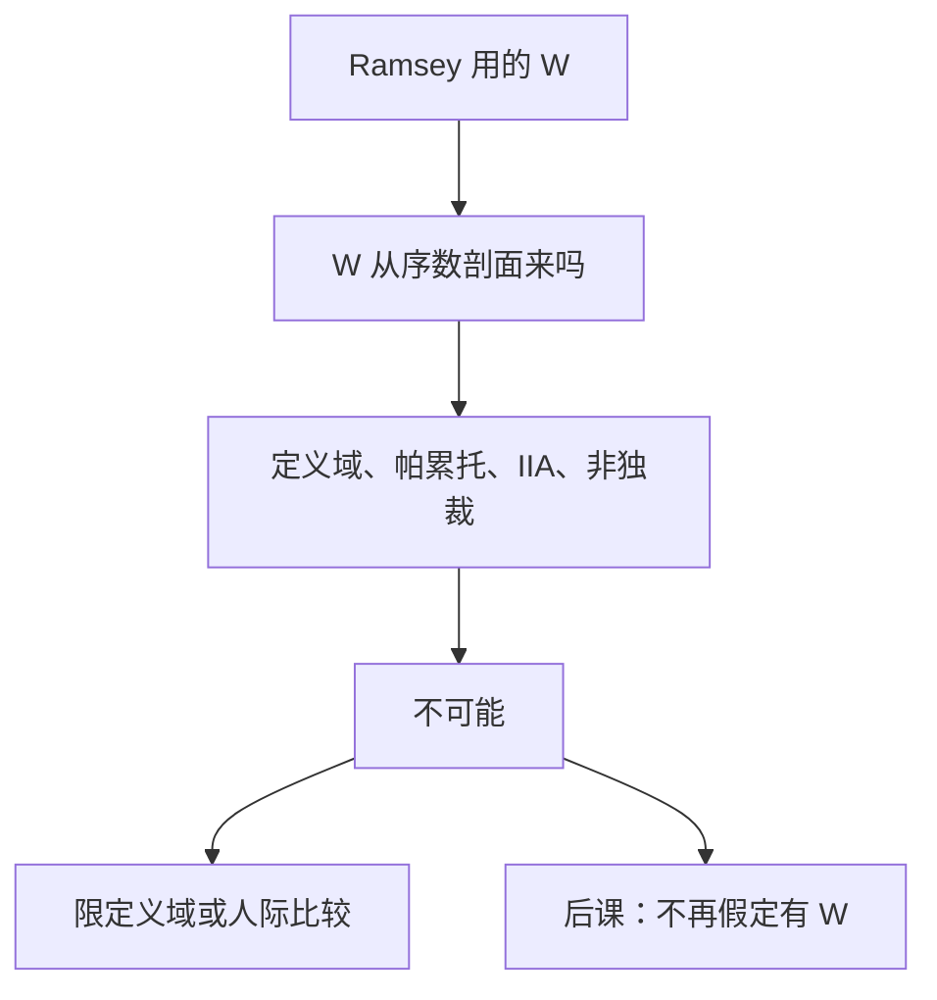

# 阿罗不可能定理

若社会排序必须对一切偏好剖面有定义，满足弱帕累托与无关方案独立性，并且不独裁，则不存在这样的加总规则。

<footer>—— Arrow, Social Choice and Individual Values, 1951；1963 第二版</footer>

[上一课](/econ/mirrlees-income)（最优所得税）。的规划假定有一个社会福利函数 $W$，把商品税写成约束最优。缺口是 $W$ 从哪来。若只有序数偏好剖面，能否用一组公理把个人排序收成社会排序？Arrow 说：不能。本课钉公理冲突，不是市场失灵或次优楔子的重讲。

## 问题

对象：有限方案集 $|X|\ge 3$，个人 $i$ 的严格（或弱）排序 $R_i$，剖面 $(R_1,\ldots,R_n)$。社会福利泛函把剖面对成社会排序 $R$。Arrow 的条件：

- 无限制定义域：一切剖面都可接受；
- 弱帕累托：人人严格偏好 $x$ 于 $y$，则社会也如此；
- 无关方案独立性（IIA）：$x$ 与 $y$ 的社会相对位置，只取决于各人在 $\{x,y\}$ 上的排序；
- 非独裁：不存在一个人，其严格偏好永远变成社会严格偏好。

定理：不存在同时满足四条的加总。Condorcet 循环（甲乙丙三人、三方案的石头剪刀布）是教具：多数规则满足帕累托与非独裁，但循环不是排序，若用「淘汰赛」打破循环又往往踩 IIA。

### 这不是「市场会失灵」

外部性、公共品、Ramsey 楔子谈的是配置能不能分权。本课谈的是规范加总：就算完全市场把帕累托集摆在桌上，社会要在集上挑哪一点，序数加总没有免费的规则。第二定理用总额转移挑点，已经假定计划者知道要去哪一点；Arrow 说「要去哪」本身加总不出来。

IIA 禁止用「对第三方案 $z$ 的看法」来决定 $x$ 对 $y$。Borda 计数用名次加总，改一个无关方案的插入可以翻转 $x,y$，故非 IIA。多数两两比较是 IIA 的，但可以不传递。

## 方法

证明骨架：由帕累托，全联盟是决定性的（其共同严格偏好即社会偏好）。IIA 加无限制域，把决定性从大联盟传到子联盟，直到收缩为单人——独裁。本课要的是这条收缩，不是投票程序清单。

逃避条款必须改公理，不能改口号。单峰偏好（Black）限制定义域，中位选民给出多数均衡。基数效用加人际比较（Harsanyi 功利）换掉序数与 IIA 的搭配。两人、两方案时多数规则没事，$|X|\ge 3$ 才炸。

## 机制

四条一起空，是因为传递的社会排序太强，而 IIA 又不许借用第三方案来恢复传递。无限制域保证循环剖面合法；帕累托强迫社会跟着一致意见走；非独裁禁止指定一个人当社会。少任何一条都可以造出规则：独裁满足前三条；Borda 放弃 IIA；多数放弃传递。

Gibbard–Satterthwaite 把同一紧张写成策略：非独裁的社会选择，在广泛定义域上无法让说真话成为占优。那是后课机制的伏笔；本课停在偏好加总，不进入博弈。

### 福利权重不是逃出定理的后门

Ramsey–Diamond 公式里的分配特征，已经在用加权的边际效用——那是基数加人际比较，正好站在 Arrow 序数框架外面。承认比较，就可以写 $W$；不承认，计划者的目标函数没有公理化来源。市场失灵课序用的 $W$ 一直是后一种实用主义，本课把它的代价写明。

Arrow 1951 第一版的条件略有不同；1963 第二版的四条是教科书标准。Sen 后来强调：放宽「社会必须是完整排序」或引入个人权利，会得到另一族不可能。主干只钉 Arrow 四条。

## 边界

定理不管偏好从哪来，也不给实证投票的预测。单峰、中间选民、概率投票是政治经济学，不是本课的逃逸证明。也不要把不可能写成「因此不要政府」——配置问题仍在，只是加总规则没有免费午餐。

市场失灵课序到此结束：缺市场、公共品、归宿、DWL、次优、Ramsey，最后加总规则本身。下一课博弈从个人策略起，不再假定桌上有一个被所有人接受的 $W$。

后课默认：序数偏好加 IIA 与帕累托，不能给出非独裁的社会排序；要用 $W$，必须另加基数、人际比较或定义域限制。

## 小结

- Ramsey 的 $W$ 不是从序数剖面免费加总出来的。
- 无限制定义域、帕累托、IIA、非独裁，四条不相容。
- 循环是教具；决定性联盟收缩才是证明。
- 单峰或人际比较可以逃，那是改公理。
- 出处：Arrow, *Social Choice and Individual Values*, 1951/1963。
