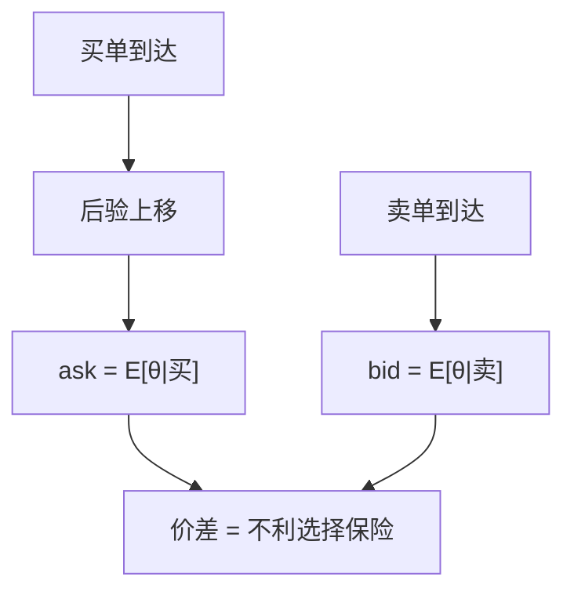

# 不对称信息与流动性理论

买卖价差可以是对知情单的保险费：无需存货，无需非理性，只要对手知道得比你多。

<footer>—— Glosten and Milgrom, Bid, Ask and Transaction Prices in a Specialist Market with Heterogeneously Informed Traders, Journal of Financial Economics, 1985</footer>

[上一课](/econ/kyle-in-equilibrium)用批量冲击 $\lambda$ 度量战略不利选择。本课缺口换成**序贯报价**：买价与卖价本身就是条件期望，价差是理论对象，不是簿上的两档挂单。不重做 Kyle 的线性批量，不分解已实现价差的实证成分。

## 问题

Bagehot（Treynor）已经口头说过：做市商对知情者亏损、对未知情者盈利，价差必须覆盖前者。Glosten 与 Milgrom（1985）把它写成贝叶斯：每来一笔买（卖），做市端把 $\theta$ 的后验往上（下）移；报价等于成交后的条件期望，否则被知情者自由选取。于是 ask 高于双向成交前的期望，bid 低于它，价差严格为正——即使存货成本为零、即使风险中性。

缺口是：流动性成本可以完全来自信息不对称。Hellwig 的 $z$ 降低揭示；这里没有 $z$ 也可以有价差，因为方向本身是信号。Kyle 的 $\lambda$ 是斜率；这里是两点报价。三者同一家族：残差信息租金，不同的交易协议抽象。协议的具体状态机仍不在本栏。

Glosten and Milgrom, *JFE* 14, 1985。风险中性、竞争型做市，把存货与市场力关掉，只留不利选择。Copeland–Galai 更早用期权语言写过类似保险费。

## 方法

两报价：$a=\mathrm{E}[\theta\mid\text{买}]$，$b=\mathrm{E}[\theta\mid\text{卖}]$。未知情者以外生动机买或卖，知情者只在有利一侧出现。价差 $a-b$ 随知情者比例、信号精度升，随未知情流量降。交易发生后公共后验更新，下一轮价差可以变——信息被「做进」报价，不必等到清算。

与 [随机折现因子](/econ/stochastic-discount-factor) 的接缝：这里的 $a,b$ 还不是 $p=\mathrm{E}[m x]$ 里那个单一 $p$。不利选择制造的是买卖两个条件期望，线性定价核面对的是可交易方向被分成两张票。本课不把价差写进 $m$；后课接口才问资产定价该不该给流动性一个状态变量。

不要把 $a,b$ 画成限价簿的最佳买卖。本课甚至没有时间优先：每期一个专营商报出两点，成交即更新。簿的几何会把同一不利选择摊到多档与队列，那是换栏之后的事。

## 机制

机制是反向选择。愿意在 ask 上买的人群里，知情者比例更高；做市端必须把 ask 定在「被买走之后」的价值上，否则期望亏损。价差因此是配置成本：未知情的流动性需求被征税，知情租金从价差里支付。社会若需要那部分未知情交易（配置、对冲），税是真实的；它不是摩擦的别名，是信息约束的影子价格。

GS 说完全揭示不能与采集共存；本课说即便信号已经存在，只要它还没被价格完全吸收，交易就要付保险费。两条在时间上衔接：采集决定有多少知情者，序贯报价决定他们如何把信息做进 $p$。

存货模型（Stoll, Ho–Stoll）给出另一条价差：风险厌恶做市商为库存要补偿。本课关掉它，是为了单独看见信息。两条可以加，但加总不是本课任务，更不是实证分解。

## 边界

不要在这里写 Roll 估计、价差分解回归、PIN。那些是量化栏对这条理论的测量。也不要把「流动性」升级成偏好参数——后文便利收益会给安全资产一个非信息的流动性溢价，对象不同。

下一课问知情者自己会不会把信号**说出来**（披露），而不是只通过交易泄漏。价差是泄漏的价格；披露是主动的公共信号。

后课默认：不对称信息足以产生价差与价格冲击，无需存货或非理性。本栏的 $a,b,\lambda$ 是条件期望对象，不是盘口数据。

## 小结

- Glosten–Milgrom：买卖报价是方向条件期望，价差是不利选择保险。
- 与 Kyle 的 $\lambda$、Hellwig 的 $z$ 同一家族，协议抽象不同。
- 实证分解与簿几何换栏；本课不写。
- 出处：Glosten and Milgrom, *JFE* 1985；对照 Kyle 1985。
