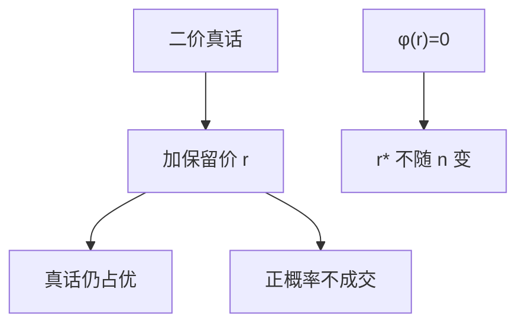

# 保留价

最优保留价由虚拟价值过零处决定，不随投标人数上升而下降；卖家故意留下正概率不成交，用效率换信息租金。

<footer>—— Myerson, Optimal Auction Design, Mathematics of Operations Research, 1981；Riley and Samuelson, Optimal Auctions, American Economic Review, 1981</footer>

[上一课](/econ/second-price-vickrey)钉了二价占优真话：最高报价得物，付第二高。缺口是卖方自己的估值 $v_0$（常取 $0$）不必等于「必须成交」。加上保留价 $r$：所有报价低于 $r$ 则物品留在卖方。真话仍占优，但配置不再总把物品交给最高 $v_i$。本课钉最优 $r$，不把收入等价的整条包络提前，也不把虚拟价值熨平写成全书。

## 问题

对称 IPV，风险中性。二价加保留价：报 $v_i$ 仍是占优；若最高报价 $<r$，不成交；若恰好一人超过 $r$，付 $r$；若至少两人超过 $r$，付第二高报价。卖方期望收入随 $r$ 先升后降：太低则把物品廉价卖给接近 $0$ 的类型；太高则经常卖不掉。

Myerson / Riley–Samuelson：正则分布下，最优 $r^*$ 满足虚拟价值为零，

$$
\varphi(r^*)=r^*-\frac{1-F(r^*)}{f(r^*)}=0
$$

（卖方估值 $v_0=0$ 时）。关键比较静态：$r^*$ **不依赖** $n$。多一个投标人提高成交概率，但不改变「边际类型该不该拿货」的虚拟价值公式。

### 不是「多来几个人就可以把 $r$ 降到零」

直觉说竞争越狠越不必设门槛。最优拍卖的会计相反：低类型成交会通过激励相容抬高所有更高类型的信息租金。挡掉 $\varphi<0$ 的类型，是在砍租金，不是在跟人数作对。人数进的是期望成交量，不进 $r^*$ 的一阶条件。

若卖方自己有 $v_0>0$，门槛改成 $\varphi(r)=v_0$。物品留在卖方，当且仅当所有投标人的虚拟价值都低于 $v_0$。有效性要求 $r=v_0$；收入最大化通常 $r^*>v_0$。

## 方法

对象：对称独立、正则 $\varphi$ 递增、单物品。在二价（或英式）上加 $r$，用占优真话把期望收入写成 $r$ 的函数，求导得 $\varphi(r)=0$。一价加保留价改的是遮挡的下边界 $b(r)=r$，最优 $r$ 在正则下与二价相同——这已经是收入等价的特例，本课只记结论，证明放后课。

不对称先验、不规则密度要熨平，最优机制不再是「简单 $r$ + 最高者得」，本课正则对称。英式加保留价：时钟从 $r$ 起跳，或卖方委托出价顶到 $r$；策略仍是退到 $v$，只是 $v<r$ 者不参与。荷式 / 一价把下边界改成 $b(r)=r$，遮挡公式从 $r$ 积分，不从 $0$。

## 机制

包络把卖方收入钉成期望虚拟剩余。配置规则若把物品交给 $\varphi<0$ 的人，该项为负，不如留给卖方（$\varphi$ 记为 $0$ 或 $v_0$）。保留价正是这道点态规则的公开写法：低于 $r^*$ 的类型赢率为零。效率损失是故意的——与次优税同一逻辑：信息不对称下，第一最佳（总把物品给估值最高者）不可及，除非放弃收入目标。

人数增加：最高估值的分布往上移，成交更频繁，期望收入上升，但 $\varphi(r)=0$ 这条切线不变。所以「热门拍品仍设高底价」与「冷门拍品也设底价」可以来自同一公式，差别在 $F$，不在 $n$。

### 参与约束在最低类型

未参与的人支付为零。保留价把最低成交类型抬到 $r^*$，其租金为零。更高类型的租金仍是赢率的积分；砍掉低端赢率，整条租金曲线下移。这与筛选课「故意扭曲低类型数量」是同一包络。

进入费与保留价在 IPV 正则下可以互换（把参与门槛写成货币）。实务上公开 $r$ 与隐藏底价、英式里卖方委托出价，实施不同，最优虚拟门槛可以相同。

## 边界

关联价值、风险厌恶、预算约束下，$r^*$ 依赖 $n$ 或不再由 $\varphi=0$ 单独给出。合谋时保留价还要防压价。也不要把保留价写成连续交易里的限价——本课是一次性拍卖的门槛。

后课默认：IPV 正则下最优保留价由虚拟价值过零决定，与人数无关；二价加 $r$ 仍真话。下一课用包络把一价、荷式、英式的期望收入钉在同一条 $Q$ 上。

## 小结

- 二价加 $r$：真话仍占优，配置不再总有效。
- 最优 $r^*$ 满足 $\varphi(r^*)=0$，不随 $n$ 下降。
- 卖方用不成交换更低的信息租金。
- 有效门槛是 $v_0$；收入最大化通常更高。
- 出处：Myerson, *Math. Oper. Res.*, 1981；Riley and Samuelson, *AER*, 1981。
