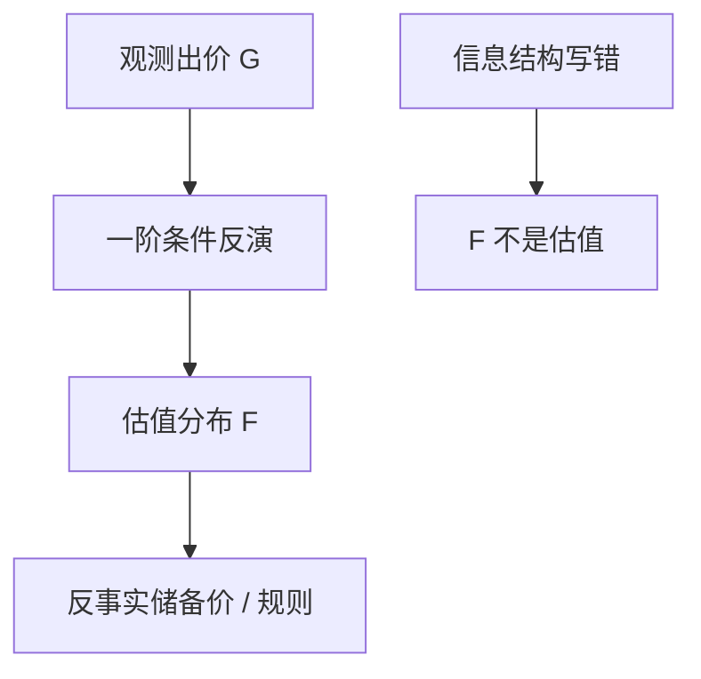
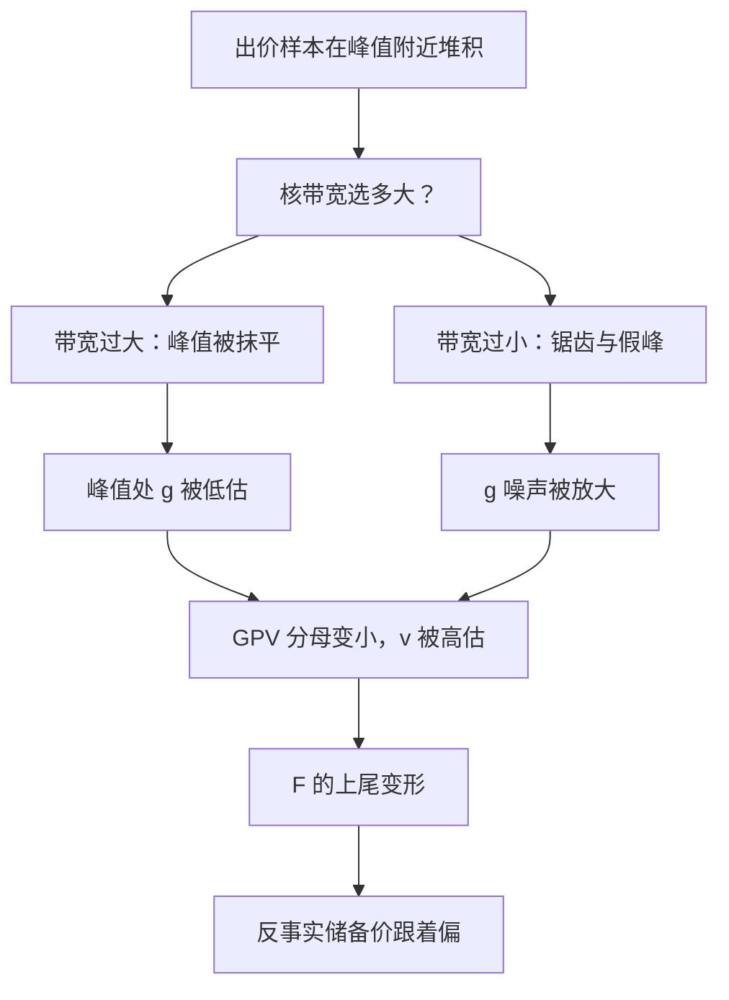

# 拍卖的结构估计

观测到的是出价，要的是估值分布；一阶条件把出价策略反演成估值，策略与信息结构写对了，反事实储备价才不是把历史成交均价再平均一次。

<footer>—— Guerre, Perrigne and Vuong, Optimal Nonparametric Estimation of First-Price Auctions, Econometrica 2000；对照 Paarsch, Haile 的结构拍卖传统</footer>

[上一课](/econ/production-function-estimation)从投入选择反演生产率。本课换博弈：第一价格密封拍卖里，出价 $b$ 是估值 $v$ 的策略。预测评估下一课离开结构、问预报精度。本课钉拍卖结构估计，不重写[机制设计](/econ/myerson-1981-paper)附录全文。

## 问题

IPV 第一价格：对称贝叶斯纳什，$b=s(v)$ 递增。观测到 $b$ 的分布 $G$，Guerre–Perrigne–Vuong（GPV）用一阶条件

$$
v=b+\frac{G(b)}{(n-1)g(b)},
$$

非参数估 $G,g$，把每个 $b$ 映回 $\hat v$，得到估值分布 $F$。缺口是：储备价、进入、风险厌恶、关联价值会改这道反演。约化形式「谁赢了、成交价多少」回答不了「若提高储备价，期望收入如何」——那要 $F$ 与策略一起变。

「非参数估计」就是不预设分布的形状（比如不假定估值服从正态），让数据自己给出整条分布。代价是对样本量和边界更敏感——出价靠近下边界处没有更低的出价可参照，估计天生不稳。

独立私人价值是最薄的许可证。关联价值、共同价值（石油租约）使赢家诅咒进入策略，GPV 公式不能直接套。Haile–Tamer 对英式拍卖给出部分识别，避免硬套 IPV。

## 方法

声明信息结构（IPV / 关联 / 共同）、规则（第一价格、英式、荷兰）、人数 $n$ 是否外生。GPV：核估 $G,g$，注意边界偏误。参数途径：假定 $F$ 族，用 MLE 或 GMM 拟合出价。进入内生：必须同时估进入成本，否则 $n$ 对储备价的反应会错。风险厌恶：一阶条件多一个效用曲率，往往与 $F$ 纠缠，识别要额外变体（不同 $n$ 的场次）。

与[第一价格理论](/econ/ipv-first-price)：策略 $s(v)$ 本课当估的对象的反函数，不重推均衡存在。Myerson 最优储备价是 $F$ 估完之后的应用。

## 机制

机制是最优出价把「再高一点的边际得物概率」与「多付的成本」对齐。密度 $g$ 出现在分母：出价堆在某点，意味着估值密度与策略斜率的特定组合。估错 $g$（带宽过大抹掉峰值）会系统扭曲 $\hat F$ 的上尾——而最优储备价对上尾敏感。

数字实例：5 人竞拍、估值均匀分布在 0 到 100，均衡策略是只报估值的八成，出价落在 0 到 80 上。这时 $G(b)/4g(b)=b/4$：看到出价 60，修正项是 $60/4=15$，反演回 $v=75$。人数 $n$ 越大，压价越轻，修正项越小。

与 BLP：都是从观测选择 / 出价反演不可观测（$\xi$ 或 $v$），再靠均衡做反事实。拍卖的均衡是贝叶斯博弈，产品市场是 Bertrand。工具在拍卖里往往是人数变化、场次协变量，排除要讲「$n$ 不进估值」。

现场数据常有秘密储备、合谋、不对称。结构估计不是自动比 DiD 更真；合谋时 IPV 反演把策略误读成估值。

## 边界

本课不给石油租约的新数字。不把英式拍卖的按钮模型与密封第一价格混用反演。下一课预报：对象是时间序列预测误差，不是估值。计量课程的结构支线在拍卖处给出「博弈 + 反演」的第二例，与离散选择、BLP、生产函数并列。

后课默认：拍卖反事实先写信息结构与一阶条件；GPV 只在 IPV 第一价格下直接用。$n$ 内生、风险厌恶、共同价值都要改公式。不要用成交均价当「估值的无偏估计」。

为什么不能直接拿成交均价当平均估值：第一价格拍卖里人人都刻意往下压价，成交价系统性低于赢家估值，平均下去依然偏低。这正是必须先写出价策略、再反演估值分布的原因——不做这一步，反事实会错得很稳。

## 小结

- 出价策略可反演估值，若信息结构与均衡写对。
- GPV 用 $G,g$ 非参数恢复 IPV 第一价格的 $F$。
- 反事实储备价在 $F$ 上重解，不是历史均价。
- 合谋、共同价值、内生进入会毁掉套用。
- 出处：Guerre, Perrigne and Vuong, *Econometrica* 2000；Paarsch；Haile and Tamer。
