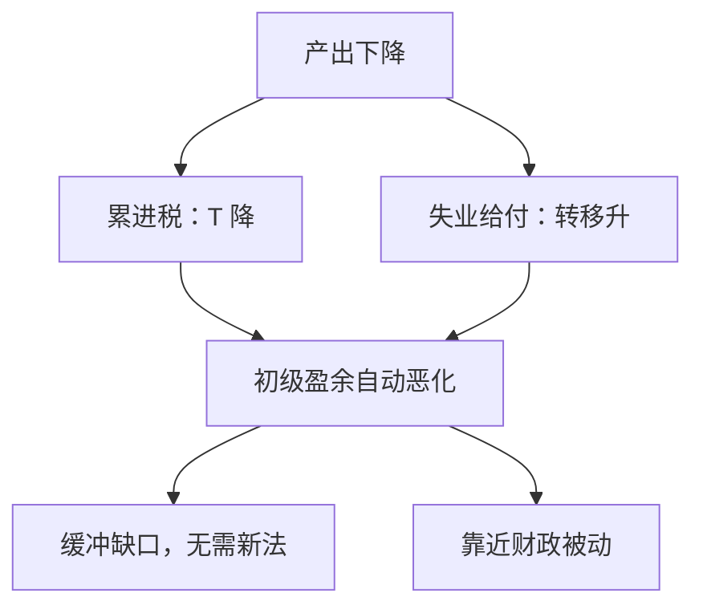

# 自动稳定器

累进税与失业保险让盈余在产出下降时自动变弱，不必再通过一次立法；这是财政规则里的反馈，不是又一次相机 $G$。

<footer>—— 据 Blinder and Solow 对财政政策是否「有用」的讨论；税制累进把弹性写进预算</footer>

[上一课](/econ/ftpl)把名义债的实际值接到初级盈余现值，并区分财政主动与被动。本课的缺口是：许多盈余反馈**无需新立法**——税率累进、失业给付、公司利润税——使 $T-G$ 随 $Y$ 自动动。开放经济会计从下一课起把 $S-I$ 接到经常账户；本课先把国内预算的自动部分钉住。

## 问题

乘数课的 $G$ 是相机购买；FTPL 的主动财政是盈余过程不对债务作充分反应。中间还有第三种对象：立法已写好的弹性。产出下降时，累进所得税使平均税率下降，失业保险使转移上升，初级盈余恶化。这不是「又一次刺激法案」，是规则。缺口是：自动稳定器如何进入已经学过的 IS、李嘉图与 Leeper 的被动财政，而不把它们重写成政治口号。

FTPL 要的是盈余对债务（或对 $P$）是否调整。稳定器提供的是对 $Y$ 的弹性，有助于被动，但立法仍可以同时规定债务上升也不加税。本课把「无需新立法」钉住，开放课序从下一课才把 $S-I$ 接到 $CA$。

自动稳定器改变的是盈余对 $Y$（和债务）的弹性。弹性足够大，财政更接近 Leeper 意义上的被动：债务上升之后，无需新决议也会有一部分盈余跟上。

## 方法

把税收写成 $T_t=T(Y_t)$，$T'>0$ 且累进时平均税率随 $Y$ 升。失业给付是反向的转移。Blinder 与 Solow 问财政是否「有用」时，已经把预算内生进 IS–LM：盈余随 $Y$ 改善，对债务累积有刹车。欧拉与李嘉图下，一次总付的自动转移仍可能被未来税抵消；扭曲税与流动性约束让当期可支配收入通道复活。NK 里，自动稳定器改变的是缺口对需求冲击的映射：同样的 $G$ 或外生需求下降，可支配收入少掉一截，乘数更小。

下限上，相机 $G$ 的乘数往往更大；自动稳定器仍然工作，而且不依赖议会再开一次会——这是执行时滞的差，不是另一套乘数公式。卢卡斯批判：稳定器的弹性是税法的结构，用旧税法样本去模拟「若累进更陡」必须重解，不能平移 MPC。

### 与相机财政、与 FTPL

相机财政是新立法：$G$ 或税率表本身改变。自动稳定器是给定税法下的反馈。FTPL 关心的是盈余现值是否钉住 $P$；稳定器提供一条对 $Y$ 从而对税基的反馈，有助于被动，但若立法同时规定「债务上升也不加税、不减支」，主动仍可成立。二者不要并成「有失业保险就不会通胀」。

## 机制

需求下降 → $Y$ 降 → 税基缩小、给付扩大 → 私人可支配收入少降一截 → 欧拉上受约束家庭的 $C$ 少降 → 缺口比没有稳定器时更浅。反向过热时自动紧缩。长期中性：$y^*$ 仍由实物决定，稳定器不永久改变自然产出；它们改变的是名义需求冲击下 $\tilde{y}$ 的振幅。铸币税仍是盈余的一项；稳定器主要走所得税与转移，不是印钞。

时间不一致：把自动稳定器临时关掉（「今年暂停失业金」）是再优化，预期会对准将来也会停。承诺技术包括把弹性写进税法而不是写进年度预算演讲。乘数课的李嘉图在一次总付转移上最强；失业给付针对受约束家庭，MPC 更高，缓冲才不是会计上的零。Blinder–Solow 在 IS–LM 里已经让预算内生；欧拉下同样的弹性改的是哪一类家庭的现金流，而不是把 $C=cY$ 请回结构。

公司利润税、累进个人所得税、按通胀指数化的税档，弹性不同。本课不估某个国家的「半弹性」。指数化税档会削弱通胀对实际税负的自动抬升。

## 边界

本课不把稳定器写成最优税率表，不估计「失业保险永远乘数 0.x」。开放漏出与下课经常账户会改变封闭缓冲。公司金融的税盾不是宏观自动稳定器。量化栏没有财政。累进也可以来自定额免税额：名义收入下降时更多家庭掉进免税，弹性不必写成连续边际税率。指数化税档则削弱「通胀自动加税」那一条，与稳定器的方向可以相反，要分开声明。

突然停止时稳定器让 $S^g$ 下降，会加大需要私人调整或贬值的幅度——开放约束与国内缓冲可以打架。那不是否定稳定器，是声明国境已经打开之后的课序。本课先封闭。

后课默认：谈财政规则时，先分相机立法与已写入税法的弹性。下一课打开国境：国民储蓄与投资的差是经常账户。

## 小结

- 自动稳定器是无需新立法的盈余反馈，核心是累进税与失业给付。
- 它们缓冲缺口，并帮助财政靠近 Leeper 的被动。
- 不是相机 $G$，也不是「有稳定器则无 FTPL」。
- 弹性是税法结构；跨规则模拟要重解。
- 受约束家庭上缓冲才不是李嘉图会计零。
- 出处：Blinder and Solow 对财政政策的讨论；税制累进。
