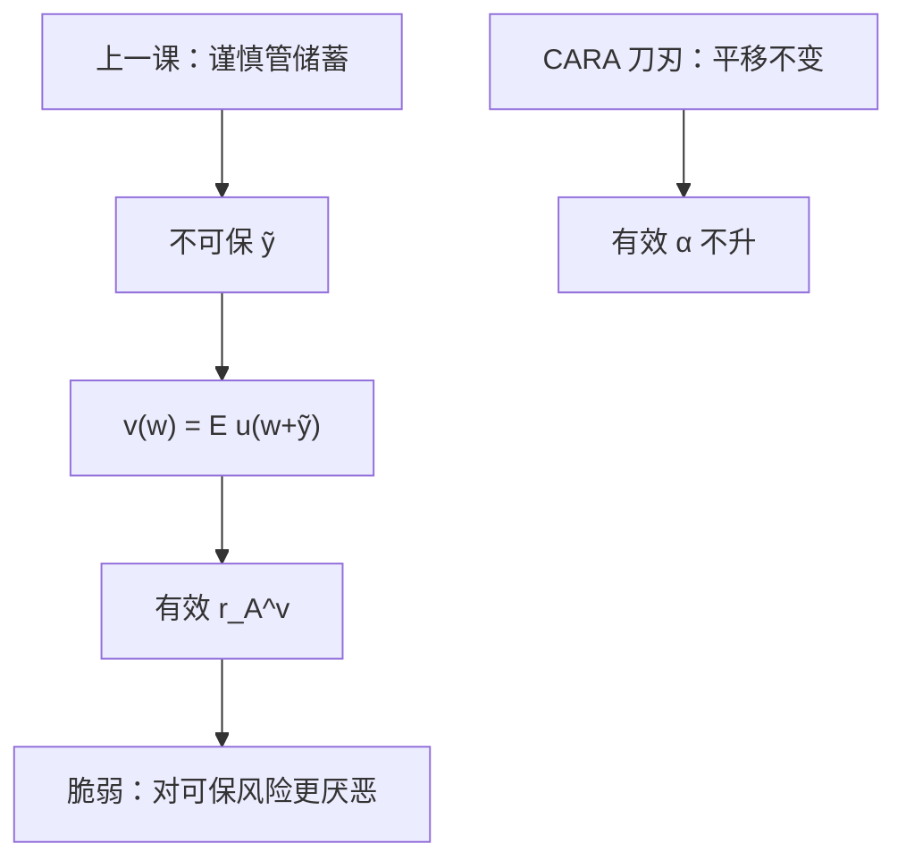

# 背景风险

不可保的那一份噪声，会改写人对另一份可保风险的有效厌恶——不是把 $r_A$ 估大一点，而是间接效用换了一条。

<footer>—— 据 Gollier and Pratt, Risk Vulnerability and the Tempering Effect of Background Risk, Econometrica, 1996；Pratt, Econometrica, 1964 整理</footer>

[上一课](/econ/prudence-kimball)把 $u'''>0$ 收成谨慎，并说明预防性储蓄针对**尚未保险**的未来风险。本课不重写 $\pi$ 的局部公式，也不把两期欧拉再推一遍。缺口是：同一期里往往还有一份独立、不可交易的噪声 $\tilde y$（劳动收入、健康、住房）。人对可交易风险 $\tilde x$ 的态度，不再等于无 $\tilde y$ 时的 $r_A$，而是间接效用 $v(w)=\mathbb{E}u(w+\tilde y)$ 的厌恶。Gollier–Pratt 的风险脆弱性，说的就是这份背景如何提高有效厌恶。

## 问题

上一课的噪声出现在第二期，决策是储蓄。现在两份风险同时在期末：$\tilde x$ 可在市场上加或减，$\tilde y$ 不能。若把 $u$ 直接拿去对 $\tilde x$ 算 Pratt 溢价，等于假装 $\tilde y$ 不存在。缺口是定义有效效用

$$
v(w)=\mathbb{E}\bigl[u(w+\tilde y)\bigr],
$$

再读 $r_A^v(w)=-v''(w)/v'(w)$。一般 $r_A^v\neq r_A^u$。背景风险改变的是**对另一风险**的态度，不是把 $\tilde y$ 加进方差就结束——非正态、非二次时，方差相加不是有效厌恶。

风险脆弱（risk vulnerability）：加入独立的不公平背景风险后，人对任何独立的零均值风险都变得更不愿承担。这比谨慎强，通常还要用到节制（$u''''$ 的符号）一类的四阶条件。本课主干取 Gollier–Pratt 的定性：背景往往让人更厌恶可保风险，而不是「分散了所以更敢赌」。

### 独立不是可加的方差

$\tilde x\perp\tilde y$ 且 $\mathbb{E}\tilde y=0$，并不蕴含 $v$ 比 $u$ 更凹的简单比较。二次效用下方差可加，但二次已排除出主干。CARA 对独立背景有平移结构：绝对需求对财富仍无弹性，有效 $\alpha$ 仍是 $\alpha$——指数把加性噪声提出期望。CRRA 没有这种平移，劳动收入会扭动有效 $\gamma$。上一课边注已预告 CARA 的平移不变；本课把它当成背景风险的刀刃，不是一般结论。

Pratt 1964 比较的是两条 $u$。本课比较的是同一 $u$ 在有无背景时诱导的 $v$。人际「更厌恶」与「背景使人更厌恶」是两刀。

## 方法

先写出 $v$，再对可交易菜单用 $v$ 做 EU。公平的可保风险：无背景时凹性给出全额投保；有背景时，若 $v$ 仍凹（通常是），全额投保仍成立，但**部分保险、资产需求**的数量被 $r_A^v$ 改写。检验脆弱性：看独立的零均值 $\tilde x$ 的风险溢价是否因 $\tilde y$ 上升。不必估一条新的伯努利函数。

不完全市场把 $\tilde y$ 锁在正交补里，与张成课同一几何：买不到的方向变成背景。本课先在静态财富上钉 $v$，不把一般均衡写完。

本课不把背景写成限价簿上的「未知对手」。微观结构的未知是机制，不是 $v$ 的期望。也不做组合实证。

## 机制

为什么背景常常加严：$\tilde y$ 把人随机推进 $u$ 更凹或 $r_A$ 更大的区域（DARA 下更穷则更厌恶）。取期望之后，$v$ 的局部厌恶是这些状态的加权，往往高于无噪声的 $r_A(w)$。谨慎保证对 $\tilde y$ 有预防性反应；节制一类条件再保证对**另一份**独立风险也不放松。CARA 把 $r_A$ 钉死，加权改变不了 $\alpha$，故背景不提高绝对厌恶——这是特例，用来反衬一般 DARA。

与预防性储蓄的分工：谨慎回答「要不要先存」；背景回答「可保的那一份还敢不敢承担」。两份噪声可以同时存在：先因 $\tilde y$ 多存，再因 $r_A^v$ 少持 $\tilde x$。不要焊成一个弹性。

Gollier and Pratt 1996 把脆弱性与「proper」风险厌恶（Pratt–Zeckhauser）排在同一条加强凹性的梯子上。本栏主干只取：不可保风险改变有效 $r_A$，CARA 除外。

## 边界

相关背景（同一衰退里劳动与股票一起跌）比独立更糟，脆弱性的独立假设不够。本课先钉独立，相关留给宏观与资产定价。模糊没有客观 $\tilde y$ 的分布。健康、不可验证损失会把 $\tilde y$ 变成信息课的隐藏类型，不是单纯背景。

也不要把「劳动收入风险」直接叫均值方差里的第二因子。那是定价课；这里没有 $\beta$，只有 $v$。

后课默认：可保风险的有效厌恶读 $v$，不读裸 $u$；CARA 下背景不改绝对厌恶。均值方差何时等于 EU，必须先声明菜单里有没有这类不可交易噪声。

## 小结

- 不可保的独立风险把 $u$ 改写成 $v=\mathbb{E}u(\cdot+\tilde y)$；有效 $r_A$ 一般上升。
- 风险脆弱：背景使人更不愿承担另一份独立零均值风险。
- CARA 平移不变，有效绝对厌恶不升；CRRA/DARA 一般会升。
- 谨慎管跨期储蓄；背景管同期可保风险的需求。
- 出处：Gollier and Pratt, *Econometrica*, 1996；Pratt, *Econometrica*, 1964。
