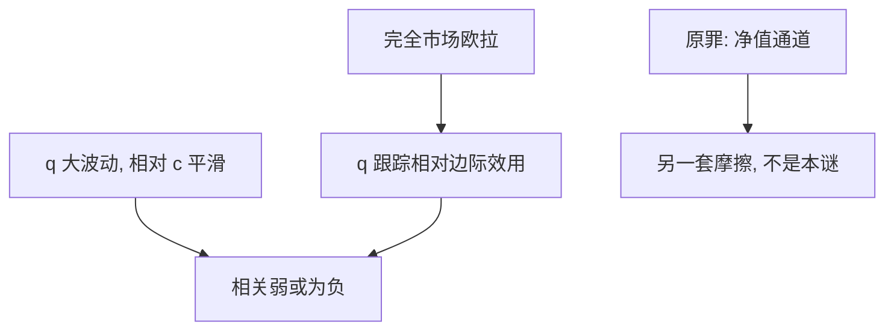

# Backus–Smith

完全市场下，实际汇率应跟踪相对消费的边际效用；数据里两者几乎不一起走，甚至常常反号。

<footer>—— Backus and Smith, Consumption and Real Exchange Rates in Dynamic Exchange Economies with Non-traded Goods, Journal of International Economics, 1993</footer>

[上一课](/econ/original-sin)把贬值写成外币债上的净值税。资产负债表解释了为何「让 $E$ 动」可以收缩，却还没有动用跨期风险分担。本课缺口是完整市场的国际欧拉：相对消费与实际汇率应当锁在一起。Backus–Smith 之谜是这把锁在数据上对不上。开放宏观主干到此结束。

## 问题

完全市场、可贸易的状态或有要求权，使各国消费者的边际替代率对齐。对时间可分效用，这意味着实际汇率 $q$ 与相对消费（或相对边际效用）同向变动：消费相对高的国家，其货物应相对贵。Backus 与 Smith（1993）在含不可贸易品的动态经济里写出这条限制，再面对事实：实际汇率波动极大，相对消费平滑，二者相关弱甚至为负。

缺口不是再讲原罪或突然停止。原罪改的是贬值的净值符号；本课改的是**风险分担是否已经写进 $q$**。CIP/UIP 的报价层仍见 `/quant/irp`，本课不报基差，也不把谜写成套息策略。

完全市场的国际风险分担：坏状态下谁消费、谁的 $q$ 升值，应由或有要求权事先排好。相关为负，像是「谁消费多谁的货币更贬」——与对齐边际效用相反。

## 方法

两国欧拉相除，得到 $q$ 与相对 $u'(c)$ 的关系（不可贸易品把总消费与可贸易消费切开，但定性限制仍在）。完全市场把国别特异冲击保险掉，剩下的相对消费路径应被 $q$ 吸收。谜是：观测到的 $q$ 波动远大于相对 $\Delta c$ 所能合理化的，符号还常错。

候选修补——不完全市场、不可贸易冲击、习惯、递归效用、崩断的国际借贷——都是改分担技术或改 $m$，不是改 $CA=S-I$。本课不展开菜单。

### 与原罪分层

原罪：负债币种错配，贬值打净值。Backus–Smith：即便没有错配，完全市场已经对 $q$ 与相对消费下了限制。两课可以同时真：新兴市场有原罪，发达经济体双边 $q$ 仍然对不上相对 $c$。不要用外债份额「解释」所有 $q$ 波动。

## 机制

机制是状态价格应对齐。若国际资产市场接近完全，$q$ 是相对稀缺性的价格，应随谁更想消费而动。货物市场分割、不可贸易品、以及名义粘性，让 $q$ 在资产市场里像资产价格一样跳（超调），而消费被平滑或被信贷约束卡住——于是价格动、数量几乎不动，相关破裂。这与 J 曲线的「价格先于数量」同族，对象换成跨国消费保险。

长期 PPP 仍可以拉回 $q$ 的水平趋势；谜针对的是**高频共动**，不是一价定律的慢锚。三角选哪一边也不自动提供完全的国际保险：资本开放是必要而非充分。

用总量消费当 $c$，测量误差会把相关往零推。谜的定性刺是符号与量级，不是某一个相关系数的小数点。本课不审表。

## 边界

不要把谜写成「浮动无效」或「PPP 失败」。也不要把因子实证、套息组合搬进本栏。下一课进入货币银行：[中介为何存在](/econ/why-intermediaries)——无论分担是否完全，不可交易的初级债权还在。

后课默认：完全市场预测 $q$ 与相对消费对齐；数据拒绝这条特化，不等于拒绝开放会计。原罪是存量币种，本课是风险分担。

开放宏观主干在此停。附录论文不接在本课之后当下一课。

不完全市场、抵押约束、不可贸易冲击，都可以让 $q$ 按资产价格跳而 $c$ 按信贷卡住。本课不选哪一条修补获胜。UIP 残差与本谜也不是同一回归：一个是利率差对 $\Delta e$，一个是 $q$ 对相对消费。

中介下一课从 Gurley–Shaw 起笔。无论国际欧拉是否对齐，家庭仍难直接持有初级贷款。

## 小结

- 完全市场要求实际汇率跟踪相对边际效用（相对消费）。
- Backus–Smith：相关弱或为负，$q$ 波动远大于相对消费所能说明的。
- 原罪与本谜分层：净值错配不是国际欧拉失败的同义反复。
- 开放宏观主干在此停；中介课不问分担是否完全，只问初级债权为何难直接持有。
- 套息与 CIP 基差仍见 `/quant/irp`，不在本栏重跑。
- $q$ 的高频共动失败，不取消长期 PPP 的慢锚。
- 出处：Backus and Smith, *JIE* 1993。
