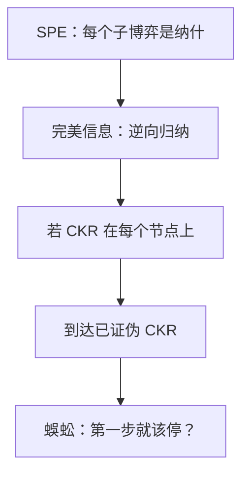

# 逆向归纳的限度

若共同知识理性意味着某些节点走不到，那么「在那些节点上仍按理性玩」就不能从共同知识理性推出来。

<footer>—— 据 Rosenthal, Games of Perfect Information, Predatory Pricing and the Chain-Store Paradox, Journal of Economic Theory, 1981；Reny, Games and Economic Behavior, 1993 整理</footer>

[上一课](/econ/trembling-hand)（颤抖手完美）。用子博弈完美与逆向归纳删掉空威胁：有限完美信息、无平局时，路径被从终点往前钉死。缺口是这把刀的认知假设。归纳要求每个节点——包括按归纳根本不该到达的节点——仍有共同知识理性。蜈蚣把冲突写成支付。本课钉限度，不重写 SPE 定义，也不把集合撑到无名氏那么肥。

## 问题

Rosenthal 蜈蚣：两人交替选「停」或「过」。过则总剩余增大，但停的人拿大头。最后一步，理性人停。倒数第二步预见到对方会停，自己先停……归纳推到第一步就停。路径上的支付远低于「一起过很久再停」。

若第一步居然过了，共同知识理性已经被证伪：按归纳，理性人不会过。到达之后，对方没有理由继续相信「从此仍按逆向归纳玩」。于是「在未达节点上仍最优」不能从「一开始就是共同知识理性」推出来——Reny 把这点写成：共同信念理性与某些信息集的到达不相容。

### 不是实验推翻了定义

SPE 作为策略组合的性质（每个子博弈是纳什）没有自相矛盾。脆的是「共同知识理性 $\Rightarrow$ 逆向归纳」这条认知命题。实验室里蜈蚣晚停，是对照：人们并不持有归纳所需的那层共同知识。定义仍可用；当作预测则过强。

百足长度越长，第一步停越「不合理」——因为对方只要有一点点可能不是归纳玩家，过的期望就升。McKelvey–Palfrey 的实验沿这条比较静态走。本课要的是逻辑限度，不是估计利他参数。

## 方法

对象：有限完美信息树。对照三条陈述：（1）SPE / 逆向归纳策略；（2）共同知识理性（CKR）；（3）在所有节点上的 CKR。有限步、支付无平局时，（1）唯一；（2）在根上可以成立；（3）一旦某偏离节点被到达，与（2）冲突。本课把（1）与（3）拆开。

实验对照只说明人们未必持有（3），不能用来改（1）的定义。

Aumann 1995 在另一套认知模型里论证：CKR 仍蕴含逆向归纳。争议在「知识」的运算：到达零概率节点后，能否还说「我知道你理性」。本课不站队选模型，只记录：把归纳当共同知识的推论，依赖于如何处理零概率。

有同时行动的信息集就不是蜈蚣那种纯完美信息，归纳算法本课不用。

## 机制

归纳从终点传向前，用的是「对方在下一节点会理性」。若下一节点只在对方已经不理性时才到达，前提落空。蜈蚣每一步都把「过」写成对归纳的偏离，于是除了终点附近，整条合作枝都活在零概率里。SPE 用策略把这些枝上的行动也规定好；CKR 在根上并不强迫人们去规定一棵「不该存在」的树上的共同知识。

这与空威胁不同。空威胁是到达之后惩罚者不愿执行，SPE 删得干净。蜈蚣的「早停」在到达之后仍是最优——脆的不是可信性，是「我们怎么会走到需要可信性的地方」。有限重复囚徒困境从终点往前拆合作，是同一逻辑的另一张支付表。

### 一点点不完全信息就拆掉归纳

若有 $\varepsilon$ 概率对方是「合作类型」，有限蜈蚣可以从后往前撑住很长的「过」。声誉把零概率节点变成正概率学习。这是后课类型的预告：限度往往用信息不完全来救，而不是把 SPE 丢掉。无限地平线没有终点，归纳不能起步，无名氏走另一条路。

连锁店悖论（Selten）是同一结构的市场版：在位者按归纳应在每一市场容纳，但直觉想「建立狠名」。有限次重复加一点类型，狠名可以是均衡。本课用蜈蚣当纯认知教具，不写进入遏制的支付。

## 边界

平局、同时行动信息集、不完美信息，逆向归纳本就不是唯一算法，SPE 仍定义。颤抖手让每个节点以任意小概率被碰到，等于用技术扰动强迫（3），归纳又硬起来——那是 Selten 的选择，不是 CKR 的推论。实验偏离归纳，不能单独用来否定 SPE 作为基准；它否定的是「CKR 已是共同知识」这一经验主张。

共同知识是「我知道你知道……」的无限层。有限层理性（我知道你理性，但不确定你知道我理性）已经足以在蜈蚣里撑住前几步「过」。归纳需要的是无限层在每一个节点上还在。实验室与逻辑都在说：无限层太贵。

后课默认：有限完美信息树上 SPE 仍是基准解；把它读成共同知识理性的必然，蜈蚣显示过强。无限重复将把 SPE 集合撑大，那是另一限度：不是太瘦，是太肥。

## 小结

- SPE 要求未达子博弈也是纳什；CKR 在根上不必给未达节点继续赋值。
- 蜈蚣把「过」写成对归纳的偏离，到达与 CKR 冲突。
- 脆的是认知推论，不是 SPE 定义自相矛盾。
- 少量类型或不完美信息即可改变归纳路径。
- 出处：Rosenthal, *JET*, 1981；Reny, *GEB*, 1993；Aumann, *GEB*, 1995。
