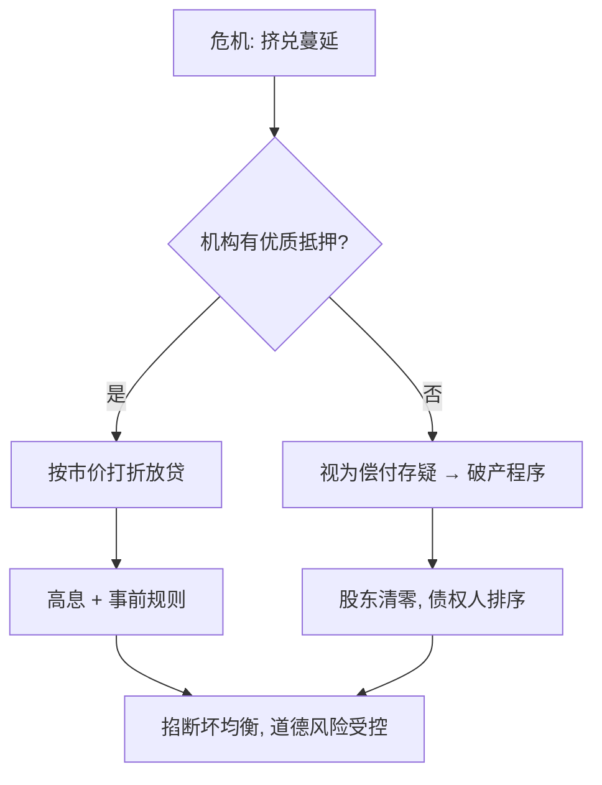
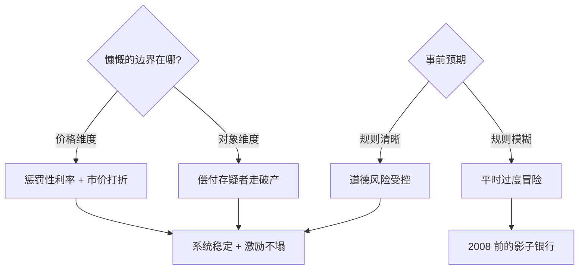

# Bagehot 与最后贷款人

危机时刻借钱要高息、要抵押、只借给有偿付能力的机构——150 年前的四句口诀，仍是每个央行最后贷款人的操作手册。

<footer>—— 据 Bagehot《Lombard Street》(1873)；Fed 2008 贴现窗与 ECB LTRO 实践</footer>

[生育的经济学](/econ/fertility-econ)讲长周期的家庭选择，本课进入危机时刻的金融治理。缺口是**最后贷款人（LOLR）**的规则设计：什么借、借给谁、按什么价、凭什么担保。Bagehot 四原则是对 1866 Overend Gurney 崩盘的复盘，至今是每轮危机争议的原点。本课不展开货币理论之争。

## 问题

银行挤兑的自我实现：存款人排队提现，好银行也被拖垮（Diamond–Dybvig 双均衡）。央行理论上能掐断坏均衡——无限量放贷。但一旦「什么机构都救」，道德风险让银行平时就过度冒险。缺口：**在「救火」与「养懒」之间画一条可执行的线**。

术语翻译：最后贷款人（lender of last resort）= 危机中唯一能创造流动性的主体；Bagehot 原则四件套：无限量放贷（lend freely）、高息（at a penalty rate）、优质抵押（against good collateral）、只借给有偿付能力者（to solvent institutions）。

数字实例：惩罚性利率的尺度——2008 年美联储把贴现窗从高于联邦基金目标 100 bp 降到 25 bp，等于暂时放弃惩罚性；结果贴现窗用量仍少（污名效应），被迫另开拍卖工具（TAF）。而 2023 年 SVB 事件中 BTFP 按面值计抵押，被批评违反「按市价」传统。

## 方法

四原则的执行排序。**先验区分偿付与流动性**：抵押品按市价打折（haircut）是操作化的关键——有优质抵押者被视为（大概率）有偿付能力，于是「看抵押」替代了「看报表」，危机时刻后者来不及。**惩罚性利率**：让借款是次优选择、把流动性优先还给市场；**事前声明**：规则清晰降低挤兑概率本身。本课不进「救不救雷曼」的个案裁判。

直觉类比：LOLR 像急诊室的分诊台——进门先看「有没有保险单」（优质抵押），有就先抢救（放贷）后收费（高息）；没保险的走常规流程（破产法）。若分诊台见人就免费全收，医院很快被诈病者挤爆（道德风险）。

## 机制

机制核心是**双均衡的切换成本不对称**：坏均衡（挤兑）的损失是系统性的，好均衡的维持成本只是惩罚利率的利差——所以「慷慨」在危机时刻是效率；而规则的事前透明决定事后干预是否养懒：若银行预期「到时候总会救」，平时就会少留优质抵押、多囤期限错配。2008–2023 的实践把边界越推越宽：抵押品从国债扩到 MBS、从银行扩到投行与货币基金（PDCF、AMLF），每一次扩容都伴随「是否偏离 Bagehot」的争论——答案通常是「抵押打折仍守住了，但对象扩了」。

常见误区：把「最后贷款人」读成「最后担保人」——Bagehot 借的是流动性、定价照旧，担保是财政的事；另一误区是危机时刻才设计工具——工具箱、法律授权与抵押品清单都要平时备好，临时立法赶不上挤兑速度（SVB 的 48 小时）。

## 边界

四原则在影子银行体系打了折扣：回购市场的「银行」不进贴现窗、没有存款保险，2008 与 2020 都靠临时工具补位。汇率锚定的新兴市场面临「 lender of last resort 没有 last resort 」的货币错配困境。污名效应（stigma）让真正需要的机构不敢来借，迫使央行发明匿名拍卖。与[碳边境调节机制](/econ/carbon-border-adjust)同属「规则先行」的一课：危机治理的有效性九成取决于事前的规则设计，一成才是现场的胆识。

直觉类比：好的最后贷款人像消防队——平时只收消防税（准备金与监管），着火时全力灭火（无限放贷），但烧掉的违章建筑照章拆除（清零股东）；若灭火还要先谈价（非惩罚性利率的另一面），全城都会烧起来。

## 小结

- Bagehot 四原则：无限量、高息、优质抵押、只借偿付者。
- 「看抵押」是危机时刻识别偿付能力的操作化替代。
- 事前规则透明决定道德风险大小；工具箱必须平时备好。
- 出处：Bagehot《Lombard Street》1873；Diamond–Dybvig 1983；Fed/ECB 危机工具文件。
