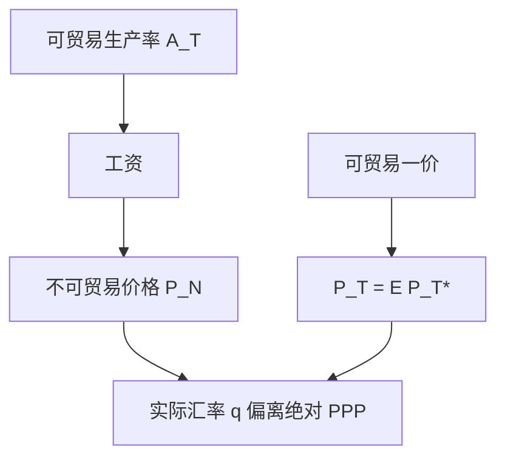

# 巴拉萨–萨缪尔森

可贸易部门的生产率更高，会把工资抬到不可贸易部门；服务价格上升，实际汇率可以长期偏离绝对 PPP，而不违背可贸易品的一价。

<footer>—— Balassa, The Purchasing-Power Parity Doctrine: A Reappraisal, JPE 1964；Samuelson, Theoretical Notes on Trade Problems, Review of Economics and Statistics 1964</footer>

[上一课](/econ/ppp-loop)给出一价定律与指数层 PPP，并允许实际汇率 $q$ 因不可贸易而慢变。本课的缺口是把那句「慢变」写成机制：可贸易生产率推高不可贸易相对价格。UIP 与 CIP 从下一课起把资产平价与货物平价分开；本课仍停在相对价格。

## 问题

绝对 PPP 要 $P=EP^*$。穷国的非贸易服务（理发、住房）按汇率换算往往更便宜，于是 $q$ 系统偏离 1。缺口不是重讲篮子：Balassa 与 Samuelson 各自指出，可贸易部门生产率的国际差异，经劳动市场传到不可贸易价格。可贸易品仍可以服从一价；CPI 却含大量不可贸易。发展核算里用 PPP 比较 $y$，正是因为名义汇率会把不可贸易「算贵或算便宜」。

上一课已经允许 $q$ 因不可贸易而慢变。本课只写机制：可贸易生产率推高不可贸易相对价格。UIP/CIP 从下一课起换对象——资产，不是 CPI 篮子。实证与基差不在此报。

实际汇率按 $q=EP^*/P$ 计。本国可贸易生产率相对更快时，本国不可贸易涨价，$P$ 相对 $EP^*$ 上升，$q$ 下降（本币实际升值）。符号随报价习惯，机制不变。

## 方法

两部门：可贸易 $T$ 与不可贸易 $N$。一价钉住 $P_T=EP_T^*$。劳动可流动，工资在部门间趋于均等。$T$ 的生产率更高则 $T$ 的边际产出更高，工资被抬起；$N$ 的生产率若没跟上，只能靠 $P_N$ 上升来支付同一工资。总价格指数含 $P_N$，于是即令 $P_T$ 服从 LOOP，$P$ 仍与 $EP^*$ 分开。相对 PPP 作为通胀差的一阶故事可以还在：$T$ 的货币通胀仍对齐 $\Delta\ln E$，但 $q$ 的水平可以有趋势。

Samuelson 的笔记强调贸易问题里的相对价格，不只是统计修正。Balassa 直接对着 PPP 教条：用汇率换算的收入比较会系统性偏。收敛核算已经用过购买力；本课把偏的来源接到生产率。

### 不是「PPP 失败所以可以预测升值」

$q$ 因巴拉萨–萨缪尔森而有趋势，不等于下一季名义汇率必回到某个套餐。卢卡斯批判对「用历史回归买卖外汇」同样适用。关税、定价市场分割也会打进楔子，与生产率机制并列，不互相取消。

## 机制

可贸易生产率冲击提高该部门劳动需求，全国工资升。不可贸易是劳动密集、技术追赶慢的服务，单位劳动成本升即 $P_N$ 升。支出在 $N$ 上的份额越大，CPI 越被带走，$q$ 越偏离绝对 PPP。长期货币中性仍在：名义锚决定 $P_T$ 的趋势，$\Delta\ln E$ 对齐可贸易通胀差；实际变量是两部门的相对价格。铸币税与 $\pi^*$ 选择不永久改变巴拉萨–萨缪尔森的相对价格路径。

增长更快的追赶经济常见实际升值，与「贸易顺差美德」不是同一句话。[经常账户](/econ/open-ca)仍是 $S-I$；$q$ 影响均衡中 $S$、$I$ 如何调，不改恒等。双赤字也不会被相对价格「解释掉」：那是数量账户；本课只说明为什么用名义汇率换算的物价篮子会系统性偏。

劳动若不能在部门间流动，工资差可以持久，$P_N$ 的传递变弱。本课取可流动的最小装置。土地与住房供给弹性会放大 $P_N$，那是同一相对价格逻辑的加项，不是另一套 PPP。

用 CPI 检验 PPP 与用可贸易价格指数，答案不同。本课解释的是前者的系统偏差。半衰期不是定律，不在此报数字。

## 边界

不要在此写完整的汇率微观结构。不要把黄金输送点当现代 PPP。下一课的 UIP/CIP 是资产平价，对象不是 CPI 篮子；实证与基差交给 `/quant/irp`。量化栏的限价不是宏观相对价格。Penn World Table 一类用 PPP 比较 $y$，已经在[收敛核算](/econ/convergence-accounting)用过；本课只补「为什么名义汇率换算会把穷国服务算便宜」。

可贸易生产率也可以下降：相对价格机制对称，实际汇率可以因此贬值。关税与配额打进的楔子与生产率并列，不互相取消。本课不把「PPP 低估」写成必升值的交易菜单。

后课默认：绝对 PPP 的水平偏差可以来自可贸易生产率与不可贸易价格；相对 PPP 仍作通胀差的参照。下一课把无抛补与抛补利率平价从货物平价里拆出来。

## 小结

- 可贸易生产率经工资推高不可贸易相对价格。
- 实际汇率可长期偏离绝对 PPP，而不违背可贸易一价。
- 相对 PPP 作为通胀差故事仍然可用。
- 不是短期汇率交易菜单。
- 用 CPI 与用可贸易价格指数检验 PPP，答案不同。
- 出处：Balassa, *JPE* 1964；Samuelson, *REStat* 1964。
