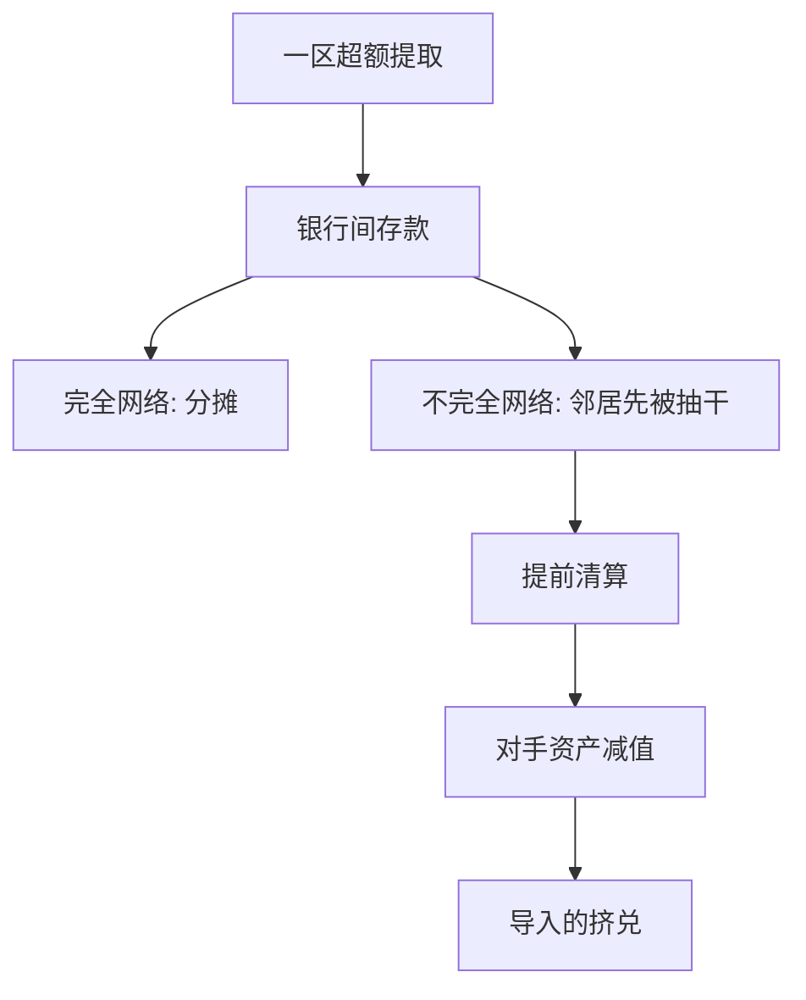

# 传染与系统性

一家银行的挤兑可以经由银行间债权写成另一家的挤兑；不完全的保险网络把区域冲击做成系统事件。

<footer>—— Allen and Gale, Financial Contagion, Journal of Political Economy 2000</footer>

定位：[上一课](/econ/diamond-dybvig)。单家银行的活期合同已经允许与基本面无关的坏均衡。本课缺口是把银行放进一个**彼此持有存款**的系统：挤兑如何从一家传到另一家。不重推 $r_1$ 与序贯服务，不问准备金乘数。

## 问题

Diamond–Dybvig 的银行是封闭的资产池。若耐心者只在本行排队，一家的坏均衡不必变成另一家的坏均衡。现实中银行用银行间存款互相保险：A 区今天急躁者偏多，向 B 区提款；B 区明天急躁者偏多，反向提。完全连接的网络可以把区域流动性冲击摊开。不完全连接时，冲击没有被摊开的出口，被迫提前清算长期技术，清算折扣写进对手的资产——传染开始。

缺口因此不是再讲一次太阳黑子，而是：在哪一种银行间结构下，单家挤兑的外部性变成系统性。Allen 与 Gale（2000）把这个问题收成市场结构，而不是「谣言传播」。

系统性不是「很多家同时倒」。它是一家的违约通过价格或债权改变另一家的可行集。同时倒可以是共同冲击；传染要求有一条可指认的传递边。

## 方法

设若干区域，每区一家代表性银行，活期合同仍是上一课的保险。银行在 $t=0$ 互相存放存款，作为跨区流动性保险。完全市场（每家持有所有其他家的存款）时，一区的超额提取由全系统分摊，没有一家需要中断长期技术。不完全市场（例如环形：每家只与邻居互存）时，冲击沿着环走：邻居先被抽干，再抽下一家。

清算有折扣：长期资产在 $t=1$ 卖掉拿不到持有到期值。折扣使对手银行的银行间资产减值，于是对手也面对 Diamond–Dybvig 式的短债长资缺口。坏均衡可以在没有新的太阳黑子的情况下，被邻居的挤兑**导入**。

Freixas、Parigi 与 Rochet 把同一逻辑写成支付系统里的信用暴露：未结算头寸是另一种银行间债权。本课只钉资产负债通道，支付通道留给 [RTGS](/econ/rtgs-payments)。

## 机制

机制是保险合同在网络上的外部性。银行间存款本意是硬币保险：平滑区域冲击。它同时是传递损失的导管。完全网络把导管铺满，每个冲击的边际清算需求小；稀疏网络把导管收成少数边，边上流量一大就触发火灾出售。价格渠道与债权渠道可以分开：即使没有直接互存，火灾出售压低共同持有的资产价格，也会改写另一家的偿付能力。

这与[柠檬](/econ/akerlof-lemons)不同：资产质量可以透明，价格下跌仍来自强制出售。也与单家 Diamond–Dybvig 不同：本行耐心者即使仍相信本行合同，也会因为对手违约而失去流动性保险，于是最优反应改变。系统性风险因此是网络与清算折扣的产物，不是把「恐慌」乘以 $N$。

### 共同冲击不是传染

许多银行同时面对同一宏观违约，是共同因子，不是传染。Allen–Gale 要识别的是：**在共同因子之外**，一家的提前清算是否改变另一家的约束。经验上两者缠在一起，理论必须先分开。本课禁止用「系统性」一词把共同冲击与网络传递混成一个故事。

不完全市场在这里是银行间债权的稀疏，不是 Arrow–Debreu 证券的缺失本身。区域冲击不可用对公众发行的或有要求权完美对冲，才需要银行间互存。

## 边界

不要把批发融资挤兑、货币市场基金赎回直接写成 2000 年的定理。那些是同一转换换了一张负债；机制同构，模型不是同一篇。也不要把资本充足当成已经解决传染：资本吸收的是亏损顺序，网络决定亏损写到谁的表上。下一课的[存款保险](/econ/deposit-insurance)删单家坏均衡，但对未保险的银行间债权不必自动删传染。

本课不写巴塞尔风险权重，不写太大而不能倒的隐担保。后两块分别改变「倒闭的社会成本被私人内部化了多少」，不是本课的网络会计。

后课默认：单家挤兑可以经由不完全的银行间保险导入邻居。完全网络分摊，稀疏网络放大清算折扣。共同冲击与传染必须分开写。

保险网络同时是损失导管。稀疏边上的流量一大，就会把 Diamond–Dybvig 的坏均衡做成系统事件。

不要用「系统性」吞掉共同因子。传递边必须可指认。

## 小结

- 单家活期合同允许挤兑；银行间互存把挤兑写成邻居的约束。
- 完全网络分摊区域冲击；不完全网络沿边导入清算与挤兑。
- 系统性是网络加折扣，不是把恐慌乘以银行家数。
- 出处：Allen and Gale, *JPE* 2000；对照 Freixas, Parigi and Rochet 的支付暴露。
