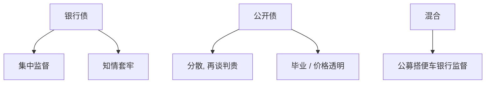

# 银行债对公开债

    
银行债集中、可监督、易再谈判；公开债分散、条款标准化、再谈判贵。企业不只选多少债，还选债是向谁借的。

    <footer>—— Diamond, Monitoring and Reputation: The Choice between Bank Loans and Directly Placed Debt, Journal of Political Economy 1991；Rajan, Insiders and Outsiders, Journal of Finance 1992</footer>

[上一课](/econ/covenants)把条款写成可验证检查。本课缺口是债权人类型：银行为何能执行更紧、更状态依存的监督，公开债市场为何仍被使用。不重写 Smith–Warner 清单，不把[中介为何存在](/econ/why-intermediaries)从零讲起——只接到企业负债结构。

## 问题

Diamond（1991）：银行作为监督者避免重复监测，声誉好的企业毕业到公开债，节省监督成本；声誉不足的用银行债。Rajan（1992）：银行知情后有套牢（hold-up），知情租金抽取可能扭曲投资，于是企业需要公开债或多元银行来制衡。缺口是：银行债「更好监督」不是免费，信息垄断是代价。资本结构动态因此多一维：私募 vs 公募。

Houston–James 等实证：成长机会多的企业更怕套牢，倾向多元信贷或公开债。有形资产多、监督收益高的用银行。机制课不堆回归，只标这两股力量。

## 方法

比较三项：监督强度、再谈判成本、流动性/展期。银行：贷款合同条款紧、豁免常见、展期是关系的一部分。公开债：持有人分散，信托人行动慢，条款松（否则技术性违约无法协调），但定价透明、可交易。混合结构（银行优先、公募在后）把监督放在先偿，公开债搭便车——后课空壳债权人会把搭便车写坏。

与期限：银行贷款往往短、可催收；公开债更长。上一课的展期风险在银行侧是关系能否续，在公募侧是市场能否发行。

Tirole：最优是状态依存的债权人结构——平时银行监督，危机时需要分散债权人的承诺不豁免（硬预算）。这与 Dewatripont–Maskin 的硬预算约束同方向。

## 机制

机制是信息生产与再谈判外部性。银行付监测成本，获得私人信号，再谈判可以避免无效率清算（减轻积压），也可以在好状态下抽取租金（加重套牢）。公开债把信号变成价格，但协调失败使无效率清算更常见。企业事前在「灵活但可能被剥削」与「僵硬但承诺」之间选。

与 Leland：违约边界取决于谁决定是否加速到期。银行更可能重组而不是清算，有效 $\alpha$ 下降，最优杠杆可以更高——若套牢不抵消。

### 不是「银行债总是关系、公募总是距离」

交易型银行贷款（辛迪加、可转让）把银行债做成准公开。公开债的集中持有（保险公司、贷款基金）可以把公募做成准银行。本课用监督与再谈判成本分类，不用户口分类。

主干里信贷配给、Diamond–Dybvig 已解释银行为何存在。本课站在企业：给定银行存在，负债菜单如何切。

## 边界

不要把本课写成贷款合同模板。下一课关系借贷把套牢与信息的跨期保险展开。证券化会把银行债再变成可交易，改变监督激励。

后课默认：银行 vs 公开是监督与套牢、再谈判与承诺的权衡。混合结构有搭便车。条款的硬度取决于债权人类型。

不要进入限价簿上的公司债做市价差；那是交易协议。

## 小结

- 银行：监督与再谈判强，知情套牢是代价；公开债相反。
- 声誉毕业、成长企业防套牢，决定菜单，而不只是杠杆率。
- 谁持有债，改变有效破产成本与违约边界。
- 出处：Diamond, *JPE* 1991；Rajan, *JF* 1992。
