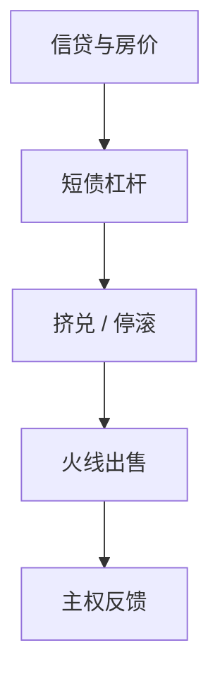

# 银行危机史与模式

信贷扩张、房地产与短期负债堆在一起，然后突然要现金。细节换世纪，模式重复。

<footer>—— Reinhart and Rogoff, This Time Is Different, 2009；Kindleberger, Manias, Panics, and Crashes</footer>

[上一课](/econ/fiscal-monetary-dominance)把预算闭合写成谁适应谁。缺口换成中介史：银行危机不是同一条会计的另一个出口，而是流动性与偿付在资产负债表上同时爆。本课钉历史模式，影子挤兑下一课。不重写 [Diamond–Dybvig](/econ/diamond-dybvig) 公式。

## 问题

Reinhart–Rogoff 的跨世纪样本里，银行危机前后是债务/GDP、信贷/GDP 和房价的共同运动；「这次不同」几乎总是错的。Kindleberger 给叙事：狂热、外部事件、清算。宏观模型若只有代表性银行的 $\phi$，会漏掉：危机是状态切换，不是 $\sigma$ 稍微大一点。缺口是把历史规律收成可对照的阶段，而不是年表。

Calomiris and Gorton 讨论恐慌是否信息还是纯粹流动性。Bordo 与 Schularick–Taylor 的信贷史。本课不把 RR 的财政乘数争论拖进来。

## 方法

读危机：先分清偿付（资产真坏了）与流动性（资产好但滚不过短债）。再看担保品（房地产）、杠杆（批发融资占比）、主权反馈（银行持有本国债）。政策对照：最后贷款人、存款保险、重组。与 HANK/GK：危机把 $\phi$ 或净值一次打穿，不是光滑的 $\sigma$ 冲击。

## 机制

机制是期限错配加不透明资产：一旦滚动停止，$q$ 下降验证最坏信念，净值蒸发，信贷供给崩溃（Gertler–Kiyotaki 的银行挤兑延伸）。历史模式是这个机制的反复校准，不是新理论。

## 边界

样本选择：只看大危机，会高估必然性；只看未爆的繁荣，会低估。下一课把「银行」换成表外影子，滚动市场换成回购与 ABCP。不写某国监管清单。

## 小结

- 银行危机的共同运动是信贷、担保品与短债，不是随机坏运气。
- 先分清偿付与流动性，再谈主权反馈。
- 出处：Reinhart and Rogoff, 2009；Kindleberger；Schularick and Taylor 信贷史。
