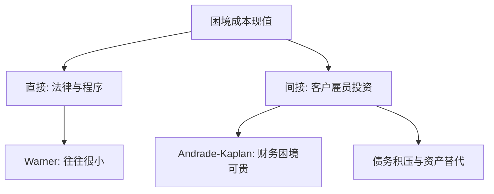

# 直接与间接破产成本

法律费用可以很小，而客户、雇员与投资机会在违约前就已经离开；权衡里的「成本」必须拆开写。

<footer>—— Warner, Bankruptcy Costs: Some Evidence, Journal of Finance 1977；Andrade and Kaplan, How Costly is Financial (Not Economic) Distress?, Journal of Finance 1998</footer>

定位：[上一课](/econ/tradeoff-capital)。税盾对困境成本已经给出内部 $D^\ast$，并把困境写成一项现值。本课缺口是把这项拆成直接与间接：法庭与专业费用是一回事，经营与激励扭曲是另一回事。不重算 $\tau_c D$，不把优序提前。

## 问题

若破产成本只是律师费与管理人报酬，Warner（1977）对铁路破产的度量给出一个刺耳的数：直接成本相对公司价值往往很小。税盾若按 $\tau_c D$ 的量级，直接成本单独撑不起观察到的内部股权——权衡会仍偏向高杠杆。因此「PV(困境成本)」必须有一块不进法庭账单的。

间接成本在违约前就开始：客户不敢下长期订单，雇员离开，供应商收现金，资产火灾出售，以及 Myers（1977）已经点名的债务积压——正 NPV 项目因为新股权先给债权人打工而被放弃。Andrade 与 Kaplan（1998）用高杠杆交易后陷入困境、但事前并非经营失败的样本，试图把**财务困境**从经济困境里分开。缺口是权衡左边的税盾已经有公式，右边必须可拆，而不是一个残差口袋。

直接成本：破产程序里的法律、会计、法院费用，以及资产在程序中的额外损耗。间接成本：违约或近违约改变了经营现金流本身。评级下调是信息，不是成本；成本是随后的真实行为。

## 方法

把权衡写成

$$
V_L = V_U + \mathrm{PV}(\text{税盾}) - \mathrm{PV}(\text{直接}) - \mathrm{PV}(\text{间接}).
$$

直接项随程序启动的概率与程序费用上升，是事件成本。间接项随杠杆与距违约距离上升，是路径成本，不必等到立案。Kraus–Litzenberger 的状态惩罚可以两套都装：有的状态付律师费，有的状态付「客户走了」。

Andrade–Kaplan 的识别策略是理论课要保留的那一句：找财务杠杆过高、核心经营未必坏的企业，看困境期间的价值损失有多大。本课不审他们的点估计，只取分类——财务困境可以单独昂贵。Warner 的直接成本小，则预测：真正挡住 $\tau_c D$ 的，主要是间接项。

资产替代（赌大的）与投资不足都是事前间接成本：它们改变项目分布，不进破产账单。权衡若只盯立案费用，会漏掉杠杆在「尚未破产」时已经做的事。

## 机制

机制是控制权转移与经营互补。直接成本是转移时的摩擦：法庭是一种配置技术，收费。间接成本是转移**被预期**时，互补的专用性投资停止——客户、雇员、供应商不愿把准租金交给可能易主的企业。这与[不完全合同](/econ/control-rights)后课的控制权语言衔接，本课只从权衡右边引入：杠杆提高控制权转移概率，于是专用性投资下降，价值在立案前就掉。

火灾出售把流动性问题做成价格冲击，与银行课的清算折扣同构，对象换成非金融资产。间接成本因此可以有宏观外部性；私人 $D^\ast$ 仍可能高于社会最优。那一层已经在资本监管出现过，这里不重开银行。

### 不要把经营失败叫成破产成本

经济困境：产品没人要，即使全股权也会收缩。财务困境：资本结构使本来可过下去的经营触发违约。权衡要减的是后者。把衰退里的亏损全部记成「破产成本」，会把税盾权衡做成周期残差。Andrade–Kaplan 标题里的 not economic 就是这道过滤器。

间接成本难以从利润表的某一行读出。它是反事实：若杠杆更低，客户是否仍在。这使右边比 $\tau_c D$ 更难审计，不使它更不真实。

## 边界

不要用直接成本的「小」否证权衡：否证的是「只有律师费」的版本。也不要把优序的发股折价算进破产成本——柠檬是发行市场的信息，下一课才用。Jensen 的债务纪律与间接成本方向相反，代理现金放到[自由现金流](/econ/agency-free-cash-flow)，以免权衡被撑成万能袋。

本课不估计行业平均困境成本百分比。后课默认：权衡右边以间接为主，直接往往不够挡税盾；债务积压与资产替代算事前间接。优序解释的是朝 $D^\ast$ 调整为何贵，不是把 $D^\ast$ 拆开。

Warner 的小数是对程序费用。把它当成「破产便宜所以应当全债」，漏了客户与投资。

财务困境可以发生在核心产品仍然有需求的时候。那才是资本结构的成本。

## 小结

- 权衡的困境成本必须拆：直接程序费用 vs 间接经营与激励。
- Warner：直接成本往往小；挡住税盾的主要是间接项。
- Andrade–Kaplan：财务困境（相对经济困境）可以单独昂贵。
- 出处：Warner, *Journal of Finance* 1977；Andrade and Kaplan, *Journal of Finance* 1998。
