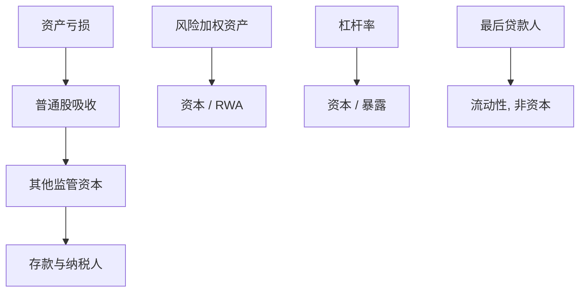

# 资本监管与巴塞尔

最后贷款人管的是挤兑时的现金；资本管的是亏损归谁。把两者写成同一个比率，监管就失去牙齿。

<footer>—— 据 Basel Committee on Banking Supervision, International Convergence of Capital Measurement and Capital Standards, 1988 及后续框架整理</footer>

定位：[最后贷款人](/econ/lender-of-last-resort)。Bagehot 已经把流动性窗口限制在好抵押上；本课缺口是偿付能力本身：若股本可以薄到接近零，再好的抵押规则也会在亏损一来时失效。不重讲挤兑博弈，不问准备金乘数。

## 问题

银行的转换功能要求杠杆：用短存款去持有长而信息密集的贷款。杠杆放大股权回报，也把损失更快推到存款人与纳税人。存款保险与最后贷款人一旦承诺删掉挤兑均衡，股东就有激励把杠杆加到保险能够覆盖的上限——这是[道德风险](/econ/moral-hazard)在银行负债上的版本。市场若相信有隐性担保，私人选择的资本会系统性偏低。

监管资本的问题因此不是「银行要不要赚钱」，而是：在保险与窗口已经改变激励之后，用哪一种可审计的比率把亏损先分配给能被核销的负债（股权与或有可转债），而不是存款。没有这层，Bagehot 的「好抵押」在资产减记后不再好。

会计资本是账面净资产。监管资本是按巴塞尔定义可计入的工具，再除以风险加权资产。两者都可以与市值资本分叉；危机中分叉最大。

## 方法

巴塞尔协议把资本写成分子分母两套定义。Basel I（1988）用风险加权资产（RWA）：表内资产按类别赋权，表外给信用转换，资本对 RWA 设最低比率。它第一次把国际银行的资本比较从「杠杆倍数」推进到「按风险加权的杠杆」。Basel II 把信用风险权重交给内部模型，引入支柱二（监督检视）与支柱三（披露）。Basel III 在危机后加回更高的普通股核心、资本缓冲、杠杆率（不再只信 RWA）与流动性覆盖——流动性覆盖是对 Diamond–Dybvig 提取的数量约束，资本缓冲才是对偿付的约束。

比率的经济学含义是损失吸收顺序。普通股先亏；其后是其他一级、二级工具；存款与优先债权在监管意义上不被当作资本。风险权重试图让「同样一单位资本」对应可比较的意外损失，但权重是规则而不是[随机折现因子](/econ/stochastic-discount-factor)：它不定价，只限制可持有的暴露。

与[内生货币](/econ/reserve-endogenous-money)的衔接：资本比准备金更硬地限制贷款创造。盯利率时准备金可以再供给，普通股不能在一周内再供给。因此资本是内生货币的数量阀，准备金是结算阀。

## 机制

机制是外部性的数量管制。银行倒闭的社会成本大于股东损失：支付体系中断、挤兑传染、处置的财政或有。私人最优资本低于社会最优。最低资本把杠杆的可行集切开，使股东在扩张风险加权暴露时必须先找到能吸收损失的资金。缓冲（conservation / countercyclical）把「刚好踩线」改成「线上方还有一层」，避免亏损立刻触发监管干预下的信贷紧缩。

风险加权的代价是监管套利：把风险赶到权重低估的暴露上，RWA 下降而真实杠杆不降。杠杆率作为不加权的后盾，正是承认权重会被操纵。这并不使资本变成「银行的成本之源」——下一课 [MM](/econ/modigliani-miller) 要问：若市场完全，用股本替换存款不应提高加权资本成本。巴塞尔把股本当成稀缺，已经预设了某种摩擦；摩擦要到权衡与优序才展开。

### 分子：什么东西算资本

普通股与留存收益是无可争议的损失吸收：可以核销、可以停股利。优先股、次级债、或有可转债能否计入，取决于它们在持续经营时是否真能减记。Basel III 收紧分子，正是因为危机中许多「二级资本」在需要时仍像债务。本课不记各类工具的合格标准表，只保留顺序：能在倒闭前吸收损失的，才是资本；能在倒闭后参与清算的，是债。存款保险覆盖的存款永远不是资本。

风险权重是规则，不是 SDF。给按揭 50%、给主权 0%，是委员会的选择，不是市场 beta。用监管资本比率当定价模型，会与下一单元的资产定价语言打架。

## 边界

不要把流动性覆盖比率（LCR）叫成资本充足。LCR 管的是高流动性资产对净流出，是 Bagehot 的事前库存；资本管的是亏损归谁。也不要用危机中的市值暴跌反推「监管资本没用」：监管用的是会计与规则资本，市值资本另有信息，两者本课不混成一个数字。

本课不推导 MM 命题，不写税收与破产成本。银行资本为什么在实务上显得贵，是公司金融单元的第一问。宏观审慎的逆周期缓冲只点到为止，不开新的周期模型。

内部模型（Basel II 支柱一）把分母交给银行自己估。这降低了「一刀切权重」的粗糙，也把模型风险引进监管比率。危机后的杠杆率与输出地板，是对「RWA 可以被做小」的回应。本课停留在：资本是数量阀；阀的刻度会被博弈。

## 小结

- 保险与 LOLR 改变激励之后，资本把亏损顺序写成可审计比率。
- 巴塞尔：分子是损失吸收工具，分母是 RWA，后辅以杠杆率与流动性覆盖。
- 资本是内生货币的数量阀；流动性工具不是资本。
- 把股本当成贵的，已经离开无摩擦 MM，下一课从那里补。
- 出处：BCBS 1988 及 Basel II / III 框架文件。
