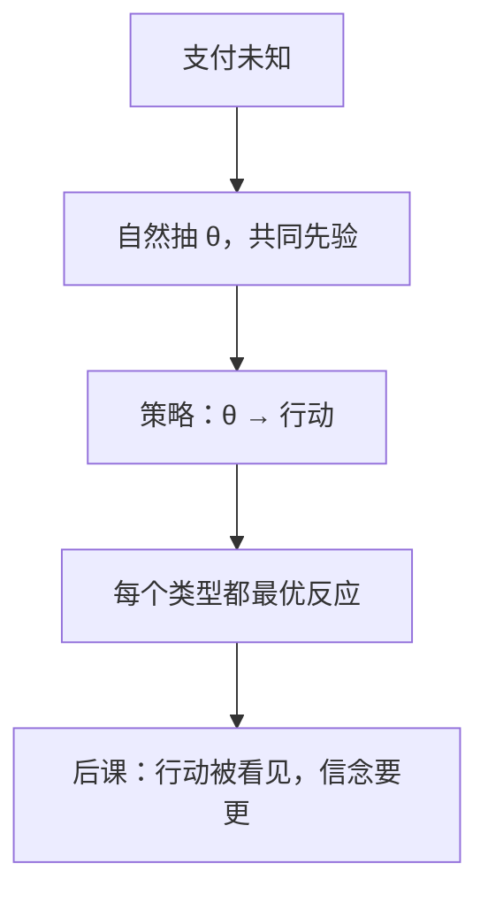

# 不完全信息与贝叶斯纳什

不完全信息博弈可改写为：自然先抽类型，每人只知己型，对他人类型持有共同先验；均衡是类型依存策略的纳什。

<footer>—— Harsanyi, Games with Incomplete Information Played by “Bayesian” Players, Management Science, 1967–68</footer>

[上一课](/econ/folk-theorem)在完全信息下把 SPE 支付集撑得很肥。缺口是：许多人连对手的支付都不知道——成本、估值、风险厌恶都是私型。此时「给定 $s_{-i}$ 的最优反应」没有定义，因为 $u_{-i}$ 未知。Harsanyi 的办法是把未知写成自然的行动，用共同先验把博弈变回完全但不完美信息。本课钉贝叶斯纳什（BNE），不管信号发出后信念如何精炼。

## 问题

不完全信息：至少一人不确定另一人的支付或可行集。直接写策略式会漏掉「我知道你不知道我知道」的层级。Harsanyi 转化：类型空间 $\Theta_i$，共同先验 $p$，条件信念 $p(\theta_{-i}\mid\theta_i)$。策略是 $\sigma_i:\Theta_i\to\Delta(S_i)$。支付是对类型与行动的期望。BNE 是：每个类型 $\theta_i$ 的 $\sigma_i(\theta_i)$ 最大化给定他人策略与后验时的期望效用。

这正是一个更大策略式的纳什：玩家是「类型–个人」，或等价地原玩家在自然行动之后行动。有限类型、有限行动时，[混合存在性](/econ/mixed-strategy)直接给出 BNE 非空。

### 共同先验不是「大家都一样聪明」

共同先验是技术假设：差异只来自私型，不来自对世界的任意异质信念。放松它会得到「没有共同知识」的另一套理论，主干不走。BNE 也不要求类型被对方观测；若类型后来变成信号，那是下一课的树。

拍卖是标准教具：每人估值 $v_i$ 私有，出价是类型依存策略。第一价格密封的 BNE 是「出价低于估值」的遮挡均衡，不是完全信息下的伯川德。先验与独立假设改均衡函数。

## 方法

对象：有限类型、有限行动、共同先验、风险中性或 vNM 效用。解：BNE。计算：对每一类型写最优反应，注意积分里是对他人类型的期望，不是对一个确定的 $s_{-i}$。纯策略 BNE 仍可空，混合在类型依存策略上取。

与完全信息纳什的关系：若 $|\Theta_i|=1$ 对所有 $i$，BNE 退化为纳什。不完全信息不是新偏好，是类型上的期望。

## 机制

类型把「我以为你以为」收成对先验的贝叶斯更新。均衡一致性是：我用来算你行动的分布，正是你各类型的策略对先验的推送。没有这层，最优反应会对错的对手分布取期望。

[无名氏定理](/econ/folk-theorem)在完全信息下过肥；一引入类型（声誉），有限次重复也可以撑住合作，因为偏离会暴露类型。这是 BNE 的动态版，本课只钉静态转化：自然先动，其余同时选类型依存策略。静态 BNE 不约束「零概率类型」上的行为——那些类型达不到，看见一个不该出现的行动时，后验没有贝叶斯定义。下一课把信念写成均衡的一部分，专门管这些信息集。

## 边界

先验从哪来，理论不回答。连续类型要技术条件保证存在。关联价值、公共价值拍卖里，赢者诅咒来自条件期望，仍是 BNE，只是信息结构变了。机制设计会把 BNE 当约束：任何机制的均衡结果必须能被激励相容说圆，那是显示原理。

后课默认：不完全信息先写成 Harsanyi 类型与 BNE；行动成为信号时，再加信念精炼。

## 小结

- 不完全信息用类型与共同先验改写成完全但不完美信息。
- BNE 是类型依存策略的纳什；有限时存在。
- 共同先验把信念差异限制为私型。
- 静态 BNE 不管零概率偏离上的信念。
- 出处：Harsanyi, *Management Science*, 1967–68。
