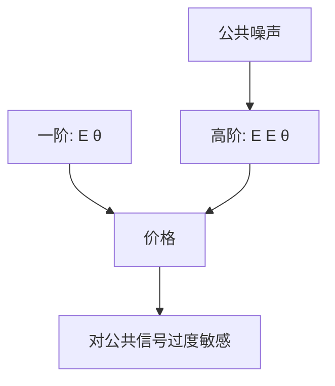

# 美人竞赛与高阶信念

职业投资是猜平均意见的平均意见；三阶以上，基本面可以让位给对别人信念的信念。

<footer>—— 据 Keynes, The General Theory, 1936, 第十二章；Allen, Morris and Shin, Review of Financial Studies, 2006</footer>

[上一课](/econ/information-acquisition)标明获取可以因协调而互补。本课缺口是把「协调」写成价格里的**高阶信念**：不只是 $\mathrm{E}[\theta]$，还有 $\mathrm{E}[\mathrm{E}[\theta\mid\cdot]]$ 以至无穷。不重做买不买信号的博弈型，不把凯恩斯写成行为偏差名录。

## 问题

凯恩斯的报纸选美：奖给最接近平均投票的人，理性策略是猜别人怎么猜，不是猜谁最美。资产若短期必须转卖，今天的支付取决于明天的平均估值，明天的平均估值又取决于再后天——价格进入美人竞赛。Allen、Morris 与 Shin（2006）在高斯差分化里把这写成：价格是对 $\theta$ 的各阶期望的加权和；公共噪声进入每一阶，因而比私有噪声更持久。

缺口是：Hellwig–Admati 的 REE 里，人们从价格学习 $\theta$，目标仍是对清算值的消费。一旦引入「关心别人的平均预期」（短期定价、相对业绩、流动性外部性），目标函数本身含高阶项。部分揭示不再只是 $z$ 与 $\theta$ 的混淆，还是高阶公共噪声的放大。

差分化：每人观察公共信号 $y$ 与私有信号 $x_i$，行动是加权猜测。均衡行动是 $y$ 与 $x_i$ 的线性组合，公共项权重大于贝叶斯权重。

## 方法

设清算在远期，中间每期价格由平均预期给出（或由短视投资者给出）。迭代期望：

$$
p \propto \bar{\mathrm{E}}[\theta] + \delta\,\bar{\mathrm{E}}[p']+\cdots
$$

把 $p'$ 再展开，得到对 $\theta$ 的一阶、二阶、……期望。高斯下高阶期望仍是 $(y,x_i)$ 的线性组合，但 $y$ 的系数随阶数衰减得更慢。于是价格对公共信号过度敏感、对私有信号迟钝——即便每个人的一阶贝叶斯是正确的。

这与 [EMH](/econ/emh) 的半强式不自动冲突：公共 $y$ 已经被写入 $p$，只是写入的权重相对 $\theta$ 的最优统计而言太大。有效是相对信息集无经济利润；美人竞赛说的是写入规则的形状。

不要把高阶信念写成限价簿上的「侦测冰山单」。那是协议层的学习；这里没有队列，只有平均意见的平均意见。

## 机制

机制是迭代期望的公共项不能被大数定律洗掉。私有误差在加总一阶期望时消失；公共误差在每一阶都还在。短期转卖把未来价格写进今天的支付，等于强迫投资者给高阶项加权。获取互补现在有了精确通道：买公共信号，是因为别人也用它猜别人。

GS 的 $z$ 是供给噪声，进入一阶混淆。美人竞赛的公共噪声即使与供给无关，也会因高阶而活下来。两种残差不要并成一个「噪声交易者」。

Angeletos 与 Werning 把金融价格当作内生公共信号，接到宏观协调博弈。本课只钉资产价格里的高阶，不写货币攻击。

## 边界

不要把第十二章读成「市场全是心理」。凯恩斯同时写了长期投资者仍应看基本面；美人竞赛是流动性与短期评价迫使的均衡，不是偏好改写。下一课 Morris–Shin 把过度权重写成福利：公共信息可以有负的社会价值。本课不审央行该不该透明。

后课默认：短期定价引入高阶期望；公共噪声比私有噪声更持久，价格对公共信号的弹性可以超过贝叶斯基准。

## 小结

- 美人竞赛把价格写成对平均意见的迭代，而不只是 $\mathrm{E}[\theta]$。
- 公共噪声进入每一阶，私有噪声在加总时被洗掉。
- 这是协调均衡，不是把上一课的 $c$ 再解一遍。
- 出处：Keynes, *General Theory*, 1936, ch. 12；Allen, Morris and Shin, *RFS* 2006。
