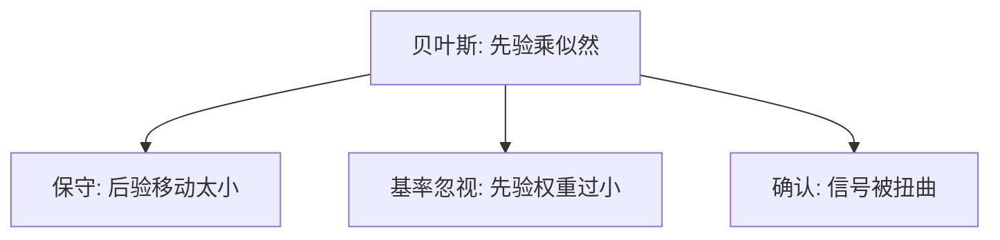

# 信念更新的偏差

贝叶斯用似然比移动先验；人往往对基率反应不足，对故事性证据反应过度，对反面证据打折。

<footer>—— Edwards 的保守主义；Kahneman and Tversky 的基率忽视；Rabin and Schrag, QJE 1999</footer>

[上一课](/econ/salience-attention)决定哪些新闻被看见。本课缺口是看见之后如何更新。不重写显著性函数。

## 问题

规范模型是贝叶斯。Edwards 记录保守主义：似然比不够被充分乘进后验。Kahneman 与 Tversky 的基率问题则是另一方向：代表性压过先验。Rabin 与 Schrag（1999）的确认偏差：信号被扭曲成支持当前假设，后验过极化且难以纠正。三种看起来相反的偏差可以并存：对统计表保守，对个案过度，对异见打折。缺口是给[启发式](/econ/heuristics-biases)一条动态：信念作为状态变量如何走错。

BSV 后课用保守主义与代表性写盈余公告后的漂移与反转。本课先钉微观更新。

有限注意力已经筛选信号。更新偏差是对已筛选信号的错误似然。两层都不必动 $v$。

## 方法

实验：抛硬币序列、疾病基率、律师–工程师问题。结构：把错误写成错的似然（确认偏差）或错的权重（基率 $\to 0$）。经验金融：对公开盈余的反应不足（PEAD）与对序列信息的过度反应，后单元模型化。本课不估计漂移。

## 机制

机制是似然误用。保守把新息往 0.5 拉；代表性把小样本当总体；确认偏差改变的是数据本身的编码。自我归因（赢=技能）是确认偏差的自我评价版，喂养过度自信。三者对价格的含义不同：保守给漂移，代表性给反转，确认给长期错定价——套利限制决定它们能否活下来，那是市场单元。

与 [EMH](/econ/emh) 的接口：半强式要求公开信号被正确写入价格。更新偏差是对「正确」的心理学否证候选；联合假说仍在，因为还要一个均衡模型。

保守与基率忽视方向相反，对象不同：一张统计表上的似然比被乘得不够，一个生动个案却把基率打到零。确认偏差改的是数据编码：不利于当前假设的信号被读成噪声。DHS 的自我归因是确认偏差对准自己能力；BSV 的体制切换是代表性对准短样本。本课只给零件，价格动态按模型课组装。实验方法课提醒：价格残差不能直接指认是哪一种误乘。

## 边界

激励、反馈、统计培训改变部分更新。群体讨论可能极化而非纠正。本课不把宏观预期（通胀）的粘性全部写成确认偏差——那有合同与信息成本。也不发明实验编号。

后课默认：行为主张要用实验方法来识别，而不是用价格残差直接当心理学。

看见之后仍可误乘似然：保守、基率忽视、确认偏差对象不同，可以并存。

价格残差不能直接指认是哪一种误乘；零件在 BSV/DHS 再组装。

## 小结

- 更新偏差是似然与基率被误用：保守、忽视基率、确认。
- 与注意力分工：一层筛新闻，一层错乘似然。
- 为 BSV/DHS 的价格动态准备零件，本课不写均衡。
- 自我归因是确认偏差对准自己的能力。
- 公开信号写入价格仍受联合假说约束。
- 出处：Edwards；Kahneman and Tversky 基率；Rabin and Schrag, *QJE* 1999。
