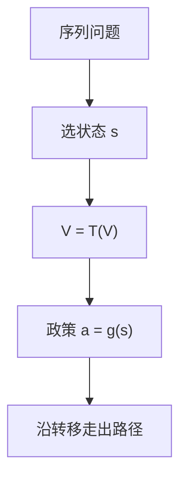

# 贝尔曼方程

最优值是今天的回报加上贴现后的续值；状态足够时，序列问题塌成函数方程。

<footer>—— Bellman, Dynamic Programming, 1957；Stokey and Lucas with Prescott, Recursive Methods in Economic Dynamics, 1989</footer>

[上一课](/econ/multi-period-consumption-portfolio)在离散多期里已经用贝尔曼写消费与组合，并声明：动态宏观的求解装置从这里交接，不再从零讲两基金。本课缺口是把那条装置从组合菜单里抽出来，写成**一般递归**：状态、控制、转移、值函数。后课默认已经有这条方程，不再每次从 Ramsey 序列重写。不重解 HJB，不进限价簿。

## 问题

Samuelson 的 $V_t(W)$ 是财富上的贝尔曼，状态几乎是标量。宏观一旦有资本、劳动、外生冲击，序列问题是 $\max\mathrm{E}\sum_t\beta^t u(c_t)$ 受资源与技术约束，直接写无穷序列既难算也难看清政策是状态的函数。Bellman：在正则条件下

$$
V(s)=\max_{a\in\Gamma(s)}\Bigl\{r(s,a)+\beta\mathrm{E}\bigl[V(s')\bigm|s,a\bigr]\Bigr\},
$$

$s$ 为状态，$a$ 为控制，$\Gamma$ 为可行集，$r$ 为当期回报。缺口不是再推消费欧拉，而是：动态宏观的对象是这个函数方程的解 $V$ 与政策 $a=g(s)$，不是一条事先写死的时间路径。

Stokey–Lucas–Prescott 把压缩映射、单调性、凹性写成宏观可用的许可证。Blackwell 充分条件保证 $T$ 是折扣压缩。本课用它们，不重写泛函分析。

## 方法

先选状态：凡是影响可行集或回报、且按已知转移走的变量都进 $s$。代表性 Ramsey：$s=k$，冲击经济再加 $z$。控制是 $c$ 或投资。算子 $T(V)(s)=\max_a\{r+\beta\mathrm{E}V'\}$。$\beta<1$、$r$ 有界时 $T$ 在有界连续函数上是压缩，唯一不动点即值函数；凹性与单调性可从原问题继承到 $V$。确定性下包络给出欧拉；随机下给出随机欧拉。横截与泡沫下一课才钉。

与上一课的分工：组合课已经示范 $V(W)$；本课示范同一算子如何接到资本与总量约束。资产菜单若再出现，只引用欧拉的资产形式，不重写短视定理。

## 机制

机制是**状态充分统计**。昨天的决策只通过今天的 $s$ 影响明天，历史不必进自变量。政策因此是函数 $g$，加总与估计才能写成递归均衡：价格是 $s$ 的函数，家庭的 $V$ 把价格函数当给定，再出清。代表性个体时 $s$ 是总量；异质时个人状态与分布一起走——那是 [Bewley](/econ/bewley-aiyagari) 的缺口，本课先把算子立住。

时间不一致已经在主干出现过：若未来自己会再优化且与今天目标冲突，$V$ 的递归要改成博弈。本课程默认标准贴现效用，承诺问题另接。连续时间 HJB 是同一递归的扩散写法，本栏不重推伊藤。

Lucas 树的 $p(y)$ 也是递归：价格是果实状态的函数。本课不重写树，只提醒：定价函数与值函数是同一装置的两个实例。

## 边界

本课不给算法（下一课 VFI/PI），不把欧拉当唯一一阶条件（再下一课才把横截补上）。也不把贝尔曼写成「宏观就是动态规划」的口号：没有正确的状态，方程是错的；没有压缩或有界性，唯一性不必有。无限维分布作为状态时，压缩论证更脆，留给 Krusell–Smith。

后课默认：动态宏观先写 $V=T(V)$ 与 $g(s)$；序列形式只在需要横截或变分时展开。组合短视、两基金、FTAP 已经在上一课程结束，本栏不重写。

## 小结

- 贝尔曼把序列问题收成状态上的函数方程；$V$ 与政策 $g$ 是后课的公共对象。
- 状态必须充分；算子在折扣与有界回报下常是压缩。
- 本课从组合贝尔曼交接，不再讲菜单。
- 出处：Bellman 1957；Stokey, Lucas and Prescott, *Recursive Methods*, 1989。
