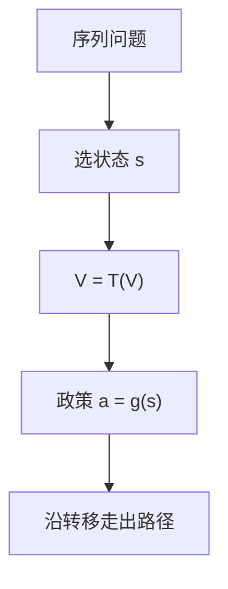
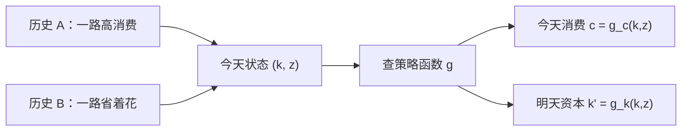

# 贝尔曼方程

最优值是今天的回报加上贴现后的续值；状态足够时，序列问题塌成函数方程。

<footer>—— Bellman, Dynamic Programming, 1957；Stokey and Lucas with Prescott, Recursive Methods in Economic Dynamics, 1989</footer>

[上一课](/econ/backus-smith)把开放宏观主干收在 Backus–Smith 之谜：完全市场要求实际汇率跟踪相对消费，数据里却锁不上，逐期检查欧拉到此已经用尽。本课是「动态宏观与异质性」的第一课，换装置：把序列问题写成**一般递归**——状态、控制、转移、值函数。方程与不动点的论证是数学基础课[贝尔曼方程](/econ/bellman-equation)的成品，本课只取用；后课默认已经有这条方程，不再每次从 Ramsey 序列重写。不重解 HJB，不进限价簿。

## 问题

Samuelson 的 $V_t(W)$ 是财富上的贝尔曼，状态几乎是标量。宏观一旦有资本、劳动、外生冲击，序列问题是 $\max\mathrm{E}\sum_t\beta^t u(c_t)$ 受资源与技术约束，直接写无穷序列既难算也难看清政策是状态的函数。写成函数方程就是 $V(s)=\max_{a\in\Gamma(s)}\{r(s,a)+\beta\mathrm{E}[V(s')\mid s,a]\}$，其中 $s$ 为状态，$a$ 为控制，$\Gamma$ 为可行集；它连同 Blackwell 压缩与唯一不动点的论证，[贝尔曼方程](/econ/bellman-equation)已经一次证完，本课只取用。缺口不是再推消费欧拉，而是：动态宏观的对象是这个函数方程的解 $V$ 与政策 $a=g(s)$，不是一条事先写死的时间路径。

Stokey–Lucas–Prescott 把压缩映射、单调性、凹性写成宏观可用的许可证。Blackwell 充分条件保证 $T$ 是折扣压缩。本课用它们，不重写泛函分析。

## 方法

先选状态：凡是影响可行集或回报、且按已知转移走的变量都进 $s$。增长模型里状态向量是 $(k,z)$：$k$ 是昨天投资留下的资本存量，$z$ 是按马尔可夫转移的生产率；不随时间变的偏好与技术参数不必进状态。控制是 $c$ 或投资。用法在解出来的**策略函数** $g$：$g_k(k,z)$ 给出下一期资本，$g_c(k,z)$ 给出消费。稳态读作 $g$ 的不动点，$g_k(k^*,\bar z)=k^*$；从任何初值反复代 $g_k$ 就得到转移路径，不再对整条 $\{k_t\}$ 做变分。冲击下同一张 $g$ 对每个 $z$ 各有一页，模拟即抽样 $z$ 的历史并迭代。确定性下包络给出欧拉；随机下给出随机欧拉。横截与泡沫下一课才钉。

数字实例：若生产率 $z$ 只取 $\{0.9,\,1.0,\,1.1\}$ 三档并按马尔可夫链转移，策略函数 $g_k$ 就是一张「$k$ 连续、$z$ 三行」的表；模拟一千期，等于抽一千次 $z$、每次查一次表，不需要重新求解任何优化问题。

```mermaid
flowchart TD
  SEQ["序列问题"] --> ST["选状态 s"]
  ST --> BE["V = T(V)"]
  BE --> POL["政策 a = g(s)"]
  POL --> PATH["沿转移走出路径"]
```

与上一课的分工：Backus–Smith 收在开放约束下欧拉失灵的实证僵局；本课回到总量装置，示范同一方程如何接到资本积累与增长。资产菜单若再出现，只引用欧拉的资产形式，不重写组合课的短视定理。

## 机制

机制是**状态充分统计**。昨天的决策只通过今天的 $s$ 影响明天，历史不必进自变量。政策因此是函数 $g$，加总与估计才能写成递归均衡：价格是 $s$ 的函数，家庭的 $V$ 把价格函数当给定，再出清。代表性个体时 $s$ 是总量；异质时个人状态与分布一起走——那是 [Bewley](/econ/bewley-aiyagari) 的缺口，本课先把算子立住。

```mermaid
flowchart LR
  H1["历史 A：一路高消费"] --> S["今天状态 (k, z)"]
  H2["历史 B：一路省着花"] --> S
  S --> G["查策略函数 g"]
  G --> C["今天消费 c = g_c(k,z)"]
  G --> K["明天资本 k' = g_k(k,z)"]
```

时间不一致已经在主干出现过：若未来自己会再优化且与今天目标冲突，$V$ 的递归要改成博弈。本课程默认标准贴现效用，承诺问题另接。连续时间 HJB 是同一递归的扩散写法，本栏不重推伊藤。

直觉类比：状态像棋盘上的当前局面——接下来怎么下只看局面，不必知道每一步是怎么走出来的。但若状态选漏了一格（比如漏掉债务期限），「局面」就不足以决定下一步，方程从源头就错了。

Lucas 树的 $p(y)$ 也是递归：价格是果实状态的函数。本课不重写树，只提醒：定价函数与值函数是同一装置的两个实例。

## 边界

本课不给算法（下一课 VFI/PI），不把欧拉当唯一一阶条件（再下一课才把横截补上）。也不把贝尔曼写成「宏观就是动态规划」的口号：没有正确的状态，方程是错的；没有压缩或有界性，唯一性不必有。无限维分布作为状态时，压缩论证更脆，留给 Krusell–Smith。

为什么重要：本课只立方程、不解方程，$g$ 的存在性靠压缩不动点保证。若跳过这一步直接拿 $g$ 做比较静态或模拟，等于把一个尚未证明存在的函数当成了工具。

后课默认：动态宏观先写 $V=T(V)$ 与 $g(s)$；序列形式只在需要横截或变分时展开。组合短视、两基金、FTAP 属于信息与无套利课程，本栏不重写。

## 小结

- 贝尔曼把序列问题收成状态上的函数方程；$V$ 与政策 $g$ 是后课的公共对象。
- 状态必须充分；算子在折扣与有界回报下常是压缩。
- 本课从开放宏观的僵局交接：交付的是状态向量与策略函数，不再讲菜单。
- 出处：Bellman 1957；Stokey, Lucas and Prescott, *Recursive Methods*, 1989。
