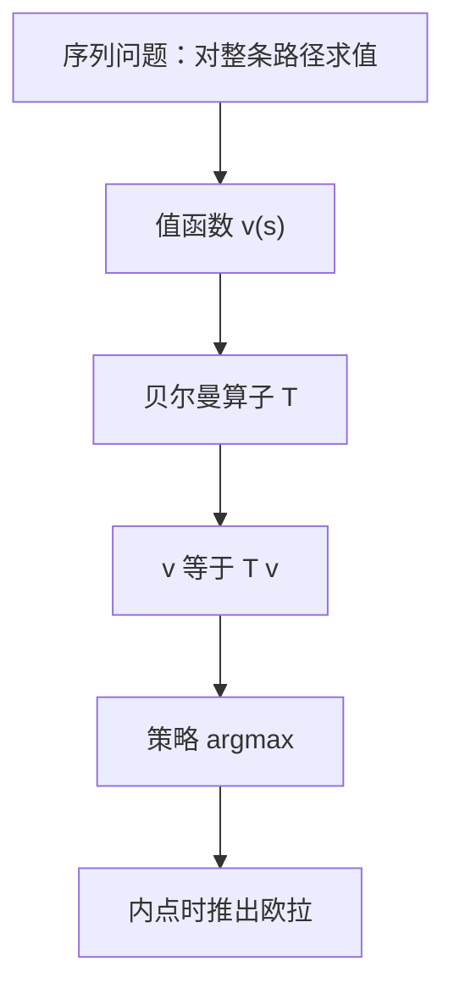

# 贝尔曼方程

动态最优的值满足：今天的回报加折扣后的续值，再对当前行动取最大；不动点是值函数，不是状态路径。

<footer>—— 据 Stokey, Lucas and Prescott, Recursive Methods in Economic Dynamics, 1989, 第 4 章；Bellman, Dynamic Programming, 1957 整理</footer>

上一课[上半连续对应](/econ/uhc-correspondence)用 Berge 保证「今天这一步最大化」的值连续、最优对应 UHC。动态问题是一串这样的步骤。缺口是把无穷期（或有限期向后）收成一个函数方程 $v=Tv$，而不是在序列空间里对整条 $\{x_t\}$ 做一次静态优化。后课 Ramsey、搜寻、随机增长都默认会写贝尔曼；本课只补方程本身与它和压缩的接口。

## 问题

状态 $s\in S$，行动 $a\in\Gamma(s)$，回报 $F(s,a)$，转移 $s'=g(s,a)$（随机情形则对条件分布取期望，那是后课[条件期望](/econ/conditional-expectation-econ)的接口）。值函数
$v(s)=\sup_{\{a_t\}} \sum_{t=0}^\infty \beta^t F(s_t,a_t)$。
在正则条件下 $v$ 满足
$v(s)=\max_{a\in\Gamma(s)}\{F(s,a)+\beta v(g(s,a))\}$。
右端定义算子 $(Tv)(s)=\max_a\{F+\beta v\circ g\}$。贝尔曼方程即 $v=Tv$。有限期则从终端值向后递推，没有不动点问题；无穷期折扣 $\beta<1$ 才用压缩。

序列问题与函数方程的等价不是自动的：要有限回报、可行计划非空、可测选择。Stokey–Lucas–Prescott 把这些写成假设清单。本课不逐条证等价，只标明：写出 $v=Tv$ 之后，还要用压缩（或单调性）确认 $T$ 的不动点就是序列问题的值。

### 贝尔曼不是欧拉方程

欧拉方程是内部解对 $a$ 的 FONC，连接 $v'(s)$ 与 $v'(s')$（包络再给 $v'$）。它是贝尔曼的一阶条件，假定内点、可微。角点、不可微、离散行动只有贝尔曼，没有欧拉。后课[跨期消费与欧拉方程](/econ/consumption-euler)会从贝尔曼推欧拉；本课禁止把两者当同一句话。

$\beta=1$ 的未折扣问题可以没有有限值，或要 overtaking 准则。主干宏观折扣 $\beta<1$。平均报酬、最优增长的无界回报用加权范数，仍是压缩家族，不是另一套哲学。

## 方法

在 $C(S)$（$S$ 紧）上，若 $F$ 连续、$\Gamma$ 连续紧值，Berge 推出 $T:C(S)\to C(S)$。Blackwell：单调加折扣 $\Rightarrow$ $T$ 是模 $\beta$ 的压缩。于是唯一连续值函数，最优对应 UHC（再加凸结构则凸值）。策略 $a^*(s)\in\arg\max$ 生成的计划达到 $v$——这要用可测选择，有限 $S$ 或连续且单值时自动。

随机情形把 $v(g(s,a))$ 换成 $\mathbb{E}[v(s')\mid s,a]$。期望是对已知条件分布的积分，信息结构用 $\sigma$-代数描述是后一单元的事。本课只要求：把续值换成条件期望后，若期望保连续与单调，压缩论证原样搬。

## 机制

最优性原理：无论今天如何到达 $s$，余下计划必须对从 $s$ 出发的子问题最优。否则把子计划换成更好的，总折现回报上升。于是无穷期最优可以递归：今天只选 $a$，明天交给已经最优的 $v$。压缩保证这个递归有唯一解，不会因「无穷多个明天」而漂。

包络：$v'(s)=F_s+\beta v'(s')g_s$ 在内点成立，状态的边际值等于直接边际回报加续值的边际。这是上一单元包络在动态上的实例。比较静态对稳态资本求导，常常走这条，而不是对整个序列变分。

时间不一致（双曲线折扣、承诺）破坏「余下问题仍用同一个 $v$」。那不是贝尔曼算错，是偏好在时间上换了算子。后课[时间不一致与承诺](/econ/time-inconsistency)再对照。

## 边界

本课不讲连续时间 HJB、黏性解，不把随机控制写成 Itô 讲义——量化栏才走 SDE。也不把 Ramsey 模型在这里展开：只准备方程。下一课把 $T$ 的 Picard 迭代写成算法：值函数迭代。

后课默认：折扣动态规划写成 $v=Tv$；$T$ 在连续有界函数上是压缩；欧拉是内点特例。

## 小结

- 贝尔曼方程：$v=Tv$，今天回报加折扣续值再最大化。
- 最优性原理把序列问题收成函数不动点。
- 连续紧、Berge、Blackwell $\Rightarrow$ 唯一连续 $v$。
- 欧拉是内部一阶条件，不是方程本身。
- 下一课：[值函数迭代](/econ/value-function-iteration)。
- 出处：Stokey, Lucas and Prescott 第 4 章；Bellman, *Dynamic Programming*。
