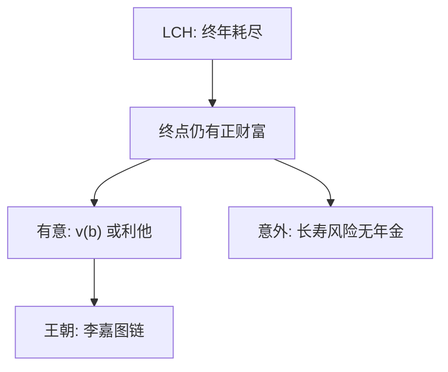

# 遗赠动机

纯生命周期在终年把财富吃完；数据里的遗产迫使我们问：那是爱、是事故，还是年金市场缺失。

<footer>—— 对照 Yaari 1965 的不确定寿命；Barro, JPE 1974；Kotlikoff and Summers, JPE 1981；Hurd, Econometrica 1989</footer>

[上一课](/econ/liquidity-constraints-excess-sensitivity)解释了年轻端的高 MPC。本课缺口转到生命终点：LCH 预测退休后负储蓄直至耗尽，但老年人仍持有大量资产并留下遗产。不重写年龄隆起。

## 问题

三种候选。有意遗赠：效用含继承人消费或遗产本身（利他或「遗产当奢侈品」）。Barro（1974）的王朝利他把世代链成李嘉图等价的微观基础。Kotlikoff 与 Summers（1981）估计美国财富中很大一块可追溯到代际转移，而不只是生命周期储蓄。意外遗赠：寿命不确定且年金不足，预防性多留的财富在死后剩下——Yaari（1965）已经把不确定寿命写进欧拉。Hurd（1989）用退休后的储蓄行为区分：许多老年人的边际遗赠效用接近零，意外与健康风险更重要。

缺口是给 LCH 的终点条件加一项，而不是重开永久收入定义。

策略性遗赠（Bernheim, Shleifer and Summers, 1985）用遗产交换子女的照料，已经是家庭内部博弈，本课只点名，不展开讨价还价。

## 方法

在有限寿命模型末项加 $v(b)$，或把继承人效用贴现进来。意外遗赠不需要 $v$：只要死亡随机且没有公平年金，最优就是持有流动性财富，死后残值归继承人。经验上比较有无子女者的退休路径、遗产的收入弹性、以及对年金的需求——下一课年金之谜正是这条线索的市场面。

本课不估计代际转移份额的争论（Modigliani 与 Kotlikoff 的口径之争只作为边界）。

## 机制

有意遗赠改变的是终点边际效用：少吃一单位可以换成 $v'(b)$。意外遗赠改变的是保险可能集：不能把「活得太长」卖给市场时，财富同时承担退休消费与遗产残值。两种机制对年金需求相反：纯粹利他仍可买年金再另留遗产；单纯意外遗赠会压低自愿年金——因为年金没有残值。后课用这个符号差。

也不进入限价簿。遗产是合同与偏好，不是成交队列。主干接到簿为止，本课补的是生命终点的效用项与保险可能集。

Barro 链把利他写成每一代都关心下一代，一次总付的政府债务被私人储蓄抵消——李嘉图等价的微观故事。现场链条会断：无子女、有限利他、流动性约束的年轻人收不到补偿。Kotlikoff–Summers 的口径之争（多少财富是转移来的）不在本课仲裁；本课只要：终点条件不再是 $a_T=0$ 这一条。

## 边界

医疗支出风险、长期护理、房产不可分，都会在终点留下资产，不必有 $v(b)$。本课不把住房提前写成下一课的全部内容，只承认住房是遗产的主要载体之一。现时偏差很少被用来解释遗产：老练自我更担心退休前被花光，而不是死后留多留少。

后课默认：终点财富有有意与意外两条通道；年金之谜要在二者之间做识别。

终点 $a_T=0$ 被遗产数据拒绝之后，有意 $v(b)$ 与意外残值给出相反的年金含义。

Barro 链把利他接到李嘉图；链条在无子女或流动性约束处会断。

## 小结

- 纯 LCH 吃完财富；遗产要求有意动机或意外残值。
- Barro 王朝把利他接到李嘉图；Kotlikoff–Summers 强调代际转移规模。
- Hurd：许多退休路径更接近意外而非强利他。
- 意外遗赠不需要遗产进入效用。
- 住房不可分会在终点留下资产，不必先有 $v(b)$。
- 出处：Yaari 1965；Barro, *JPE* 1974；Kotlikoff and Summers, *JPE* 1981；Hurd, *Econometrica* 1989。
