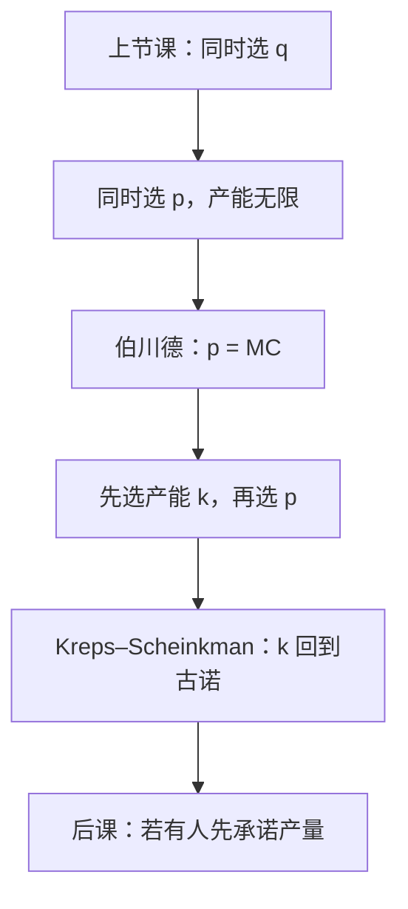

# 伯川德与产能约束

若两家成本相同、产品无差异、产能无限，同时喊价会把价格喊到边际成本——与古诺的中间加价不是同一均衡。

<footer>—— 据 Bertrand, Théorie mathématique de la richesse sociale, Journal des Savants, 1883 整理</footer>

上一课[古诺数量竞争](/econ/cournot-oligopoly)在同时选产量时给出带份额的勒纳。本课不重讲反应函数的交点。缺口是：市场上贴出去的往往是价格，不是吨数。策略变量换成价格之后，同一套同质产品、常数 MC，均衡可以从「中间加价」跳到「$P=\mathrm{MC}$」。必须先标明这道伯川德悖论，再用产能把两种模型接回去。

## 问题

两家同时选 $p_i$，需求流向标价更低者；同价则按某种规则分享。成本同为常数 $c$，产能不受限。唯一相互最优是 $p_1=p_2=c$：谁若标得更高，销量归零；谁若标得低于 $c$，亏本。利润与完全竞争相同，$L_i=0$。缺口因此不是再定义一次 MR，而是：**为什么古诺的 $s_i/|\varepsilon|$ 在换策略变量后消失？** 不是偏好变了，是「低价拿走全部需求」让价格变成赢者通吃，数量竞争里那种平滑的剩余需求斜率不复存在。

若产能先被钉死，低价者也装不满全部需求，高价者仍能卖剩余。价格战不再一刀切到 $c$。Edgeworth 已经指出产能约束下可能没有纯策略价格均衡。Kreps–Scheinkman 把顺序写成：先同时选产能，再伯川德定价；在合适的配给规则下，产能阶段的均衡产量等于古诺产量。于是「先量后价」把两课焊回同一数字。

### 悖论不是计算错误，是制度假设

把伯川德读成「价格竞争一定更激烈」是口头禅。无限产能、瞬时扩产、完全同质、消费者只看价格，四条少一条，结论就动。上一课古诺隐含的是：产量（产能）先锁死、价格由市场读出。本课把锁死拿掉，结论翻过来。后课不要混用两套一阶条件而不声明策略变量。

配给规则很关键。有效配给（低价者的需求被愿付最高的人拿走）与按比例配给，给后续价格阶段的剩余需求形状不同。Kreps–Scheinkman 用的是有效配给。

## 方法

无限产能：直接验证 $p=c$ 是相互最优，任何 $p>c$ 都被对方的 $\varepsilon$ 底切。不对称成本时，低成本者标到高成本者的 MC 下方（或等于，视是否必须报价在连续统上），取出全部需求。这仍是刀刃，对「几乎同质」不稳定——霍特林课会把同质撤掉。

有限产能 $k_i$：价格阶段给定 $k$，再选 $p$。产能总和小于竞争产量时，价格可以停在使需求等于总产能的水平上，甚至接近垄断价；产能总和过大则回到底切。Edgeworth 循环出现在中间地带：纯策略没有固定点，价格在区间里跳。然后把均衡利润当作 $k$ 的函数，回到产能阶段做一次古诺式选择。本课只钉这个两阶段接口，不把配给规则的全部变体列成表。

不对称成本时，低成本者可以把价格标在对手成本之下、自己垄断价之上，取出全部市场；高成本者销量为零。这仍是刀刃：成本差一旦被产品差异平滑，下一课霍特林会给出内点加价。本课先在同质上把产能说清。

产品差异、搜寻摩擦、转换成本都会缓和悖论，但那是下一课之后的对象。本课先在同质上把产能说清。

## 机制

赢者通吃的机制是：对买方而言两家的产品是完全替代，价格低的那家面对的是整条市场需求，直到产能。无限产能时，剩余需求从「倾斜」变成「水平直到零」。MR 不再是 $P+q_i P'$ 那种内点公式，最优变成底切。产能约束把「整条需求」改回「最多 $k_i$」，高价者的剩余需求又获得斜率，加价可以存活。

两阶段的机制是承诺：产能在价格战之前沉没，相当于上一课序的 $z_f$。价格阶段的伯川德在既定 $k$ 上打，进入阶段所选的 $k$ 内化了后面的价格战。于是表面上的价格竞争，骨子里仍是数量（产能）竞争——这把古诺从「厂商真的只选吨数」里救出来，变成「产能难调」的简写。

不对称产能时，小厂更容易把价格贴近大厂的保留价，大厂则更像面对一条有截断的剩余需求。本课不把不对称写成一般公式，只强调：产能分布决定价格阶段还能否被底切到 $c$。

Bertrand 1883 是对 Cournot 的书评式批评，不是一篇现代博弈论。Kreps and Scheinkman, *Bell Journal of Economics*, 1983，才把产能预承诺写清楚。不要把 1883 写成已经包含两阶段。

## 边界

差异产品的价格竞争可以有纯策略加价，不必靠产能——下一课霍特林。重复互动、惩罚性降价，会把一次性 $p=c$ 撑成合谋区间，那是无名氏定理课，本课不预支。菜单成本、价格粘性是宏观，不在这里改伯川德。

也不要把交易所里的限价指令写成伯川德：簿上有深度、有时间优先，是量化栏。本课是产品市场的同时喊价。

后课默认：同质且产能无限时价格落到 MC；产能预承诺可以把均衡产量读回古诺。

## 小结

- 策略变量从数量换成价格后，无限产能的同质双寡头 $p=\mathrm{MC}$。
- 悖论来自赢者通吃，不是古诺算错。
- 产能约束与两阶段预承诺把价格战接回古诺产量。
- 下一课让一家先动，把同时选择改成可观察的承诺。
- 出处：Bertrand, *Journal des Savants*, 1883；Kreps and Scheinkman, *Bell Journal*, 1983；Edgeworth 论产能约束。
